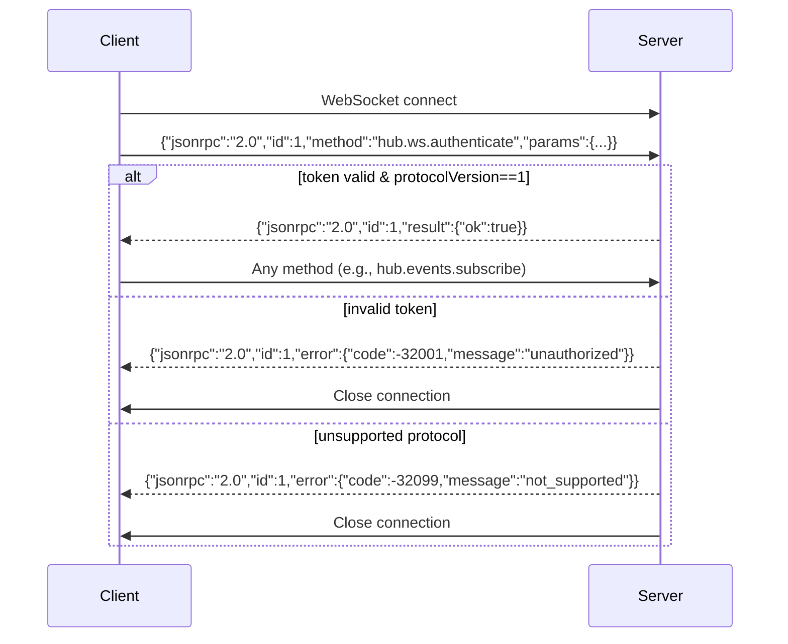

# DevHub Protocol Specification v1.0

**Status**: Final
**Date**: 2026-01-30
**Applicability**: DevHub Hub v1.x, SDKs (any language)

---

## 1. Introduction

### 1.1 Purpose
This specification defines the protocol for DevHub — a **per-user local daemon** that enables:
- App instance registration & discovery
- Cross-tool method invocation orchestration
- Workspace isolation via `scope`
- Event subscription for UI/monitoring

### 1.2 Scope
MUST be used by:
- DevHub Hub implementation
- All language SDKs (.NET, JS/TS, etc.)
- Conformance test suites

### 1.3 Non-Goals
- Cross-machine communication
- Strong consistency guarantees
- Multi-user authorization

---

## 2. Conformance Keywords (RFC 2119)

| Keyword      | Meaning                                       |
| ------------ | --------------------------------------------- |
| **MUST**     | Required behavior; violation = non-conformant |
| **SHOULD**   | Recommended; deviation requires justification |
| **MAY**      | Optional capability                           |
| **MUST NOT** | Prohibited behavior                           |

---

## 3. Transport & Message Format

### 3.1 JSON-RPC 2.0 Baseline
All messages MUST conform to [JSON-RPC 2.0](https://www.jsonrpc.org/specification) and MUST be UTF-8 JSON text.

#### 3.1.1 Request
```json
{
  "jsonrpc": "2.0",
  "id": "string | number",
  "method": "string",
  "params": "object | array (optional)"
}
```

- `id` MUST be present for requests expecting a response and MUST be a **string** or **number**
- Notifications MUST **omit** `id` (i.e., `id` MUST NOT be present)
  - `"id": null` MUST NOT be used as a “notification marker”
- `params` MAY be omitted
- Batch requests (`array` root) MUST NOT be supported; Hub MUST return `-32600 invalid_request`

#### 3.1.2 Notification (Client → Server or Server → Client on WS)
```json
{
  "jsonrpc": "2.0",
  "method": "string",
  "params": "object | array (optional)"
}
```

#### 3.1.3 Success Response
```json
{
  "jsonrpc": "2.0",
  "id": "<same as request>",
  "result": "object"
}
```
- `result` MUST be a JSON object for all `hub.*` methods.

#### 3.1.4 Error Response
```json
{
  "jsonrpc": "2.0",
  "id": "<same as request, or null if unparseable>",
  "error": {
    "code": "integer",
    "message": "string",
    "data": "object (optional)"
  }
}
```
- If the request is not parseable JSON, Hub MUST return `-32700 parse_error` with `id: null`.

---

### 3.2 HTTP Transport

| Property        | Requirement                                  |
| --------------- | -------------------------------------------- |
| Endpoint        | `POST /rpc` (base URL from `hub.json`)       |
| `Content-Type`  | MUST be `application/json` (charset allowed) |
| HTTP Status     | MUST always return `200 OK` even for errors  |
| Error signaling | MUST use JSON-RPC `error` field              |

---

### 3.3 WebSocket Transport

| Property          | Requirement                                                   |
| ----------------- | ------------------------------------------------------------- |
| Endpoint          | `/ws` (base URL from `hub.json`)                              |
| Authentication    | MUST use `hub.ws.authenticate` as first message               |
| Pre-auth behavior | MUST reject all non-auth methods with `-32001 unauthorized`   |
| Message format    | JSON-RPC 2.0 objects; server MAY send notifications post-auth |

---

## 4. Runtime Discovery, Authentication & Security Boundary

### 4.1 Runtime Files & Discovery (Normative)

#### 4.1.1 Runtime directory
- Default (Windows): `%LOCALAPPDATA%\DevHub\runtime\`
- SDKs SHOULD support overriding the runtime directory via environment variable `DEVHUB_RUNTIME_DIR` (primarily for test harnesses / portable installs).

#### 4.1.2 `hub.json` (Discovery file)
Hub MUST write a discovery file at `${runtimeDir}\hub.json` containing at least:

```json
{
  "protocolVersion": 1,
  "hubVersion": "1.0.0",
  "pid": 47231,
  "httpBaseUrl": "http://127.0.0.1:47231",
  "wsUrl": "ws://127.0.0.1:47231/ws",
  "tokenFile": "C:\\Users\\me\\AppData\\Local\\DevHub\\runtime\\token.txt",
  "startedAtUtc": "2026-01-30T12:34:56Z"
}
```

Normative requirements:
- `protocolVersion` MUST be `1` for this spec.
- `httpBaseUrl` MUST NOT include trailing slash.
- `httpBaseUrl` and `wsUrl` MUST point to loopback (`127.0.0.1` and/or `localhost`; implementations MAY use `::1` additionally).
- `tokenFile` MUST be an absolute path.
- Hub MUST update `hub.json` atomically (write temp + replace) to avoid torn reads.
- `hub.json` MUST have OS ACL restricting access to the current user only.

Clients MUST use `hub.json` as the authoritative endpoint source and MUST NOT assume a fixed port.

#### 4.1.3 `token.txt`
- Default location: `${runtimeDir}\token.txt` (also discoverable via `hub.json.tokenFile`)
- File contents: a single bearer token string (UTF-8 text). Clients SHOULD trim trailing `\r\n`/whitespace when reading.
- Token lifetime: token SHOULD be regenerated on Hub startup (“per Hub session”). Old tokens MUST be rejected.

#### 4.1.4 AppDefinition store (Windows v1)
- Default location: `%LOCALAPPDATA%\DevHub\apps\definitions\`
- Each definition MUST be a JSON file named `{appId}.json` and MUST validate against `AppDefinition` schema (§5.1).
- Hub MUST ignore files that do not match the naming rule or fail schema validation (and SHOULD log diagnostics).

> Note: Non-Windows filesystem locations are implementation-defined in v1; conformance testing assumes the Windows default unless `DEVHUB_RUNTIME_DIR` is used.

---

### 4.2 HTTP Headers (MUST be present)

| Header                     | Format           | Description                                                                 |
| -------------------------- | ---------------- | --------------------------------------------------------------------------- |
| `Authorization`            | `Bearer {token}` | Token read from `hub.json.tokenFile` (or default `${runtimeDir}\token.txt`) |
| `X-DevHub-Protocol`        | `1`              | Protocol version; MUST be `1`                                               |
| `X-DevHub-ClientId`        | string           | Logical client identity (`DevHubUI`, `VSPlugin`, etc.)                      |
| `X-DevHub-ClientSessionId` | UUID-like string | Session identifier; MUST change on client restart                           |

Missing/invalid headers MUST be handled as:
- Missing/invalid `Authorization`: `-32001 unauthorized`
- Missing/invalid `X-DevHub-Protocol`: `-32099 not_supported`
- Missing `X-DevHub-ClientId` or `X-DevHub-ClientSessionId`: `-32600 invalid_request` with `error.data.reason="missing_header"`

---

### 4.3 WebSocket Authentication Flow

`hub.ws.authenticate` MUST be the first WS message and MUST be a JSON-RPC request (i.e., has `id`).



---

### 4.4 Security Boundary
- `token.txt` and `hub.json` MUST have OS ACL restricting to current user only (Windows: read access for current user only)
- Hub MUST listen ONLY on loopback (`127.0.0.1` / `localhost` and/or `::1`)
- Cross-user access MUST NOT be supported in v1 (token is the boundary)

---

## 5. Data Models (with JSON Schema)

### 5.1 AppDefinition
```json
{
  "$schema": "http://json-schema.org/draft-07/schema#",
  "$id": "https://devhub.spec/v1/app-definition.json",
  "type": "object",
  "required": ["appId", "displayName", "scopePolicy"],
  "properties": {
    "appId": { "type": "string", "pattern": "^[a-z0-9][a-z0-9.-]*$" },
    "displayName": { "type": "string" },
    "description": { "type": "string" },
    "scopePolicy": { "type": "string", "enum": ["any", "globalOnly", "required"] },
    "capabilities": {
      "type": "object",
      "properties": {
        "rpc": { "type": "boolean" },
        "events": { "type": "boolean" }
      }
    },
    "launch": {
      "type": "object",
      "required": ["exePath"],
      "properties": {
        "exePath": { "type": "string" },
        "argsTemplate": { "type": "string" },
        "workingDirectory": { "type": "string" },
        "dedupeKeyTemplate": { "type": "string" }
      }
    }
  }
}
```

---

### 5.2 AppInstance
```json
{
  "$schema": "http://json-schema.org/draft-07/schema#",
  "$id": "https://devhub.spec/v1/app-instance.json",
  "type": "object",
  "required": ["instanceId", "appId", "pid", "registeredAtUtc", "lastSeenUtc", "endpoints"],
  "properties": {
    "instanceId": {
      "type": "string",
      "maxLength": 256,
      "pattern": "^[a-zA-Z0-9._:-]+$"
    },
    "appId": { "type": "string" },
    "scope": { "type": ["string", "null"] },
    "pid": { "type": "integer", "minimum": 1 },
    "registeredAtUtc": { "type": "string", "format": "date-time" },
    "lastSeenUtc": { "type": "string", "format": "date-time" },
    "endpoints": {
      "type": "object",
      "required": ["poll", "respond"],
      "properties": {
        "poll": { "type": "boolean" },
        "respond": { "type": "boolean" }
      }
    },
    "meta": { "type": "object" }
  }
}
```

---

### 5.3 Invocation
```json
{
  "$schema": "http://json-schema.org/draft-07/schema#",
  "$id": "https://devhub.spec/v1/invocation.json",
  "type": "object",
  "required": ["invocationId", "appId", "target", "method", "kind", "createdAtUtc", "caller"],
  "properties": {
    "invocationId": {
      "type": "string",
      "maxLength": 256,
      "pattern": "^invk-[a-zA-Z0-9._:-]+$"
    },
    "appId": { "type": "string" },
    "target": {
      "type": "object",
      "properties": {
        "scope": { "type": ["string", "null"] },
        "instanceId": { "type": ["string", "null"] }
      }
    },
    "method": { "type": "string" },
    "params": { "type": ["object", "array"] },
    "kind": { "type": "string", "enum": ["request", "notify"] },
    "createdAtUtc": { "type": "string", "format": "date-time" },
    "options": {
      "type": "object",
      "properties": {
        "ttlMs": { "type": "integer", "minimum": 1000 },
        "waitTimeoutMs": { "type": "integer", "minimum": 1 },
        "queueIfOffline": { "type": "boolean" },
        "autoLaunch": { "type": "boolean" }
      }
    },
    "delivery": {
      "type": "object",
      "properties": {
        "leaseSeconds": { "type": "integer", "minimum": 1 },
        "attempt": { "type": "integer", "minimum": 1 }
      }
    },
    "caller": {
      "type": "object",
      "required": ["clientId", "clientSessionId"],
      "properties": {
        "clientId": { "type": "string" },
        "clientSessionId": { "type": "string" }
      }
    }
  }
}
```

---

### 5.4 HubRuntime (`hub.json`)
```json
{
  "$schema": "http://json-schema.org/draft-07/schema#",
  "$id": "https://devhub.spec/v1/hub-runtime.json",
  "type": "object",
  "required": ["protocolVersion", "pid", "httpBaseUrl", "wsUrl", "tokenFile", "startedAtUtc"],
  "properties": {
    "protocolVersion": { "type": "integer", "enum": [1] },
    "hubVersion": { "type": "string" },
    "pid": { "type": "integer", "minimum": 1 },
    "httpBaseUrl": { "type": "string", "format": "uri" },
    "wsUrl": { "type": "string", "format": "uri" },
    "tokenFile": { "type": "string" },
    "startedAtUtc": { "type": "string", "format": "date-time" }
  }
}
```

---

### 5.5 Scope Rules (Normative)

| Input            | Interpretation                                   | Forbidden / Invalid Values |
| ---------------- | ------------------------------------------------ | -------------------------- |
| omitted field    | global scope                                     | —                          |
| `null`           | global scope                                     | —                          |
| empty string     | **invalid**                                      | `""`                       |
| non-empty string | workspace-scoped (case-sensitive, exact match)   | `"global"` string literal  |
| **Routing rule** | MUST NOT fallback to global when scope specified | —                          |

---

## 6. RPC Methods

### 6.1 Conventions (Normative)
- All `hub.*` methods MUST use **object** params (named params). If params is an array, Hub MUST return `-32602 invalid_params`.
- Unless explicitly specified otherwise, success responses MUST have `result` shaped as:
  ```json
  { "ok": true }
  ```
- All errors MUST be returned using JSON-RPC `error` object as defined in §8.

### 6.2 Method Matrix

| Method                        | HTTP | WS (post-auth)     | Retry-safe* | Side Effects                            |
| ----------------------------- | ---- | ------------------ | ----------- | --------------------------------------- |
| `hub.ping`                    | ✓    | ✓                  | ✓           | None                                    |
| `hub.ws.authenticate`         | ✗    | ✓ (first msg only) | ✓           | Binds client identity to WS             |
| `hub.apps.listDefinitions`    | ✓    | ✓                  | ✓           | None                                    |
| `hub.apps.getDefinition`      | ✓    | ✓                  | ✓           | None                                    |
| `hub.apps.registerInstance`   | ✓    | ✗                  | ✗           | Upserts instance; updates `lastSeenUtc` |
| `hub.apps.heartbeat`          | ✓    | ✗                  | ✓           | Updates `lastSeenUtc`                   |
| `hub.apps.unregisterInstance` | ✓    | ✗                  | ✓           | Removes instance                        |
| `hub.apps.listInstances`      | ✓    | ✓                  | ✓           | None                                    |
| `hub.apps.launch`             | ✓    | ✗                  | ✗           | Starts process (if not running)         |
| `hub.invoke.notify`           | ✓    | ✗                  | ✗           | Enqueues invocation                     |
| `hub.invoke.request`          | ✓    | ✗                  | ✗           | Enqueues + waits for response           |
| `hub.invoke.poll`             | ✓    | ✗                  | ✗           | Claims invocations (lease begins)       |
| `hub.invoke.respond`          | ✓    | ✗                  | ✗           | Completes invocation                    |
| `hub.events.subscribe`        | ✗    | ✓                  | ✗           | Creates subscription                    |
| `hub.events.unsubscribe`      | ✗    | ✓                  | ✓           | Removes subscription                    |

\* “Retry-safe” means callers can safely retry on transport failure without creating duplicate durable resources. It is not strict HTTP idempotency.

> **Note**: WS transport for invocation methods (`poll`/`respond`) is intentionally unsupported to avoid callee-side WS connection state complexity.

---

### 6.3 Method Definitions

#### 6.3.1 `hub.ping`
**Params (optional)**: `{ "echo": any }`
**Result**:
```json
{ "ok": true, "serverTimeUtc": "2026-01-30T12:34:56Z", "echo": "..." }
```

#### 6.3.2 `hub.ws.authenticate` (WS only)
**Params**:
```json
{
  "token": "string",
  "protocolVersion": 1,
  "clientId": "string",
  "clientSessionId": "string"
}
```
**Result**:
```json
{ "ok": true, "protocolVersion": 1 }
```

#### 6.3.3 `hub.apps.listDefinitions`
**Params**: `{}` (or omitted)
**Result**:
```json
{ "ok": true, "definitions": [ /* AppDefinition[] */ ] }
```

#### 6.3.4 `hub.apps.getDefinition`
**Params**:
```json
{ "appId": "test.app" }
```
**Result**:
```json
{ "ok": true, "definition": { /* AppDefinition */ } }
```
**Errors**: `-32014 app_definition_not_found`

#### 6.3.5 `hub.apps.registerInstance` (HTTP only)
Clients MUST generate `instanceId` such that it is unique per process lifetime (SHOULD change on process restart).

**Params**:
```json
{
  "instance": {
    "appId": "test.app",
    "instanceId": "inst-123",
    "scope": null,
    "pid": 12345,
    "endpoints": { "poll": true, "respond": true },
    "meta": {}
  }
}
```

**Result**:
```json
{ "ok": true, "instance": { /* AppInstance */ } }
```

Normative behavior:
- Hub MUST set `registeredAtUtc` and `lastSeenUtc` server-side.
- Hub MUST update `lastSeenUtc` on every successful `registerInstance`.
- Hub MUST validate `scope` per §5.5 and (if definition exists) enforce `AppDefinition.scopePolicy`. Violations MUST return `-32002 forbidden`.

#### 6.3.6 `hub.apps.heartbeat` (HTTP only)
**Params**:
```json
{ "instanceId": "inst-123" }
```
**Result**:
```json
{ "ok": true, "lastSeenUtc": "2026-01-30T12:34:56Z" }
```
**Errors**: `-32010 instance_not_found`

#### 6.3.7 `hub.apps.unregisterInstance` (HTTP only)
**Params**:
```json
{ "instanceId": "inst-123" }
```
**Result**:
```json
{ "ok": true }
```
Idempotent: if instance does not exist, Hub MUST still return `{ "ok": true }`.

#### 6.3.8 `hub.apps.listInstances`
**Params (optional)**:
```json
{
  "appId": "test.app",
  "scope": null,
  "includeOffline": false,
  "includeAllScopes": false
}
```
**Result**:
```json
{ "ok": true, "instances": [ /* AppInstance[] */ ] }
```
Normative behavior:
- If `includeAllScopes` is `true`, Hub MUST ignore the `scope` parameter and return instances from all scopes.
- If `includeAllScopes` is `false` (or omitted), Hub MUST filter by `scope` (defaulting to global if omitted).
- `includeOffline` defaults to `false`.

#### 6.3.9 `hub.apps.launch` (HTTP only)
**Params**:
```json
{
  "appId": "test.app",
  "scope": null,
  "dedupeKey": "optional-key",
  "waitForRegisterMs": 3000
}
```

**Result**:
```json
{
  "status": "started | starting | already_running",
  "pid": 12345,
  "launchId": "..."
}
```

Normative behavior:
- “Already running” is defined as “an **online** registered instance exists matching `appId` and `scope`” OR “a launch with the same `dedupeKey` is in progress.”
- Hub MUST maintain a dedupe window (default 30 seconds) for `dedupeKey`. During this window, concurrent launches with the same key MUST return `already_running`.
- If `dedupeKey` is omitted, Hub MUST generate it using `AppDefinition.launch.dedupeKeyTemplate`.
- **Template Substitution**: Hub MUST support the following placeholders in `dedupeKeyTemplate` and `argsTemplate`:
  - `{appId}`: The application ID.
  - `{scope}`: The requested scope (or empty string if global).
  - `{scopeOrGlobal}`: The requested scope, or the literal string `global` if scope is null/omitted.
  - `{httpBaseUrl}`: The Hub's HTTP base URL (e.g. `http://127.0.0.1:47231`).
- If `AppDefinition.launch.dedupeKeyTemplate` is omitted or null, Hub MUST use the default template: `{appId}:{scopeOrGlobal}`.
- If `waitForRegisterMs > 0`, Hub SHOULD wait up to that duration for an instance to register. If timeout occurs but process started, return `status: "starting"`.
- Hub MUST read `AppDefinition.launch.exePath`. If definition missing: `-32014`. If process creation fails: `-32020`.

#### 6.3.10 `hub.invoke.notify` (HTTP only)
**Params**:
```json
{
  "appId": "test.app",
  "target": { "scope": null, "instanceId": null },
  "method": "test.ping",
  "params": {},
  "options": {
    "ttlMs": 60000,
    "queueIfOffline": true,
    "autoLaunch": true
  }
}
```

**Result**:
```json
{ "accepted": true, "invocationId": "invk-..." }
```

Validation:
- If `options.autoLaunch==true`, then `options.queueIfOffline` MUST be `true` (else `-32602 invalid_params`).
- If `target.instanceId` is provided, `options.autoLaunch` MUST be `false` (else `-32602 invalid_params`).
- Default values if omitted: `ttlMs=60000`, `queueIfOffline=true`, `autoLaunch=true`.

#### 6.3.11 `hub.invoke.request` (HTTP only)
**Params**: same shape as `hub.invoke.notify`, plus:
```json
"options": {
  "ttlMs": 300000,
  "waitTimeoutMs": 120000,
  "queueIfOffline": true,
  "autoLaunch": true
}
```

**Success Result**:
```json
{ "invocationId": "invk-...", "value": {} }
```

**Errors**:
- `-32012 invocation_timeout` when `waitTimeoutMs` elapses before completion
  - Hub MUST cancel the invocation (callee SHOULD NOT receive it afterwards; late `respond` MUST be rejected)
- `-32011 invocation_expired` when `ttlMs` elapses before delivery/response
- `-32050 invocation_failed` when callee responds with an application error (details in `error.data.calleeError`)
- plus routing/auth/validation errors (§8)

Validation:
- Default values if omitted: `ttlMs=300000`, `waitTimeoutMs=120000`, `queueIfOffline=true`, `autoLaunch=true`.
- `waitTimeoutMs` MUST be <= `ttlMs`.

#### 6.3.12 `hub.invoke.poll` (HTTP only)
**Params**:
```json
{
  "instanceId": "inst-123",
  "maxCount": 10,
  "waitMs": 25000
}
```

**Result**:
```json
{
  "ok": true,
  "serverTimeUtc": "2026-01-30T12:34:56Z",
  "leaseSeconds": 30,
  "items": [
    {
      "invocationId": "invk-...",
      "appId": "test.app",
      "target": { "scope": null, "instanceId": null },
      "method": "test.ping",
      "params": {},
      "kind": "notify",
      "createdAtUtc": "2026-01-30T12:34:56Z",
      "caller": { "clientId": "DevHubUI", "clientSessionId": "..." },
      "delivery": { "leaseSeconds": 30, "attempt": 1 },
      "options": { "ttlMs": 60000 }
    }
  ]
}
```

Normative behavior:
- Hub MUST require the instance to be registered (`hub.apps.registerInstance`) before polling; otherwise `-32010 instance_not_found`.
- Hub MUST enforce that the instance has `endpoints.poll==true`; otherwise `-32002 forbidden`.
- Hub MUST support Long Polling: if no items are available, Hub MUST wait up to `waitMs` before returning an empty list.
- Successful `poll` MUST update the instance’s `lastSeenUtc`.

#### 6.3.13 `hub.invoke.respond` (HTTP only)
**Params** (exactly one of `value` or `error` MUST be present):
```json
{
  "instanceId": "inst-123",
  "invocationId": "invk-...",
  "value": {}
}
```

Error response from callee:
```json
{
  "instanceId": "inst-123",
  "invocationId": "invk-...",
  "error": { "code": 1001, "message": "app_error", "data": {} }
}
```

**Result**:
```json
{ "ok": true }
```

**Errors**:
- `-32030 delivery_conflict` if lease is invalid/expired, wrong instance responds, or duplicate respond
- `-32011 invocation_expired` if invocation is expired/canceled/timeout
- `-32602 invalid_params` on malformed payload

Successful `respond` MUST update the instance’s `lastSeenUtc`.

#### 6.3.14 `hub.events.subscribe` (WS only)
**Params**:
```json
{ "types": ["app.instance.registered", "invocation.completed"] }
```
If `types` is omitted or empty, subscribe to all events.

**Result**:
```json
{ "ok": true, "subscriptionId": "sub-..." }
```

**Supported Event Types**:
- `app.instance.registered`
- `app.instance.unregistered`
- `invocation.queued`
- `invocation.delivered`
- `invocation.completed`
- `invocation.failed`

#### 6.3.15 `hub.events.unsubscribe` (WS only)
**Params**:
```json
{ "subscriptionId": "sub-..." }
```
**Result**:
```json
{ "ok": true }
```
Idempotent: unsubscribing an unknown `subscriptionId` MUST still return `{ "ok": true }`.

#### 6.3.16 Server → Client Event Delivery (WS only)
Hub MUST deliver subscribed events as JSON-RPC notifications:

```json
{
  "jsonrpc": "2.0",
  "method": "hub.event",
  "params": {
    "subscriptionId": "sub-...",
    "type": "app.instance.registered",
    "timeUtc": "2026-01-30T12:34:56Z",
    "payload": {
      "invocationId": "...",
      "appId": "asset.indexer",
      "instanceId": "asset.indexer:pid-12345:..."
    }
  }
}
```

Events are best-effort and non-durable; Hub MAY drop events under load.

---

## 7. Invocation Lifecycle & Routing

### 7.1 Routing Decision Matrix (Normative)
```mermaid
flowchart TD
    A[Invocation Received] --> B[Validate params/options/scope rules]
    B -->|Invalid| X[Return -32602 invalid_params]
    B --> C{ScopePolicy violation?}
    C -->|Yes| D[Return -32002 forbidden]
    C -->|No| E{Online instance matches?}
    E -->|Yes| F[Enqueue (Queued) → await poll]
    E -->|No| G{queueIfOffline?}
    G -->|No| H[Return -32010 instance_not_found]
    G -->|Yes| CheckDef{AppDefinition exists?}
    CheckDef -->|No| H2[Return -32010 instance_not_found]
    CheckDef -->|Yes| I{autoLaunch?}
    I -->|true| L{Launch succeeds?}
    L -->|No| M[Return -32020 launch_failed]
    L -->|Yes| N[Enqueue (Pending)]
    I -->|false| N[Enqueue (Pending)]
```

Routing rules:
- If `target.instanceId` is provided, Hub MUST ONLY route to that instanceId (no fallback).
- If `target.scope` is a non-empty string, Hub MUST ONLY route to that scope (no fallback).
- When multiple instances match a scope/global queue, delivery is “first poll wins.”
- **Pending Queue Constraint**: Hub MUST NOT enqueue an invocation if no `AppDefinition` exists for the `appId`, even if `queueIfOffline` is true. In this case, `-32010 instance_not_found` MUST be returned.

### 7.2 Invocation State Machine

```mermaid
stateDiagram-v2
    [*] --> Created
    Created --> Queued: Accepted
    Created --> Rejected: Validation/forbidden/no route + !queueIfOffline

    Queued --> Pending: No online instance
    Queued --> Delivered: Callee polls (lease starts)

    Pending --> Delivered: Matching instance polls
    Pending --> Expired: ttlMs elapsed
    Pending --> Timeout: waitTimeoutMs elapsed (request only; cancels)

    Delivered --> Completed: Callee responds (success)
    Delivered --> Failed: Callee responds (error)
    Delivered --> Requeued: Lease expired and ttlMs not elapsed (attempt++)
    Delivered --> Expired: ttlMs elapsed
    Delivered --> Timeout: waitTimeoutMs elapsed (request only; cancels)

    Requeued --> Queued

    Completed --> [*]
    Failed --> [*]
    Expired --> [*]
    Timeout --> [*]
    Rejected --> [*]
```


### 7.3 Key Timing Constraints

| Parameter                 | Default (notify) | Default (request) | Constraint                                     |
| ------------------------- | ---------------- | ----------------- | ---------------------------------------------- |
| `ttlMs`                   | 60,000 ms        | 300,000 ms        | MUST be ≥ 1,000 ms                             |
| `waitTimeoutMs`           | N/A              | 120,000 ms        | MUST be ≤ `ttlMs`                              |
| `leaseSeconds`            | 30 s (fixed)     | 30 s (fixed)      | Assigned by Hub on `poll`                      |
| Online threshold          | 30 s             | 30 s              | `now - lastSeenUtc ≤ 30s`                      |
| Dedupe window             | 30 s             | 30 s              | Launch dedupe window                           |
| `maxCount` (poll default) | 10               | 10                | MUST be 1..100 (out of range = invalid_params) |

---

## 8. Error Codes

### 8.1 Standard JSON-RPC Errors

| Code   | Name               | Condition                                  |
| ------ | ------------------ | ------------------------------------------ |
| -32700 | `parse_error`      | Invalid JSON text                          |
| -32600 | `invalid_request`  | Invalid JSON-RPC structure / batch request |
| -32601 | `method_not_found` | Method not found                           |
| -32602 | `invalid_params`   | Missing/invalid parameter                  |
| -32603 | `internal_error`   | Internal server error                      |

### 8.2 DevHub-Specific Errors

| Code   | Name                       | When to Return                                      | `data` Fields (object)                                                            |
| ------ | -------------------------- | --------------------------------------------------- | --------------------------------------------------------------------------------- |
| -32001 | `unauthorized`             | Invalid/missing token                               | `reason: "missing_token"                                                          | "invalid_token"`         |
| -32002 | `forbidden`                | ScopePolicy violation / disallowed operation        | `reason: "scope_policy_violation"                                                 | "rpc_disabled"           | "poll_not_enabled"`, plus context fields |
| -32010 | `instance_not_found`       | No route + !queueIfOffline / unknown instance       | `reason: "offline_no_queue"                                                       | "unknown_instance"       | "target_instance_missing"`               |
| -32011 | `invocation_expired`       | TTL elapsed / canceled invocation used late         | `invocationId?: string`, `elapsedMs?: number`                                     |
| -32012 | `invocation_timeout`       | `waitTimeoutMs` elapsed (request only)              | `invocationId?: string`, `elapsedMs: number`                                      |
| -32014 | `app_definition_not_found` | Definition file missing / required for launch       | `appId?: string`                                                                  |
| -32020 | `launch_failed`            | Process start failed / launch config unusable       | `reason?: string`, `exitCode?: number                                             | null`, `stderr?: string` |
| -32030 | `delivery_conflict`        | Duplicate respond or lease violation                | `currentLeaseHolder?: string`, `invocationId?: string`                            |
| -32040 | `rate_limited`             | Rate limit or resource cap exceeded                 | `reason?: string`                                                                 |
| -32050 | `invocation_failed`        | Callee responded with application error (request)   | `invocationId: string`, `calleeError: { code:int, message:string, data?:object }` |
| -32099 | `not_supported`            | Protocol version mismatch / missing protocol header | `expected: 1`, `received?: string                                                 | number                   | null`, `reason: "missing"                | "mismatch"` |

> **Note**: `-32013 instance_offline` is intentionally omitted; use `-32010 instance_not_found` with `data.reason` for diagnostics.

### 8.3 Canonical `error.message` Strings (Normative)
For conformance, Hub MUST set `error.message` to exactly the `Name` string in the tables above.

---

## 9. Versioning & Compatibility

### 9.1 Version Identifier
- Protocol version is signaled via `X-DevHub-Protocol` header (HTTP) or `protocolVersion` param (WS auth)
- Current protocol version: `1`

### 9.2 Backward Compatibility Rules

| Change Type                                           | Allowed in v1.x? | Client Impact                              |
| ----------------------------------------------------- | ---------------- | ------------------------------------------ |
| Add optional field to response                        | ✓                | MUST ignore unknown fields                 |
| Add new error code                                    | ✓                | MUST handle unknown codes as generic error |
| Add new RPC method                                    | ✓                | MAY ignore unsupported methods             |
| Change field type/semantics                           | ✗                | Breaking; requires v2                      |
| Remove field                                          | ✗                | Breaking; requires v2                      |
| Tighten validation (reject previously accepted input) | ✗                | Breaking; requires v2                      |

### 9.3 Hub Behavior on Version Mismatch
- If `X-DevHub-Protocol` missing or not equal to `1`: MUST return `-32099 not_supported` with `data.expected=1`
- Hub MUST NOT attempt protocol negotiation

---

## 10. Conformance Test Baseline

### 10.1 Required Test Categories
| Category             | Test Count (min) | Description                                              |
| -------------------- | ---------------- | -------------------------------------------------------- |
| Discovery            | 3                | `hub.json` parsing, token discovery                      |
| Authentication       | 5                | Valid/invalid token, missing headers, WS auth flow       |
| AppDefinition        | 4                | List/get with/without definitions                        |
| AppInstance          | 8                | Register/heartbeat/unregister/list with scope variations |
| Invocation (notify)  | 6                | Online/offline/queue/autoLaunch paths                    |
| Invocation (request) | 10               | Full roundtrip + timeout/lease/TTL edge cases            |
| Events               | 4                | Subscribe/unsubscribe + disconnect cleanup               |
| Error handling       | 12               | All error codes with correct `data` fields               |

### 10.2 Signature Test Vector Format
Each test vector MUST be a JSON file with:

```json
{
  "id": "invoke.request.timeout.wait_exceeds_ttl",
  "description": "waitTimeoutMs > ttlMs MUST be rejected at call time",
  "transport": "http",
  "http": {
    "headers": {
      "X-DevHub-Protocol": "1",
      "X-DevHub-ClientId": "Conformance",
      "X-DevHub-ClientSessionId": "00000000-0000-0000-0000-000000000000",
      "Authorization": "Bearer ${TOKEN}"
    }
  },
  "request": {
    "jsonrpc": "2.0",
    "id": 1,
    "method": "hub.invoke.request",
    "params": {
      "appId": "test.app",
      "target": { "scope": null },
      "method": "test.ping",
      "params": {},
      "options": {
        "ttlMs": 5000,
        "waitTimeoutMs": 10000
      }
    }
  },
  "expectedResponse": {
    "jsonrpc": "2.0",
    "id": 1,
    "error": {
      "code": -32602,
      "message": "invalid_params",
      "data": { "reason": "waitTimeoutMs must be <= ttlMs" }
    }
  },
  "tags": ["invocation", "validation", "boundary"]
}
```

### 10.3 Conformance Criteria
An implementation is conformant IFF:
1. Passes 100% of MUST-level assertions in this spec
2. Passes 100% of test vectors in the official conformance suite
3. Produces JSON responses that are semantically equivalent to expected responses (JSON object key order and whitespace MUST be ignored)

---

## 11. Security Considerations

### 11.1 Threat Model (v1 Scope)
| Threat                  | Mitigation                                                                                                        |
| ----------------------- | ----------------------------------------------------------------------------------------------------------------- |
| Local user token theft  | OS ACL on `token.txt` / `hub.json` (current user only)                                                            |
| Cross-user access       | Listen only on loopback; token is per-user secret                                                                 |
| Malicious AppDefinition | User responsible for `%LOCALAPPDATA%\DevHub\apps\definitions\` integrity; Hub does NOT sandbox launched processes |
| Replay attacks          | Token is per Hub session; short-lived invocations limit impact                                                    |

### 11.2 Out of Scope (v1)
- Process sandboxing for launched apps
- Definition signing/verification
- Cross-user isolation beyond OS ACLs

---

## Appendix A: Complete JSON Schema Bundle

[Download full schema bundle (ZIP)](schemas/v1/devhub-schemas-v1.0.1.zip) containing:
- `app-definition.json`
- `app-instance.json`
- `invocation.json`
- `hub-runtime.json`
- `rpc-request.json`
- `rpc-response.json`
- `error-response.json`

All schemas are Draft-07 compliant and include `$id` URIs for tooling integration.

---

## Appendix B: Example Conformance Test Run

```bash
# Run official conformance suite against local Hub
devhub-conformance-cli \
  --hub-url http://127.0.0.1:47231 \
  --token-file %LOCALAPPDATA%\DevHub\runtime\token.txt \
  --suite v1.0.1

# Output:
PASS  discovery.hub_json_parsable
PASS  auth.missing_token_returns_unauthorized
PASS  auth.invalid_protocol_version
...
FAIL  invocation.request.timeout.wait_exceeds_ttl
      Expected error.code=-32602, got 200 with result.accepted=true
```