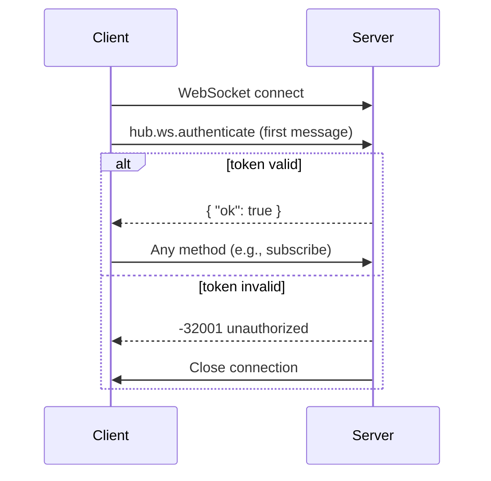
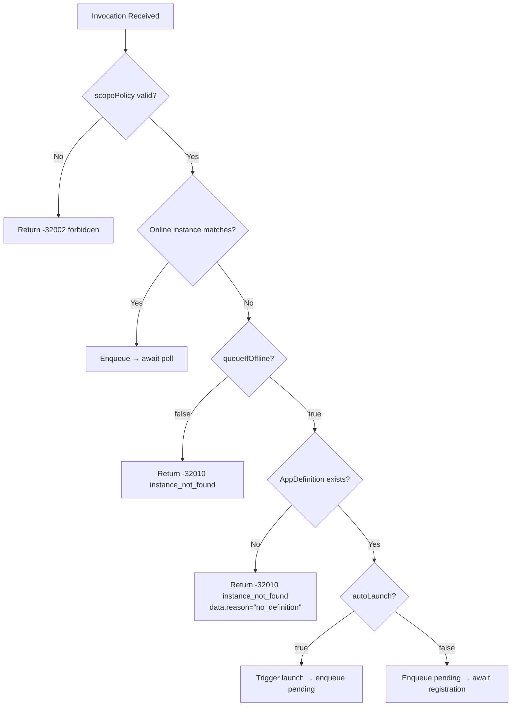
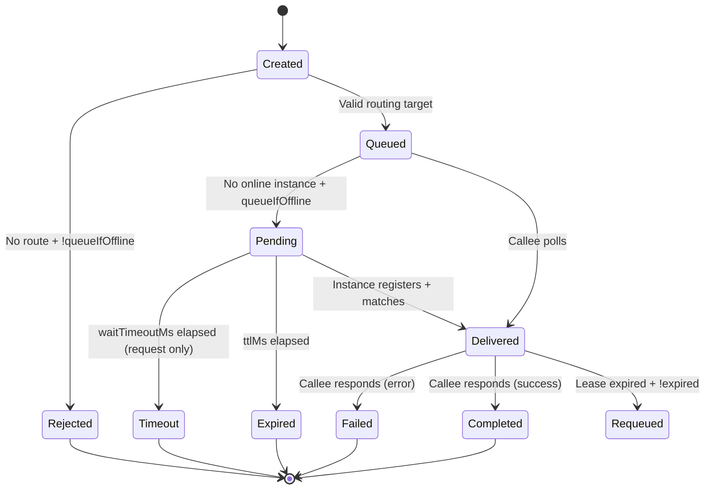

# DevHub Protocol Specification v1.0

**Status**: Final  
**Date**: 2026-01-30
**Supersedes**: DevHub_v1.md (Draft)  
**Applicability**: DevHub Hub v1.x, SDKs (any language)

---

## 1. Introduction

### 1.1 Purpose
This specification defines the protocol for DevHub — a **per-user local daemon** that enables:
- App instance registration & discovery
- Cross-tool method invocation orchestration
- Workspace isolation via `scope`
- Event subscription for UI/monitoring

### 1.2 Scope
MUST be used by:
- DevHub Hub implementation
- All language SDKs (.NET, JS/TS, etc.)
- Conformance test suites

### 1.3 Non-Goals
- Cross-machine communication
- Strong consistency guarantees
- Multi-user authorization

---

## 2. Conformance Keywords (RFC 2119)

| Keyword      | Meaning                                       |
| ------------ | --------------------------------------------- |
| **MUST**     | Required behavior; violation = non-conformant |
| **SHOULD**   | Recommended; deviation requires justification |
| **MAY**      | Optional capability                           |
| **MUST NOT** | Prohibited behavior                           |

---

## 3. Transport & Message Format

### 3.1 JSON-RPC 2.0 Baseline
All messages MUST conform to [JSON-RPC 2.0](https://www.jsonrpc.org/specification).

#### 3.1.1 Request
```json
{
  "jsonrpc": "2.0",
  "id": "string | number | null",
  "method": "string",
  "params": "object | array"
}
```
- `id` MUST be present for requests expecting a response
- `id` MAY be `null` for notifications (client → server)
- Batch requests (`array` root) MUST NOT be supported; server MUST return `-32600 invalid_request`

#### 3.1.2 Success Response
```json
{
  "jsonrpc": "2.0",
  "id": "<same as request>",
  "result": "object"
}
```

#### 3.1.3 Error Response
```json
{
  "jsonrpc": "2.0",
  "id": "<same as request, or null if unparseable>",
  "error": {
    "code": "integer",
    "message": "string",
    "data": "object (optional)"
  }
}
```

### 3.2 HTTP Transport
| Property        | Requirement                                 |
| --------------- | ------------------------------------------- |
| Endpoint        | `POST /rpc`                                 |
| `Content-Type`  | MUST be `application/json`                  |
| HTTP Status     | MUST always return `200 OK` even for errors |
| Error signaling | MUST use JSON-RPC `error` field             |

### 3.3 WebSocket Transport
| Property          | Requirement                                                                     |
| ----------------- | ------------------------------------------------------------------------------- |
| Endpoint          | `/ws`                                                                           |
| Authentication    | MUST use `hub.ws.authenticate` as first message                                 |
| Pre-auth behavior | MUST reject all methods except `hub.ws.authenticate` with `-32001 unauthorized` |
| Message format    | Same as HTTP (JSON-RPC 2.0 objects)                                             |

---

## 4. Authentication & Headers

### 4.1 HTTP Headers (MUST be present)
| Header                     | Format           | Description                                            |
| -------------------------- | ---------------- | ------------------------------------------------------ |
| `Authorization`            | `Bearer {token}` | Token from `%LOCALAPPDATA%\DevHub\runtime\token.txt`   |
| `X-DevHub-Protocol`        | `1`              | Protocol version; MUST be `1`                          |
| `X-DevHub-ClientId`        | string           | Logical client identity (`DevHubUI`, `VSPlugin`, etc.) |
| `X-DevHub-ClientSessionId` | GUID-like string | Session identifier; changes on client restart          |

### 4.2 WebSocket Authentication Flow


### 4.3 Security Boundary
- Token file (`token.txt`) MUST have OS ACL restricting to current user only (Windows: `Read` for current user only)
- Hub MUST listen ONLY on `127.0.0.1` / `localhost`
- Cross-user access MUST NOT be supported in v1

---

## 5. Data Models (with JSON Schema)

### 5.1 AppDefinition
```json
{
  "$schema": "http://json-schema.org/draft-07/schema#",
  "$id": "https://devhub.spec/v1/app-definition.json",
  "type": "object",
  "required": ["appId", "displayName", "scopePolicy"],
  "properties": {
    "appId": { "type": "string", "pattern": "^[a-z0-9][a-z0-9.-]*$" },
    "displayName": { "type": "string" },
    "description": { "type": "string" },
    "scopePolicy": { "enum": ["any", "globalOnly", "required"] },
    "capabilities": {
      "type": "object",
      "properties": {
        "rpc": { "type": "boolean" },
        "events": { "type": "boolean" }
      }
    },
    "launch": {
      "type": "object",
      "required": ["exePath"],
      "properties": {
        "exePath": { "type": "string" },
        "argsTemplate": { "type": "string" },
        "workingDirectory": { "type": "string" },
        "dedupeKeyTemplate": { "type": "string" }
      }
    }
  }
}
```

### 5.2 AppInstance
```json
{
  "$schema": "http://json-schema.org/draft-07/schema#",
  "$id": "https://devhub.spec/v1/app-instance.json",
  "type": "object",
  "required": ["instanceId", "appId", "pid", "registeredAtUtc", "lastSeenUtc", "endpoints"],
  "properties": {
    "instanceId": {
      "type": "string",
      "maxLength": 256,
      "pattern": "^[a-zA-Z0-9._:-]+$"
    },
    "appId": { "type": "string" },
    "scope": { "type": ["string", "null"] },
    "pid": { "type": "integer", "minimum": 1 },
    "registeredAtUtc": { "type": "string", "format": "date-time" },
    "lastSeenUtc": { "type": "string", "format": "date-time" },
    "endpoints": {
      "type": "object",
      "properties": {
        "poll": { "type": "boolean" },
        "respond": { "type": "boolean" }
      }
    },
    "meta": { "type": "object" }
  }
}
```

### 5.3 Invocation
```json
{
  "$schema": "http://json-schema.org/draft-07/schema#",
  "$id": "https://devhub.spec/v1/invocation.json",
  "type": "object",
  "required": ["invocationId", "appId", "target", "method", "kind", "createdAtUtc", "caller"],
  "properties": {
    "invocationId": {
      "type": "string",
      "pattern": "^invk-[0-9]{8}-[0-9]{6}$"
    },
    "appId": { "type": "string" },
    "target": {
      "type": "object",
      "properties": {
        "scope": { "type": ["string", "null"] },
        "instanceId": { "type": ["string", "null"] }
      }
    },
    "method": { "type": "string" },
    "params": { "type": "object" },
    "kind": { "enum": ["request", "notify"] },
    "createdAtUtc": { "type": "string", "format": "date-time" },
    "delivery": {
      "type": "object",
      "properties": {
        "leaseSeconds": { "type": "integer", "minimum": 1 },
        "attempt": { "type": "integer", "minimum": 1 }
      }
    },
    "caller": {
      "type": "object",
      "required": ["clientId", "clientSessionId"],
      "properties": {
        "clientId": { "type": "string" },
        "clientSessionId": { "type": "string" }
      }
    }
  }
}
```

### 5.4 Scope Rules (Normative)
| Input            | Interpretation                                   | Forbidden Values          |
| ---------------- | ------------------------------------------------ | ------------------------- |
| omitted field    | global scope                                     | —                         |
| `null`           | global scope                                     | —                         |
| non-empty string | workspace-scoped                                 | `"global"` string literal |
| **Routing rule** | MUST NOT fallback to global when scope specified | —                         |

---

## 6. RPC Methods

### 6.1 Common Response Pattern
All methods MUST return result as:
```json
{ "ok": true, ...additional fields... }
```
or error as defined in §8.

### 6.2 Method Matrix
| Method                        | HTTP | WS (post-auth)     | Idempotent | Side Effects                            |
| ----------------------------- | ---- | ------------------ | ---------- | --------------------------------------- |
| `hub.ping`                    | ✓    | ✓                  | ✓          | None                                    |
| `hub.ws.authenticate`         | ✗    | ✓ (first msg only) | ✓          | Binds client identity to WS             |
| `hub.apps.listDefinitions`    | ✓    | ✓                  | ✓          | None                                    |
| `hub.apps.getDefinition`      | ✓    | ✓                  | ✓          | None                                    |
| `hub.apps.registerInstance`   | ✓    | ✗                  | ✗          | Upserts instance; updates `lastSeenUtc` |
| `hub.apps.heartbeat`          | ✓    | ✗                  | ✓          | Updates `lastSeenUtc`                   |
| `hub.apps.unregisterInstance` | ✓    | ✗                  | ✓          | Removes instance                        |
| `hub.apps.listInstances`      | ✓    | ✓                  | ✓          | None                                    |
| `hub.apps.launch`             | ✓    | ✗                  | ✗          | Starts process (if not running)         |
| `hub.invoke.notify`           | ✓    | ✗                  | ✓          | Enqueues invocation (no wait)           |
| `hub.invoke.request`          | ✓    | ✗                  | ✗          | Enqueues + waits for response           |
| `hub.invoke.poll`             | ✓    | ✗                  | ✗          | Claims invocations (lease begins)       |
| `hub.invoke.respond`          | ✓    | ✗                  | ✗          | Completes invocation                    |
| `hub.events.subscribe`        | ✗    | ✓                  | ✗          | Creates subscription                    |
| `hub.events.unsubscribe`      | ✗    | ✓                  | ✓          | Removes subscription                    |

> **Note**: WS transport for invocation methods (`poll`/`respond`) is intentionally unsupported to avoid WS connection state complexity on callee side.

---

## 7. Invocation Lifecycle & Routing

### 7.1 Routing Decision Matrix (Normative)


### 7.2 Invocation State Machine


### 7.3 Key Timing Constraints
| Parameter        | Default (notify) | Default (request) | Constraint                |
| ---------------- | ---------------- | ----------------- | ------------------------- |
| `ttlMs`          | 60,000 ms        | 300,000 ms        | MUST be ≥ 1,000 ms        |
| `waitTimeoutMs`  | N/A              | 120,000 ms        | MUST be ≤ `ttlMs`         |
| `leaseSeconds`   | 30 s (fixed)     | 30 s (fixed)      | Assigned by Hub on `poll` |
| Online threshold | 30 s             | 30 s              | `now - lastSeenUtc ≤ 30s` |

---

## 8. Error Codes

### 8.1 Standard JSON-RPC Errors
| Code   | Condition                                  |
| ------ | ------------------------------------------ |
| -32600 | Invalid JSON-RPC structure / batch request |
| -32601 | Method not found                           |
| -32602 | Missing/invalid parameter                  |
| -32603 | Internal server error                      |

### 8.2 DevHub-Specific Errors
| Code   | Name                       | When to Return                                             | `data` Fields                                                                      |
| ------ | -------------------------- | ---------------------------------------------------------- | ---------------------------------------------------------------------------------- |
| -32001 | `unauthorized`             | Invalid/missing token                                      | `reason: "missing_token" \| "invalid_token"`                                       |
| -32002 | `forbidden`                | scopePolicy violation                                      | `reason: "scope_policy_violation"`, `policy: "globalOnly"`, `providedScope: "..."` |
| -32010 | `instance_not_found`       | No route + !queueIfOffline OR no definition for autoLaunch | `reason: "offline_no_queue" \| "no_definition"`                                    |
| -32011 | `invocation_expired`       | TTL elapsed before delivery/respond                        | `elapsedMs: number`                                                                |
| -32012 | `invocation_timeout`       | `waitTimeoutMs` elapsed (request only)                     | `elapsedMs: number`                                                                |
| -32014 | `app_definition_not_found` | Definition file missing for `appId`                        | —                                                                                  |
| -32020 | `launch_failed`            | Process start failed                                       | `exitCode: number \| null`, `stderr: string`                                       |
| -32030 | `delivery_conflict`        | Duplicate `respond` or lease violation                     | `currentLeaseHolder: string`                                                       |
| -32099 | `not_supported`            | `X-DevHub-Protocol != 1`                                   | `expected: 1`, `received: number`                                                  |

> **Note**: `-32013 instance_offline` is intentionally omitted; use `-32010` with `data.reason` for diagnostics.

---

## 9. Versioning & Compatibility

### 9.1 Version Identifier
- Protocol version is signaled via `X-DevHub-Protocol` header (HTTP) or `protocolVersion` param (WS auth)
- Current version: `1`

### 9.2 Backward Compatibility Rules
| Change Type                                           | Allowed in v1.x? | Client Impact                              |
| ----------------------------------------------------- | ---------------- | ------------------------------------------ |
| Add optional field to response                        | ✓                | MUST ignore unknown fields                 |
| Add new error code                                    | ✓                | MUST handle unknown codes as generic error |
| Add new RPC method                                    | ✓                | MAY ignore unsupported methods             |
| Change field type/semantics                           | ✗                | Breaking; requires v2                      |
| Remove field                                          | ✗                | Breaking; requires v2                      |
| Tighten validation (reject previously accepted input) | ✗                | Breaking; requires v2                      |

### 9.3 Hub Behavior on Version Mismatch
- If `X-DevHub-Protocol != 1`: MUST return `-32099 not_supported` with `data.expected=1`
- Hub MUST NOT attempt protocol negotiation

---

## 10. Conformance Test Baseline

### 10.1 Required Test Categories
| Category             | Test Count (min) | Description                                              |
| -------------------- | ---------------- | -------------------------------------------------------- |
| Discovery            | 3                | `hub.json` parsing, token validation                     |
| Authentication       | 5                | Valid/invalid token, missing headers, WS auth flow       |
| AppDefinition        | 4                | List/get with/without definitions                        |
| AppInstance          | 8                | Register/heartbeat/unregister/list with scope variations |
| Invocation (notify)  | 6                | Online/offline/queue/autoLaunch paths                    |
| Invocation (request) | 10               | Full roundtrip + timeout/lease/TTL edge cases            |
| Events               | 4                | Subscribe/unsubscribe + disconnect cleanup               |
| Error handling       | 12               | All error codes with correct `data` fields               |

### 10.2 Signature Test Vector Format
Each test vector MUST be a JSON file with:
```json
{
  "id": "invoke.request.timeout.wait_exceeds_ttl",
  "description": "waitTimeoutMs > ttlMs MUST be rejected at call time",
  "request": {
    "method": "hub.invoke.request",
    "params": {
      "appId": "test.app",
      "target": { "scope": null },
      "method": "test.ping",
      "params": {},
      "options": {
        "ttlMs": 5000,
        "waitTimeoutMs": 10000
      }
    }
  },
  "expectedResponse": {
    "error": {
      "code": -32602,
      "message": "invalid_params",
      "data": { "reason": "waitTimeoutMs must be <= ttlMs" }
    }
  },
  "tags": ["invocation", "validation", "boundary"]
}
```

### 10.3 Conformance Criteria
An implementation is conformant IFF:
1. Passes 100% of MUST-level assertions in this spec
2. Passes 100% of test vectors in the official conformance suite
3. Produces identical wire-level messages for all test vectors (byte-for-byte for responses)

---

## 11. Security Considerations

### 11.1 Threat Model (v1 Scope)
| Threat                  | Mitigation                                                                                                        |
| ----------------------- | ----------------------------------------------------------------------------------------------------------------- |
| Local user token theft  | OS ACL on `token.txt` (current user only)                                                                         |
| Cross-user access       | Listen only on `127.0.0.1`; no network exposure                                                                   |
| Malicious AppDefinition | User responsible for `%LOCALAPPDATA%\DevHub\apps\definitions\` integrity; Hub does NOT sandbox launched processes |
| Replay attacks          | Token is per-session; short-lived invocations limit impact                                                        |

### 11.2 Out of Scope (v1)
- Process sandboxing for launched apps
- Definition signing/verification
- Cross-user isolation beyond OS ACLs

---

## Appendix A: Complete JSON Schema Bundle

[Download full schema bundle (ZIP)](schemas/v1/devhub-schemas-v1.0.zip) containing:
- `app-definition.json`
- `app-instance.json`
- `invocation.json`
- `rpc-request.json`
- `rpc-response.json`
- `error-response.json`

All schemas are Draft-07 compliant and include `$id` URIs for tooling integration.

---

## Appendix B: Example Conformance Test Run

```bash
# Run official conformance suite against local Hub
devhub-conformance-cli \
  --hub-url http://127.0.0.1:47231 \
  --token-file %LOCALAPPDATA%\DevHub\runtime\token.txt \
  --suite v1.0

# Output:
PASS  discovery.hub_json_parsable
PASS  auth.missing_token_returns_unauthorized
PASS  auth.invalid_protocol_version
...
FAIL  invocation.request.timeout.wait_exceeds_ttl
      Expected error.code=-32602, got 200 with result.accepted=true
```

---

**Document Revision History**
| Version | Date       | Changes                                                  |
| ------- | ---------- | -------------------------------------------------------- |
| v1.0    | 2026-01-30 | Initial final specification; replaces DevHub_v1.md draft |

---

> This document is the sole authoritative source for DevHub v1 protocol implementation. All deviations require explicit amendment to this specification.