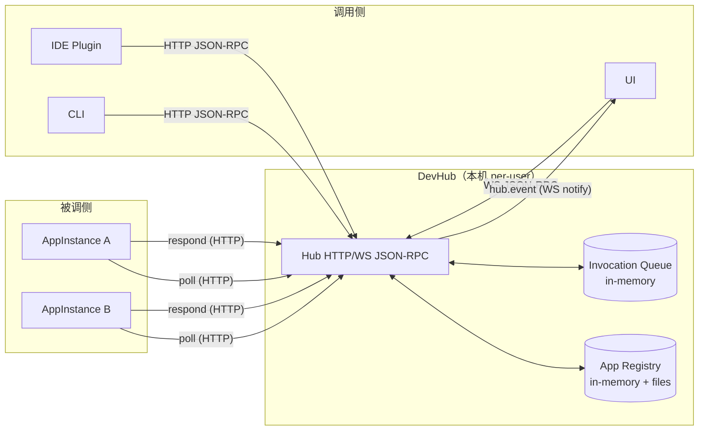

# DevHub协议与开发规划

> 状态：Draft（可进入实现）
> 目标：在 **本机 per-user** 场景下，为多个开发工具/插件/服务提供统一的：
> - 实例注册（AppInstance）与发现
> - 应用启动（auto-launch / dedupe）
> - 方法调用编排（Invocation orchestration）
> - 事件订阅与推送（Events）
>
> v1 核心原则：**能稳定跑通闭环**，**避免过度设计**。
> v1 明确不做：跨机器、强一致持久队列、分布式锁、复杂权限系统。
>
> **注意：本文档侧重于架构设计、工程实现建议与开发规划。详细的协议规范（JSON结构、错误码、时序强制要求等）请严格遵循 [Spec.md](./Spec.md)。**

---

## 目录

1. [背景与目标](#1-背景与目标)
2. [术语](#2-术语)
3. [总体架构](#3-总体架构)
4. [本机部署与发现](#4-本机部署与发现)
5. [安全模型](#5-安全模型)
6. [传输与消息格式](#6-传输与消息格式)
7. [数据模型](#7-数据模型)
8. [方法定义](#8-方法定义)
9. [路由规则](#9-路由规则)
10. [离线、排队与 autoLaunch 行为矩阵](#10-离线排队与-autolaunch-行为矩阵)
11. [事件系统](#11-事件系统)
12. [错误码规范](#12-错误码规范)
13. [实现建议（v1 必要工程细节）](#13-实现建议v1-必要工程细节)
14. [开发里程碑（更新版）](#14-开发里程碑更新版)
15. [v1 已知限制与 v2 展望](#15-v1-已知限制与-v2-展望)
16. [附录：示例](#16-附录示例)

---

## 1. 背景与目标

### 1.1 背景
在一个开发者的本机环境中，常见形态包括：
- 游戏引擎（Unity / Unreal）
- 扩展工具（任务编辑器、配置编辑器）
- CLI 工具（git hooks、资源处理器、编译/打包助手）
- UI（WPF/Avalonia/Electron/Web）

它们需要相互调用、互相发现、互相启动，并能隔离不同 workspace/分支/工程上下文（scope）。

### 1.2 v1 目标（必须实现）
- **Hub 本机常驻**（per-user），提供统一 RPC 入口（HTTP + WebSocket）。
- **AppDefinition**（静态定义）与 **AppInstance**（运行时注册）的基本闭环。
- **Invocation** 调用编排：调用方发起 -> Hub 路由 -> 被调方 poll 拉取 -> 被调方回传结果 -> Hub 转发给调用方。
- **scope 隔离**：不同 scope 不互相 fallback（避免串 workspace）。
- **Events**：订阅与推送（用于 UI/监控/调试）。

### 1.3 v1 非目标（明确不做）
- 跨机器通信 / 多机集群
- 强一致持久化队列（Hub 重启后不保证保留 pending/invocation）
- 复杂授权（RBAC、多用户共享）
- exactly-once 投递保证（v1 为 at-least-once + 幂等建议）

---

## 2. 术语

| 名称          | 含义                                                                    |
| ------------- | ----------------------------------------------------------------------- |
| Hub           | DevHub 服务进程，本机路由中枢                                           |
| Client        | 任意调用方（IDE 插件、CLI、UI）                                         |
| Callee        | 被调用方应用实例（AppInstance）                                         |
| AppDefinition | 某类应用的静态定义（如何启动、支持什么能力等）                          |
| AppInstance   | 某个已运行进程/服务的运行时实例信息                                     |
| Invocation    | 一次调用（请求/通知），可排队、可等待结果                               |
| scope         | 工作空间隔离标识（例如 `p4ws://...`、`git://...`），global 表示无 scope |
| global scope  | “不带 scope / scope 为 null”的默认范围                                  |

> 详细定义请参考 **[Spec.md §5 (Data Models)](./Spec.md#5-data-models-with-json-schema)**。

---

## 3. 总体架构



说明：
- v1 的核心投递采用 **Callee 轮询（poll）**，减少 Hub push 的连接状态复杂度。
- WS 主要用于 UI/调试/监控等需要推送的事件流。

---

## 4. 本机部署与发现

### 4.1 per-user 安装与运行原则
- Hub **每个 OS 用户 1 个**（single instance）。
- 仅监听 `127.0.0.1` / `localhost`。
- 不支持跨用户访问（默认以文件 ACL + token 保证）。

### 4.2 数据目录（Windows 参考）
> 规范定义见 **[Spec.md §4.1.1](./Spec.md#411-runtime-directory)**。

- Root：`%LOCALAPPDATA%\DevHub\`
  - `runtime\hub.json`：Hub 运行信息
  - `runtime\token.txt`：访问 token
  - `apps\definitions\*.json`：AppDefinition 文件
  - `apps\instances\*.json`：AppInstance 注册镜像（便于调试/诊断；v1 以 in-memory 为主）
  - `logs\*.log`

### 4.3 Hub 发现（Discovery）
> 规范定义见 **[Spec.md §4.1.2 (hub.json)](./Spec.md#412-hubjson-discovery-file)**。

Client 必须通过读取 `runtime\hub.json` 获取 `httpBaseUrl`、`wsUrl` 和 `protocolVersion`。

---

## 5. 安全模型

> 规范定义见 **[Spec.md §4.2 (HTTP Headers)](./Spec.md#42-http-headers-must-be-present)** 及 **[Spec.md §4.3 (WebSocket Authentication)](./Spec.md#43-websocket-authentication-flow)**。

### 5.1 核心机制
- **Token**：Hub 启动时生成随机 token 写入文件，仅当前 OS 用户可读（文件 ACL）。
- **Client Identity**：通过 Header 传递 `clientId` 和 `clientSessionId`。
- **HTTP 鉴权**：必须携带 `Authorization: Bearer {token}` 及相关 Headers。
- **WebSocket 鉴权**：连接建立后，**第一条消息必须是 `hub.ws.authenticate`**。

---

## 6. 传输与消息格式

> 规范定义见 **[Spec.md §3 (Transport & Message Format)](./Spec.md#3-transport--message-format)**。

- **协议**：JSON-RPC 2.0。
- **HTTP**：POST `{httpBaseUrl}/rpc`，始终返回 200 OK。
- **WebSocket**：`{wsUrl}`，需先认证。
- **Batch**：v1 **不支持** Batch 请求。

---

## 7. 数据模型

> 规范定义与 Schema 见 **[Spec.md §5 (Data Models)](./Spec.md#5-data-models-with-json-schema)**。

### 7.1 核心模型
- **AppDefinition**：静态定义（`appId`, `launch` 配置与能力开关）。
- **AppInstance**：运行时实例（`instanceId`, `pid`, `invoke` 能力开关）。
- **Invocation**：调用对象（`invocationId`, `target`, `method`, `options`, `delivery`）。

### 7.2 Scope 策略
> 规则详见 **[Spec.md §5.5 (Scope Rules)](./Spec.md#55-scope-rules-normative)**。

- **Global**：`scope` 为 null 或 omitted。
- **Scoped**：`scope` 为非空字符串。
- **默认作用域原则**：调用请求未指定 `target.scope`（null/omitted）时，仅允许命中 Global 实例。
- **显式作用域原则**：调用请求指定 `target.scope`（非空字符串）时，仅允许命中该作用域，且找不到时禁止 fallback 到 Global。
- **非法值原则**：`scope` 或 `target.scope` 为 `""` 或 `"global"` 字符串时，必须按 `invalid_params (-32602)` 处理。

---

## 8. 方法定义

> 完整 API 定义、参数与返回值见 **[Spec.md §6 (RPC Methods)](./Spec.md#6-rpc-methods)**。

### 8.1 基础与管理
- `hub.ping`
- `hub.ws.authenticate` (WS only)
- `hub.apps.listDefinitions` / `getDefinition`
- `hub.apps.registerInstance` / `unregisterInstance` / `heartbeat` / `listInstances`

### 8.2 启动与调用
- `hub.apps.launch`
- `hub.invoke.notify` (Fire-and-forget)
- `hub.invoke.request` (Request-Response)
- `hub.invoke.poll` (Callee 拉取)
- `hub.invoke.respond` (Callee 回复)

---

## 9. 路由规则

> 规范定义见 **[Spec.md §7.1 (Routing Decision Matrix)](./Spec.md#71-routing-decision-matrix-normative)**。

Hub 依据 `appId`、`target.scope` 和 `target.instanceId` 将 Invocation 路由至在线实例或进入 Pending 队列。

---

## 10. 离线、排队与 autoLaunch 行为矩阵

> 规范定义见 **[Spec.md §7.1 (Routing Decision Matrix)](./Spec.md#71-routing-decision-matrix-normative)** 及 **[Spec.md §7.2 (Invocation State Machine)](./Spec.md#72-invocation-state-machine)**。

行为由 `options.queueIfOffline` 和 `options.autoLaunch` 控制。
- 若无在线实例且 `queueIfOffline=true`：进入 Pending 队列。
- 若同时 `autoLaunch=true` 且存在 AppDefinition：触发启动流程。
- 若无 AppDefinition：**不得进入 Pending 队列**，必须返回 `instance_not_found`（详见 Spec）。

---

## 11. 事件系统

> 规范定义见 **[Spec.md §6.3.14+ (Events)](./Spec.md#6314-hubeventssubscribe-ws-only)**。

- **订阅**：`hub.events.subscribe` / `unsubscribe`。
- **推送**：`hub.event` 通知。
- **生命周期**：Subscription 绑定 WS 连接，断开自动清理。

---

## 12. 错误码规范

> 规范定义见 **[Spec.md §8 (Error Codes)](./Spec.md#8-error-codes)**。

- 标准 JSON-RPC 错误（-326xx, -32700）。
- DevHub 自定义错误（-320xx），如 `unauthorized`, `forbidden`, `instance_not_found`, `invocation_timeout` 等。

---

## 13. 实现建议（v1 必要工程细节）

> 本节是“必须考虑的工程落点”，用于指导 Hub 的具体实现，需确保数值与逻辑符合 **[Spec.md §7.3 (Key Timing Constraints)](./Spec.md#73-key-timing-constraints)**。

### 13.1 并发与取消
- `invoke.request` 内部等待建议用 `TaskCompletionSource` + `CancellationToken`。
- 当 HTTP 请求被客户端取消（连接断开）：
  - 必须取消等待并清理 waiter（避免内存泄露）。
- 建议限制：
  - `maxWaitingRequestsPerClient`（例如 200）。
  - `maxPendingInvocationsTotal`（例如 5000）。
  - 超限返回 `internal_error` 或专用 `rate_limited`。

### 13.2 poll 的长轮询实现
- `hub.invoke.poll` 的 `waitMs` 在服务端用异步等待（不要阻塞线程）。
- wait 到期返回空数组。
- poll 也是心跳的一部分（见 lastSeen）。

### 13.3 lastSeen 更新时间规则
> 判定阈值遵循 **Spec.md §7.3**（30s）。

Hub 在以下任一事件发生时更新 `AppInstance.lastSeenUtc`：
- `registerInstance`
- `heartbeat`
- `invoke.poll`（只要 poll 成功到达 Hub，就算空列表也更新）
- `invoke.respond`

### 13.4 文件写入原子性
- `runtime\hub.json`、`instances\*.json` 等建议使用：
  - 写临时文件 + 原子 rename/replace。
- 避免半写入导致 discovery/诊断读取失败。

### 13.5 单实例（single instance）
- Windows 建议使用 Mutex：`Global\DevHub_{UserSid}` 或 `Local\DevHub_{UserSid}`。
- 若已有实例运行：
  - 新进程退出或转为“客户端模式”提示如何连接（可选）。

### 13.6 Invocation Lease 与重投递
> Lease 时长遵循 **Spec.md §7.3**（30s）。

- Hub 在 `invoke.poll` 返回时为每条 invocation 生成 lease。
- lease 期间仅分配给该 instance；到期仍未 `respond` 且未过期时，放回队列并 `attempt++`。
- `invoke.request` 达到 `waitTimeoutMs`：Hub 返回 `invocation_timeout` 并终止该 invocation。
- 若 invocation 已完成：后续 `respond` 返回 `delivery_conflict`。

### 13.7 launch 去重生命周期
> Dedupe window 遵循 **Spec.md §7.3**（30s）。

- Hub 对 `dedupeKey` 维护 launching 记录。
- launching 期间重复 `launch`：返回 `already_running`（复用同一 `launchId`）。
- 若在窗口内观察到匹配实例注册：状态转为 running。
- 窗口到期仍未注册：清理 dedupe 记录，允许再次启动。

---

## 14. 开发里程碑（更新版）

### 14.1 里程碑概览

| Milestone | 目标                               | 交付物                                                                                        | 备注               |
| --------- | ---------------------------------- | --------------------------------------------------------------------------------------------- | ------------------ |
| M0        | 文档冻结 + Spec v0                 | 本规划文档 + **Spec.md**                                                                      | 本文档即为 M0 产物 |
| M1        | Hub（HTTP）基础能力 + Spec v1 冻结 | `/rpc`、token、client headers、apps definitions/instances、TTL/lastSeen + Spec v1（协议定稿） | WS 可先不做        |
| M2        | Invocation 闭环（HTTP）            | invoke.notify/request/poll/respond、离线矩阵、autoLaunch、launch dedupe                       | v1 核心            |
| M3        | Scope 路由一致性与隔离完善         | 默认 Global 路由、显式 Scope 不回退、非法 scope 校验、测试用例                                |                    |
| M4        | WebSocket（认证 + events）         | `/ws`、hub.ws.authenticate、subscribe/unsubscribe、hub.event 推送                             | UI/监控可接入      |
| M5        | SDK（.NET + JS/TS）                | .NET SDK、JS/TS SDK、签名测试向量、契约测试                                                   | Spec 已前置        |
| M6        | 治理与诊断增强（可选）             | 指标、日志、dump、限流配置                                                                    | 不阻塞 v1          |

### 14.2 里程碑验收清单（最小可验收）
**M0**
- 本规划文档冻结；**Spec.md** 冻结；核心数据模型与 RPC 契约进入可评审状态。

**M1**
- 启动 Hub 生成 `runtime/hub.json` 与 `runtime/token.txt`。
- `hub.ping` 返回 ok；缺 token 返回 `unauthorized`。
- `hub.apps.listDefinitions` 能读取 `apps/definitions/*.json`。
- `hub.apps.registerInstance` 后可 `listInstances` 看到；`lastSeen` 更新。
- 实现行为符合 **Spec.md** 要求。

**M2**
- `invoke.request`：caller -> hub -> callee poll -> respond -> caller 收到结果。
- `invoke.notify`：可入队并被 poll 取走。
- `queueIfOffline + autoLaunch` 能触发 `hub.apps.launch`，注册后投递。
- lease 到期可重投递；TTL 到期返回 `invocation_expired`。

**M3**
- register/launch/invoke 在 `scope` 解释上统一遵循 Spec §5.5。
- 调用未指定 `target.scope` 时仅命中 Global；指定时仅命中显式 Scope 且禁止 fallback 到 Global。

**M4**
- WS 必须先 `hub.ws.authenticate`；未认证调用返回 `unauthorized`。
- `subscribe/unsubscribe` 可用；断线自动清理订阅。
- 事件覆盖注册、投递、完成/失败。

**M5**
- 基于 **Spec.md** 完成 .NET SDK 与 JS/TS SDK。
- 通过 Hub↔SDK 契约测试（正向/异常/兼容性场景）。

---

## 15. v1 已知限制与 v2 展望

### 15.1 v1 限制
- Hub 重启会丢失：
  - pending invocations
  - request 等待中的 TCS 状态
- 投递语义为 **at-least-once**：
  - 若 callee 取到 invocation 后崩溃，可能被重新投递（取决于 lease/实现）
- Events 不支持重放：断线期间事件丢失

### 15.2 v2 可能增强
- pending/invocation 持久化（轻量本地 KV）
- delivery ack + 更明确 lease 机制
- events replay（按 subscription 游标）
- 更细粒度的权限模型（若出现多用户共享需求）

---

## 16. 附录：示例

### 16.1 HTTP 调用示例（curl）
```bash
curl -X POST "http://127.0.0.1:47231/rpc" ^
  -H "Content-Type: application/json" ^
  -H "Authorization: Bearer <token>" ^
  -H "X-DevHub-Protocol: 1" ^
  -H "X-DevHub-ClientId: CLI" ^
  -H "X-DevHub-ClientSessionId: 2f7d..." ^
  -d "{\"jsonrpc\":\"2.0\",\"id\":\"1\",\"method\":\"hub.apps.listDefinitions\",\"params\":{}}"
```

### 16.2 WS 认证 + 订阅示例（伪代码）
```js
const ws = new WebSocket("ws://127.0.0.1:47231/ws");

ws.onopen = () => {
  // 必须第一条：authenticate
  ws.send(JSON.stringify({
    jsonrpc: "2.0",
    id: "1",
    method: "hub.ws.authenticate",
    params: {
      token: "<token>",
      protocolVersion: 1,
      clientId: "DevHubUI",
      clientSessionId: "a1b2c3..."
    }
  }));
};

ws.onmessage = (e) => {
  const msg = JSON.parse(e.data);

  // authenticate ok 后再 subscribe
  if (msg.id === "1" && msg.result?.ok) {
    ws.send(JSON.stringify({
      jsonrpc: "2.0",
      id: "2",
      method: "hub.events.subscribe",
      params: { types: ["invocation.completed", "app.instance.registered"] }
    }));
  }

  // event push
  if (msg.method === "hub.event") {
    console.log("event:", msg.params);
  }
};
```

---

## 17. 当前里程碑状态（截至 2026-03-09）

- 当前分支：`m5`。
- M0：已完成。
- M1：已完成。
- M2：已完成。
- M3：已完成。
- M4：已完成（`/ws`、`hub.ws.authenticate`、`hub.events.subscribe/unsubscribe`、`hub.event` 事件推送已落地，当前分支白盒/黑盒回归通过）。
- M5：进行中（`.NET SDK` 子范围已完成 runtime discovery、HTTP JSON-RPC、WebSocket events、统一错误模型、依赖注入工厂接入、打包元数据与 SDK 白盒/黑盒测试；JS/TS SDK 与 conformance 资产尚未创建）。
- 2026-03-08 已验证：`dotnet build src/DevHub.slnx -c Release`、`dotnet test src/DevHub.slnx -c Release --no-build`、`python3 tests/test_runner.py --smoke --no-header`、`python3 tests/test_runner.py --full --no-header` 均可通过。
- 2026-03-09 已验证：`dotnet test sdks/dotnet/DevHub.DotNetSdk.slnx -c Release`、`dotnet pack sdks/dotnet/src/DevHub.Sdk/DevHub.Sdk.csproj -c Release -o temp/sdk-pack` 可通过；在本地 Host 运行时，`python3 tests/test_runner.py --smoke --no-header` 可通过。
