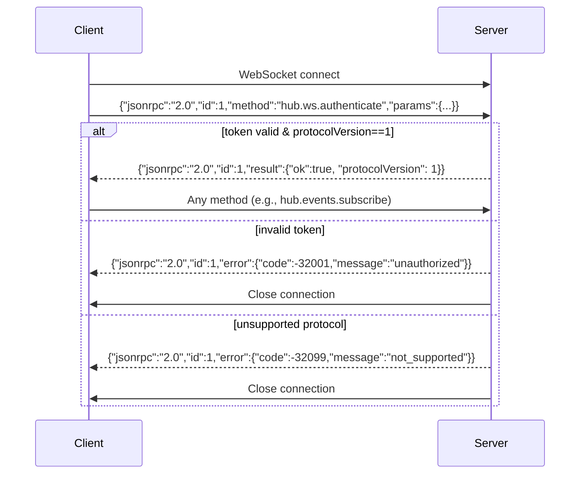
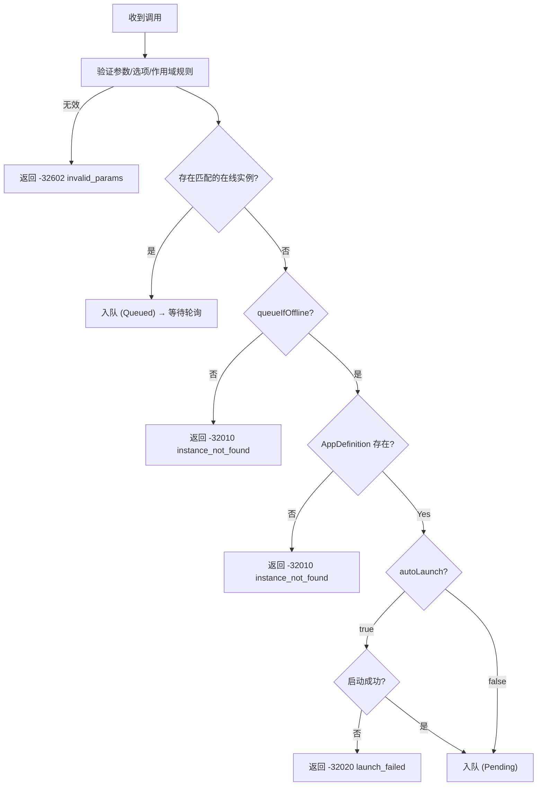
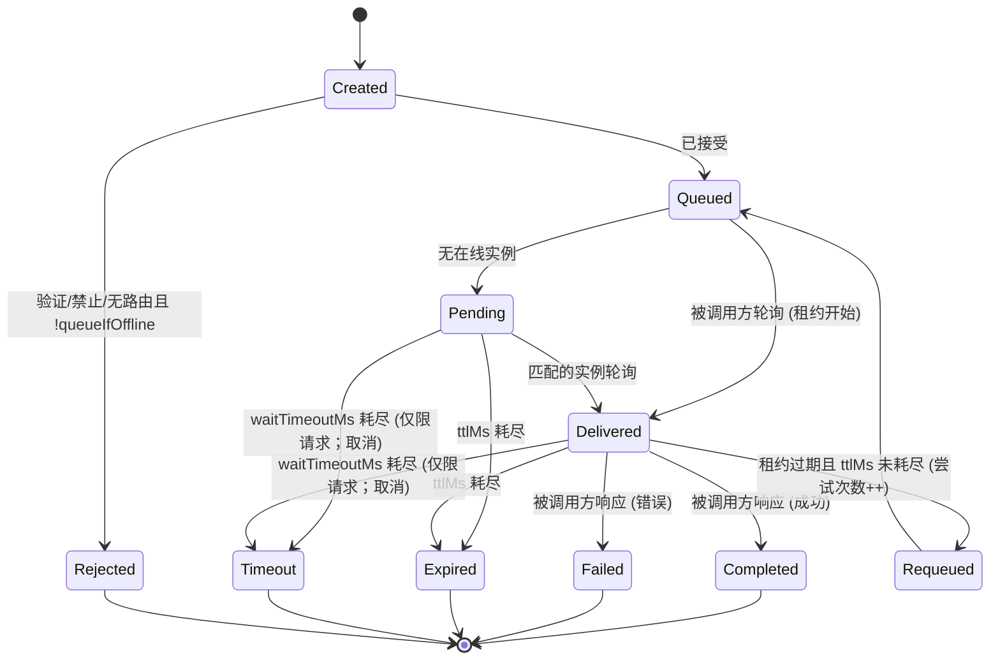

# DevHub 协议规范 v1.0.1

**状态**：最终版
**日期**：2026-01-31
**适用范围**：DevHub Hub v1.x, SDKs（任意语言）

---

## 1. 引言

### 1.1 目的
本规范定义了 DevHub 的协议 —— 一个**per-user本地守护进程**，用于实现：
- 注册与发现应用实例
- 编排跨工具方法调用
- 由 `scope` 实现的工作区隔离
- 用于 UI/监控 的事件订阅

### 1.2 范围
**必须**由以下项使用：
- DevHub Hub 实现
  - 简单身份验证
- 所有语言 SDK（.NET, JS/TS 等）
- 符合性测试套件

### 1.3 非目标
- 跨机器通信
- 强一致性保证
- 多用户授权
- 复杂身份验证

---

## 2. 符合性关键字 (RFC 2119)

| 关键字                  | 含义                             |
| ----------------------- | -------------------------------- |
| **必须** (**MUST**)     | 强制性行为；违反即视为不符合规范 |
| **应该** (**SHOULD**)   | 推荐行为；偏离需有正当理由       |
| **可以** (**MAY**)      | 可选功能                         |
| **禁止** (**MUST NOT**) | 禁止的行为                       |

---

## 3. 传输与消息格式

### 3.1 JSON-RPC 2.0 基准
所有消息**必须**符合 [JSON-RPC 2.0](https://www.jsonrpc.org/specification) 规范，且**必须**为 UTF-8 编码的 JSON 文本。

#### 3.1.1 请求
```json
{
  "jsonrpc": "2.0",
  "id": "string | number",
  "method": "string",
  "params": "object | array (optional)"
}
```

- 期望响应的请求**必须**包含 `id`，且**必须**为 **string** 或 **number**。
- 通知**必须省略** `id`（即**禁止**存在 `id` 字段）。
  - **禁止**使用 `"id": null` 作为“通知标记”。
- `params` **可以**省略。
- **禁止**支持批量请求（以 `array` 为根）。
  - 如果输入的 JSON 根是数组，Hub **必须**返回一个**单一**的 JSON-RPC 错误响应：
    - `error.code = -32600` (`invalid_request`)
    - `id = null`

#### 3.1.2 通知（客户端 → 服务端 或 服务端 → 客户端 在 WS 上）
```json
{
  "jsonrpc": "2.0",
  "method": "string",
  "params": "object | array (optional)"
}
```

#### 3.1.3 成功响应
```json
{
  "jsonrpc": "2.0",
  "id": "<与请求相同>",
  "result": "object"
}
```
- 所有 `hub.*` 方法的 `result` **必须**是一个 JSON 对象。

#### 3.1.4 错误响应
```json
{
  "jsonrpc": "2.0",
  "id": "<与请求相同，若无法解析则为 null>",
  "error": {
    "code": "integer",
    "message": "string",
    "data": "object (optional)"
  }
}
```
- 如果请求不是可解析的 JSON，Hub **必须**返回 `-32700 parse_error` 和 `id: null`。

---

### 3.2 HTTP 传输

| 属性            | 要求                                            |
| --------------- | ----------------------------------------------- |
| 端点 (Endpoint) | `POST /rpc`（基础 URL 来自 `hub.json`）         |
| `Content-Type`  | **必须**为 `application/json`（允许指定字符集） |
| HTTP 状态码     | 即使发生错误也**必须**始终返回 `200 OK`         |
| 错误信号        | **必须**使用 JSON-RPC 的 `error` 字段           |

---

### 3.3 WebSocket 传输

| 属性            | 要求                                                                       |
| --------------- | -------------------------------------------------------------------------- |
| 端点 (Endpoint) | 连接到 `hub.json` 中的 `wsUrl`（原样使用）                                 |
| 身份验证        | **必须**使用 `hub.ws.authenticate` 作为第一条消息                          |
| 鉴权前行为      | 当**存在** `id` 时，**必须**拒绝所有非鉴权方法并返回 `-32001 unauthorized` |
| 消息格式        | JSON-RPC 2.0 对象；服务端可在鉴权后发送通知                                |

**鉴权前处理顺序（规范性）**：
1. Hub **必须**解析 JSON 文本。
   - 解析失败：返回 `-32700 parse_error` 且 `id: null`（随后**可以**关闭连接）。
2. Hub **必须**验证 JSON-RPC 信封结构。
   - 若无效：返回 `-32600 invalid_request`（无法确定 `id` 时使用 `id: null`；随后**可以**关闭）。
3. 如果消息是 `method != hub.ws.authenticate` 的 JSON-RPC 请求/通知且连接未通过鉴权：
   - 如果存在 `id`：返回 `-32001 unauthorized`。
   - 如果不存在 `id`（通知）：Hub **必须**关闭连接（因为无法发送 JSON-RPC 错误响应）。

---

## 4. 运行时发现、身份验证与安全边界

### 4.1 运行时文件与发现（规范性）

#### 4.1.1 运行时数据根目录

**路径分隔符约定**：本文档中的路径示例统一使用 `/` 作为分隔符。Windows 平台实现时应将 `/` 替换为 `\`（例如 `C:/Users/me/...` → `C:\Users\me\...`）。

Host 与 SDK **必须**按以下优先级解析数据根目录：
1. 显式配置的数据根目录参数（若该实现提供此能力）。
2. 环境变量 `DEVHUB_DATA_DIR`。
3. 平台默认数据根目录。

标准目录布局固定如下：

```text
${dataDir}/
├── runtime/
│   ├── hub.json
│   └── token.txt
├── apps/
│   ├── definitions/
│   └── instances/
└── logs/
```

| 平台        | 建议运行时数据根目录                              | 完整路径（供参考）                     |
| :---------- | :---------------------------------------------- | :------------------------------------- |
| **Windows** | `%LOCALAPPDATA%/DevHub/`                        | `<User>/AppData/Local/DevHub/`         |
| **macOS**   | `~/Library/Application Support/DevHub/`         | 与标准路径相同                         |
| **Linux**   | `$XDG_DATA_HOME/DevHub/`                        | `~/.local/share/DevHub/`               |

规范性要求：
- 单实例粒度**必须**为“当前 OS 用户 + 规范化后的 `${dataDir}`”；同一用户在同一 `${dataDir}` 下只允许一个 Host，不同 `${dataDir}` 可并行运行。

#### 4.1.2 `hub.json`（发现文件）
Hub **必须**在 `${dataDir}/runtime/hub.json` 写入发现文件。该文件**必须**符合 §5.4 定义的 `HubRuntime` 架构。

示例：
```json
{
  "protocolVersion": 1,
  "hubVersion": "1.0.1",
  "pid": 47231,
  "httpBaseUrl": "http://127.0.0.1:47231",
  "wsUrl": "ws://127.0.0.1:47231/ws",
  "tokenFile": "C:/Users/me/AppData/Local/DevHub/runtime/token.txt",
  "startedAtUtc": "2026-01-30T12:34:56Z",
  "runtimeTuning": {
    "leaseSeconds": 30,
    "onlineThresholdSeconds": 30,
    "launchDedupeWindowSeconds": 30
  }
}
```

规范性要求：
- 本规范的 `protocolVersion` **必须**为 `1`。
- 本次目录约定调整**不得**修改 `hub.json` 字段集合；Host 与客户端 **必须**继续使用 §5.4 定义的既有架构，**不得**引入新的发现字段。
- `httpBaseUrl` **禁止**包含末尾斜杠。
- `wsUrl` **必须**是 WebSocket 绝对 URL （`ws://` 或 `wss://`）且**禁止**包含末尾斜杠。
- `httpBaseUrl` 和 `wsUrl` **必须**指向回环地址（`127.0.0.1` 和/或 `localhost`；实现也**可以**额外使用 `::1`）。
- `tokenFile` **必须**是绝对路径。
- `runtimeTuning` **必须**存在，且 `leaseSeconds`、`onlineThresholdSeconds`、`launchDedupeWindowSeconds` **必须**为大于等于 1 的整数；未显式配置时默认值均为 `30`。
- Hub **必须**原子化地更新 `hub.json`（先写临时文件再替换）以避免读取不完整。
- `hub.json` **必须**具有 OS ACL，限制仅当前用户可访问。
- 客户端**必须**将 `hub.json` 作为权威端点来源，**禁止**假设固定的端口或固定的 WS 路径。

#### 4.1.3 `token.txt`
- 默认位置：`${dataDir}/runtime/token.txt`（也可通过 `hub.json.tokenFile` 发现）
- 文件内容：单个持有者令牌 (bearer token) 字符串（UTF-8 文本）。客户端读取时**应该**修剪末尾的 `\r\n` 和空白字符。
- 令牌有效期：令牌**应该**在 Hub 启动时重新生成（“每个 Hub 会话一次”）。旧令牌**必须**被拒绝。

#### 4.1.4 AppDefinition 存储 (v1)
- 默认位置：`${dataDir}/apps/definitions/`
- 定义目录**必须**由 `${dataDir}` 固定派生，不提供独立覆盖环境变量。
- 每个定义**必须**是一个名为 `{appId}.json` 的 JSON 文件，且**必须**符合 `AppDefinition` 架构 (§5.1)。
- Hub **必须**忽略不符合命名规则或未通过架构验证的文件（并**应该**记录诊断日志）。

#### 4.1.5 AppInstance 镜像目录 (v1)
- 默认位置：`${dataDir}/apps/instances/`
- 实例镜像目录**必须**由 `${dataDir}` 固定派生，不提供独立覆盖环境变量。
- 当前 v1 仅对目录路径本身建立约定；目录内部文件布局属于 Hub 内部实现，客户端**禁止**依赖其内部结构作为公开契约。

> 注意：符合性测试假设使用平台默认值，除非显式配置了 `DEVHUB_DATA_DIR` 或等价的数据根目录参数。

---

### 4.2 HTTP 请求头（**必须**存在）

| 请求头                     | 格式             | 描述                                                                    |
| -------------------------- | ---------------- | ----------------------------------------------------------------------- |
| `Authorization`            | `Bearer {token}` | 从 `hub.json.tokenFile`（或默认的 `${dataDir}/runtime/token.txt`）读取的令牌 |
| `X-DevHub-Protocol`        | `"1"`            | 协议版本；HTTP 请求头值为字符串；**必须**精确为 `"1"`                   |
| `X-DevHub-ClientId`        | string           | 逻辑客户端身份（如 `DevHubUI`, `VSPlugin` 等）                          |
| `X-DevHub-ClientSessionId` | UUID string      | RFC 4122 UUID；**必须**在客户端重启时更改                               |

缺失/无效请求头的处理方式：
- 缺失/无效 `Authorization`：返回 `-32001 unauthorized`
- 缺失/无效 `X-DevHub-Protocol`：返回 `-32099 not_supported`
- 缺失 `X-DevHub-ClientId` 或 `X-DevHub-ClientSessionId`：返回 `-32600 invalid_request` 且 `error.data.reason="missing_header"`

---

### 4.3 WebSocket 身份验证流程

`hub.ws.authenticate` **必须**是第一条 WS 消息，且**必须**是一个 JSON-RPC 请求（即包含 `id`）。



---

### 4.4 安全边界
- Hub **必须**仅监听回环地址（`127.0.0.1` / `localhost` 和/或 `::1`）。
- v1 **禁止**跨用户访问（令牌是边界）。
- §4.1.2 和 §4.1.3 中关于 `token.txt` 和 `hub.json` 的文件 ACL 要求是规范性的。

---

## 5. 数据模型（含 JSON Schema）

### 5.1 AppDefinition
```json
{
  "$schema": "http://json-schema.org/draft-07/schema#",
  "$id": "https://devhub.spec/v1/app-definition.json",
  "type": "object",
  "required": ["appId", "displayName"],
  "properties": {
    "appId": { "type": "string", "pattern": "^[a-z0-9][a-z0-9.-]*$" },
    "displayName": { "type": "string" },
    "description": { "type": "string" },
    "capabilities": {
      "type": "object",
      "properties": {
        "rpc": { "type": "boolean" },
        "events": { "type": "boolean" }
      }
    },
    "launch": {
      "type": "object",
      "required": ["exePath"],
      "properties": {
        "exePath": { "type": "string" },
        "argsTemplate": { "type": "string" },
        "workingDirectory": { "type": "string" },
        "dedupeKeyTemplate": { "type": "string" }
      }
    }
  }
}
```

#### 5.1.1 AppDefinition 语义（规范性）
- `AppDefinition` 不定义作用域白名单或强制模式；`scope` 的解释与路由行为统一由 §5.5 定义。
- 如果省略 `capabilities` 或 `capabilities.rpc`，默认值为 `true`。
  - 如果 `AppDefinition` 存在且 `capabilities.rpc` 为 `false`，Hub **必须**拒绝该 `appId` 的 `hub.invoke.notify` 和 `hub.invoke.request` 调用，返回 `-32002 forbidden` 且 `error.data.reason="rpc_disabled"`。
- `capabilities.events` 保留供未来使用；在 v1 中，Hub **必须**忽略它。

---

### 5.2 AppInstance
```json
{
  "$schema": "http://json-schema.org/draft-07/schema#",
  "$id": "https://devhub.spec/v1/app-instance.json",
  "type": "object",
  "required": ["instanceId", "appId", "pid", "registeredAtUtc", "lastSeenUtc", "invoke"],
  "properties": {
    "instanceId": {
      "type": "string",
      "maxLength": 256,
      "pattern": "^[a-zA-Z0-9._:-]+$"
    },
    "appId": { "type": "string" },
    "scope": { "type": ["string", "null"] },
    "pid": { "type": "integer", "minimum": 1 },
    "registeredAtUtc": { "type": "string", "format": "date-time" },
    "lastSeenUtc": { "type": "string", "format": "date-time" },
    "invoke": {
      "type": "object",
      "required": ["poll", "respond"],
      "properties": {
        "poll": { "type": "boolean" },
        "respond": { "type": "boolean" }
      }
    },
    "meta": { "type": "object" }
  }
}
```

#### 5.2.1 AppInstanceRegistration（规范性）
`hub.apps.registerInstance.params.instance` **必须**符合以下结构（省略服务端管理的时间戳）：

```json
{
  "$schema": "http://json-schema.org/draft-07/schema#",
  "$id": "https://devhub.spec/v1/app-instance-registration.json",
  "type": "object",
  "required": ["instanceId", "appId", "pid", "invoke"],
  "properties": {
    "instanceId": {
      "type": "string",
      "maxLength": 256,
      "pattern": "^[a-zA-Z0-9._:-]+$"
    },
    "appId": { "type": "string" },
    "scope": { "type": ["string", "null"] },
    "pid": { "type": "integer", "minimum": 1 },
    "invoke": {
      "type": "object",
      "required": ["poll", "respond"],
      "properties": {
        "poll": { "type": "boolean" },
        "respond": { "type": "boolean" }
      }
    },
    "meta": { "type": "object" }
  }
}
```

---

### 5.3 Invocation
```json
{
  "$schema": "http://json-schema.org/draft-07/schema#",
  "$id": "https://devhub.spec/v1/invocation.json",
  "type": "object",
  "required": ["invocationId", "appId", "target", "method", "kind", "createdAtUtc", "caller"],
  "properties": {
    "invocationId": {
      "type": "string",
      "maxLength": 256,
      "pattern": "^invk-[a-zA-Z0-9._:-]+$"
    },
    "appId": { "type": "string" },
    "target": {
      "type": "object",
      "properties": {
        "scope": { "type": ["string", "null"] },
        "instanceId": { "type": ["string", "null"] }
      }
    },
    "method": { "type": "string" },
    "args": {
      "description": "Any valid JSON value is allowed (object/array/string/number/boolean/null)."
    },
    "kind": { "type": "string", "enum": ["request", "notify"] },
    "createdAtUtc": { "type": "string", "format": "date-time" },
    "options": {
      "type": "object",
      "properties": {
        "ttlMs": { "type": "integer", "minimum": 1000 },
        "waitTimeoutMs": { "type": "integer", "minimum": 1 },
        "queueIfOffline": { "type": "boolean" },
        "autoLaunch": { "type": "boolean" }
      }
    },
    "delivery": {
      "type": "object",
      "properties": {
        "leaseSeconds": { "type": "integer", "minimum": 1 },
        "attempt": { "type": "integer", "minimum": 1 }
      }
    },
    "caller": {
      "type": "object",
      "required": ["clientId", "clientSessionId"],
      "properties": {
        "clientId": { "type": "string" },
        "clientSessionId": { "type": "string" }
      }
    }
  }
}
```

---

### 5.4 HubRuntime (`hub.json`)
```json
{
  "$schema": "http://json-schema.org/draft-07/schema#",
  "$id": "https://devhub.spec/v1/hub-runtime.json",
  "type": "object",
  "required": ["protocolVersion", "pid", "httpBaseUrl", "wsUrl", "tokenFile", "startedAtUtc", "runtimeTuning"],
  "properties": {
    "protocolVersion": { "type": "integer", "enum": [1] },
    "hubVersion": { "type": "string" },
    "pid": { "type": "integer", "minimum": 1 },
    "httpBaseUrl": { "type": "string", "format": "uri" },
    "wsUrl": { "type": "string", "format": "uri" },
    "tokenFile": { "type": "string" },
    "startedAtUtc": { "type": "string", "format": "date-time" },
    "runtimeTuning": {
      "type": "object",
      "required": ["leaseSeconds", "onlineThresholdSeconds", "launchDedupeWindowSeconds"],
      "properties": {
        "leaseSeconds": { "type": "integer", "minimum": 1 },
        "onlineThresholdSeconds": { "type": "integer", "minimum": 1 },
        "launchDedupeWindowSeconds": { "type": "integer", "minimum": 1 }
      }
    }
  }
}
```

---

### 5.5 作用域 (Scope) 规则（规范性）

- **SCOPE-01（App 生效作用域）**：对于 `hub.apps.registerInstance` 与 `hub.apps.launch` 的 `scope` 字段，省略、`null` 或 `""` 时生效为 Global；为非空字符串时生效为该字符串对应作用域（包括字面量 `"global"`）。
- **SCOPE-02（调用默认作用域）**：对于 `hub.invoke.notify` 与 `hub.invoke.request` 的 `target.scope`，省略、`null` 或 `""` 时，Hub **必须**仅在 Global 作用域内匹配与投递，**禁止**命中任何非 Global 作用域实例。
- **SCOPE-03（调用显式作用域）**：当 `target.scope` 为非空字符串时，Hub **必须**仅路由到该字符串对应作用域；若不存在匹配实例，**禁止**回退到 Global。
- **SCOPE-04（非法值）**：`scope` 或 `target.scope` 若存在且类型不是 `string|null`，Hub **必须**返回 `-32602 invalid_params`。
- **SCOPE-05（匹配规则）**：非空字符串作用域 **必须**按区分大小写的精确匹配处理。

---

## 6. RPC 方法

### 6.1 约定（规范性）
- 所有 `hub.*` 方法**必须**使用**对象**参数（具名参数）。如果参数是数组，Hub **必须**返回 `-32602 invalid_params`。
- `hub.invoke.notify` / `hub.invoke.request` 的 `args` **可以**是任意 JSON 值（`object | array | string | number | boolean | null`）。
- 对于所有成功的 `hub.*` 调用，`result` **必须**是一个至少包含以下内容的 JSON 对象：
  ```json
  { "ok": true }
  ```
  **可以**包含额外字段。
- 所有错误**必须**使用 §8 定义的 JSON-RPC `error` 对象返回。

**术语（规范性）**：
- “指定了 `target.scope`” 指 `target.scope` 是一个**非空字符串**（且**必须**符合 §5.5 验证）。
- “指定了 `target.instanceId`” 指 `target.instanceId` 是一个**非 null 字符串**。
  - 空字符串**应该**被拒绝并返回 `-32602 invalid_params`。

### 6.2 方法矩阵

| 方法                          | HTTP | WS (鉴权后)      | 重试安全* | 副作用                            |
| ----------------------------- | ---- | ---------------- | --------- | --------------------------------- |
| `hub.ping`                    | ✓    | ✓                | ✓         | 无                                |
| `hub.ws.authenticate`         | ✗    | ✓ (仅限首条消息) | ✓         | 将客户端身份绑定到 WS             |
| `hub.apps.listDefinitions`    | ✓    | ✓                | ✓         | 无                                |
| `hub.apps.getDefinition`      | ✓    | ✓                | ✓         | 无                                |
| `hub.apps.registerInstance`   | ✓    | ✗                | ✗         | 更新/插入实例；更新 `lastSeenUtc` |
| `hub.apps.heartbeat`          | ✓    | ✗                | ✓         | 更新 `lastSeenUtc`                |
| `hub.apps.unregisterInstance` | ✓    | ✗                | ✓         | 移除实例                          |
| `hub.apps.listInstances`      | ✓    | ✓                | ✓         | 无                                |
| `hub.apps.launch`             | ✓    | ✗                | ✗         | 启动进程（若未运行）              |
| `hub.invoke.notify`           | ✓    | ✗                | ✗         | 将调用入队                        |
| `hub.invoke.request`          | ✓    | ✗                | ✗         | 入队并等待响应                    |
| `hub.invoke.poll`             | ✓    | ✗                | ✗         | 认领调用（租约开始）              |
| `hub.invoke.respond`          | ✓    | ✗                | ✗         | 完成调用                          |
| `hub.events.subscribe`        | ✗    | ✓                | ✗         | 创建订阅                          |
| `hub.events.unsubscribe`      | ✗    | ✓                | ✓         | 移除订阅                          |

\* “重试安全”意味着调用者在传输失败时**可以**安全重试，而不会创建重复的持久资源。这不等同于严格的 HTTP 幂等性。

> **注意**：调用方法（`poll`/`respond`）有意不支持 WS 传输，以避免被调用侧 WS 连接状态的复杂性。

---

### 6.3 方法定义

#### 6.3.1 `hub.ping`
**参数（可选）**：`{ "echo": any }`
**结果**：
```json
{ "ok": true, "serverTimeUtc": "2026-01-30T12:34:56Z", "echo": "..." }
```

#### 6.3.2 `hub.ws.authenticate` (仅限 WS)
**参数**：
```json
{
  "token": "string",
  "protocolVersion": 1,
  "clientId": "string",
  "clientSessionId": "string"
}
```
**结果**：
```json
{ "ok": true, "protocolVersion": 1 }
```

#### 6.3.3 `hub.apps.listDefinitions`
**参数**：`{}` (或省略)
**结果**：
```json
{ "ok": true, "definitions": [ /* AppDefinition[] */ ] }
```

#### 6.3.4 `hub.apps.getDefinition`
**参数**：
```json
{ "appId": "test.app" }
```
**结果**：
```json
{ "ok": true, "definition": { /* AppDefinition */ } }
```
**错误**：`-32014 app_definition_not_found`

#### 6.3.5 `hub.apps.registerInstance` (仅限 HTTP)
客户端**必须**生成的 `instanceId` 在进程生命周期内唯一（**应该**在进程重启时更改）。

**参数**：
```json
{
  "instance": {
    "appId": "test.app",
    "instanceId": "inst-123",
    "scope": null,
    "pid": 12345,
    "invoke": { "poll": true, "respond": true },
    "meta": {}
  }
}
```

规范性要求：
- `params.instance` **必须**符合 `AppInstanceRegistration` (§5.2.1)。
- Hub **必须**在服务端设置 `registeredAtUtc` 和 `lastSeenUtc`。
- Hub **必须**在每次成功的 `registerInstance` 时更新 `lastSeenUtc`。
- Hub **必须**根据 §5.5 验证并解释 `scope`；若 `scope` 类型非法（非 `string|null`），**必须**返回 `-32602 invalid_params`。

**结果**：
```json
{ "ok": true, "instance": { /* AppInstance */ } }
```

#### 6.3.6 `hub.apps.heartbeat` (仅限 HTTP)
**参数**：
```json
{ "instanceId": "inst-123" }
```
**结果**：
```json
{ "ok": true, "lastSeenUtc": "2026-01-30T12:34:56Z" }
```
**错误**：`-32010 instance_not_found`

#### 6.3.7 `hub.apps.unregisterInstance` (仅限 HTTP)
**参数**：
```json
{ "instanceId": "inst-123" }
```
**结果**：
```json
{ "ok": true }
```
幂等性：如果实例不存在，Hub 仍**必须**返回 `{ "ok": true }`。

#### 6.3.8 `hub.apps.listInstances`
**参数（可选）**：
```json
{
  "appId": "test.app",
  "scope": null,
  "includeOffline": false,
  "includeAllScopes": false
}
```
**结果**：
```json
{ "ok": true, "instances": [ /* AppInstance[] */ ] }
```
规范性行为：
- 如果 `includeAllScopes` 为 `true`，Hub **必须**忽略 `scope` 参数并返回所有作用域的实例。
- 如果 `includeAllScopes` 为 `false`（或省略），Hub **必须**按 `scope` 过滤（省略时默认为全局）。
- `includeOffline` 默认为 `false`。

#### 6.3.9 `hub.apps.launch` (仅限 HTTP)
**参数**：
```json
{
  "appId": "test.app",
  "scope": null,
  "dedupeKey": "optional-key",
  "waitForRegisterMs": 3000
}
```

**结果**：
```json
{
  "ok": true,
  "status": "started",
  "pid": 12345,
  "launchId": "..."
}
```

规范性行为：
- `status` **必须**是以下之一：`started`, `starting`, `already_running`。
- “Already running” (已在运行) 的定义为：“存在匹配 `appId` 和 `scope` 的**在线**注册实例” 或 “具有相同 `dedupeKey` 的启动正在进行中”。
- Hub **必须**为 `dedupeKey` 维护一个去重窗口（默认 30 秒）。在此窗口内，具有相同 key 的并发启动**必须**返回 `already_running`。
- 如果省略 `dedupeKey`，Hub **必须**使用 `AppDefinition.launch.dedupeKeyTemplate` 生成它。
- **模板替换**：Hub **必须**支持 `dedupeKeyTemplate` 和 `argsTemplate` 中的以下占位符：
  - `{appId}`: 应用程序 ID。
  - `{scope}`: 请求的作用域（若为全局则为空字符串）。
  - `{scopeOrGlobal}`: 请求的作用域，若 scope 为 null/省略则为字面量字符串 `global`。
  - `{httpBaseUrl}`: Hub 的 HTTP 基础 URL（例如 `http://127.0.0.1:47231`）。
- 如果 `AppDefinition.launch.dedupeKeyTemplate` 被省略或为 null，Hub **必须**使用默认模板：`{appId}:{scopeOrGlobal}`。
- `waitForRegisterMs` 若省略则默认为 `0`，且**必须**为 ≥ 0 的整数（超出范围 => `-32602 invalid_params`）。
- 如果 `waitForRegisterMs > 0`，Hub **应该**等待最长该时长以待实例注册。如果超时但进程已启动，返回 `status: "starting"`。
- 如果缺失 `AppDefinition.launch` 或 `launch.exePath` 缺失/为空，Hub **必须**返回 `-32020 launch_failed` 且 `error.data.reason="launch_config_missing"`。
- Hub **必须**读取 `AppDefinition.launch.exePath`。若定义缺失：返回 `-32014`。若进程创建失败：返回 `-32020`。

#### 6.3.10 `hub.invoke.notify` (仅限 HTTP)
**参数**：
```json
{
  "appId": "test.app",
  "target": { "scope": null, "instanceId": null },
  "method": "test.ping",
  "args": {},
  "options": {
    "ttlMs": 60000,
    "queueIfOffline": true,
    "autoLaunch": true
  }
}
```

**结果**：
```json
{ "ok": true, "invocationId": "invk-..." }
```

验证与默认值：
- 省略时的默认值：`ttlMs=60000`, `queueIfOffline=true`。
- `autoLaunch` 默认为 `true`，**除非**指定了 `target.instanceId`（非 null 字符串），此时默认为 `false`。
- 如果指定了 `target.instanceId` 且 `options.autoLaunch` 被显式设为 `true`，Hub **必须**返回 `-32602 invalid_params`。
- 如果 `options.autoLaunch` 为 true，则 `options.queueIfOffline` **必须**为 true（否则返回 `-32602 invalid_params`）。
- 如果 `target.scope` 省略、为 `null` 或为 `""`，Hub **必须**仅在 Global 作用域中路由该调用。
- 如果 `AppDefinition` 存在且 `capabilities.rpc` 为 `false`，Hub **必须**返回 `-32002 forbidden` 且 `error.data.reason="rpc_disabled"`。

#### 6.3.11 `hub.invoke.request` (仅限 HTTP)
**参数**：结构与 `hub.invoke.notify` 相同，外加：
```json
"options": {
  "ttlMs": 300000,
  "waitTimeoutMs": 120000,
  "queueIfOffline": true,
  "autoLaunch": true
}
```

**成功结果**：
```json
{ "ok": true, "invocationId": "invk-...", "value": {} }
```

**错误**：
- `-32012 invocation_timeout`：当 `waitTimeoutMs` 在完成前耗尽。
  - Hub **必须**取消该调用（被调用方此后**不应该**收到该调用；迟到的 `respond` **必须**被拒绝）。
- `-32011 invocation_expired`：当 `ttlMs` 在交付/响应前耗尽。
- `-32050 invocation_failed`：当被调用方返回应用程序错误时（详见 `error.data.calleeError`）。
- 以及路由/鉴权/验证错误 (§8)。

验证与默认值：
- 省略时的默认值：`ttlMs=300000`, `waitTimeoutMs=120000`, `queueIfOffline=true`。
- `autoLaunch` 默认为 `true`，**除非**指定了 `target.instanceId`（非 null 字符串），此时默认为 `false`。
- 如果指定了 `target.instanceId` 且 `options.autoLaunch` 被显式设为 `true`，Hub **必须**返回 `-32602 invalid_params`。
- 如果 `options.autoLaunch` 为 true，则 `options.queueIfOffline` **必须**为 true（否则返回 `-32602 invalid_params`）。
- 如果 `target.scope` 省略、为 `null` 或为 `""`，Hub **必须**仅在 Global 作用域中路由该调用。
- `waitTimeoutMs` **必须** ≤ `ttlMs`。
- 如果 `AppDefinition` 存在且 `capabilities.rpc` 为 `false`，Hub **必须**返回 `-32002 forbidden` 且 `error.data.reason="rpc_disabled"`。

#### 6.3.12 `hub.invoke.poll` (仅限 HTTP)
**参数**：
```json
{
  "instanceId": "inst-123",
  "maxCount": 10,
  "waitMs": 25000
}
```

**结果**：
```json
{
  "ok": true,
  "serverTimeUtc": "2026-01-30T12:34:56Z",
  "items": [
    {
      "invocationId": "invk-...",
      "appId": "test.app",
      "target": { "scope": null, "instanceId": null },
      "method": "test.ping",
      "args": {},
      "kind": "notify",
      "createdAtUtc": "2026-01-30T12:34:56Z",
      "caller": { "clientId": "DevHubUI", "clientSessionId": "..." },
      "delivery": { "leaseSeconds": 30, "attempt": 1 },
      "options": { "ttlMs": 60000 }
    }
  ]
}
```

规范性行为：
- Hub **必须**要求实例在轮询前已注册（`hub.apps.registerInstance`）；否则返回 `-32010 instance_not_found`。
- Hub **必须**强制要求实例具有 `invoke.poll==true`；否则返回 `-32002 forbidden` 且 `error.data.reason="poll_not_enabled"`。
- Hub **必须**支持长轮询 (Long Polling)：如果没有可用项，Hub **必须**等待最长 `waitMs` 时长再返回空列表。
- 成功的 `poll` **必须**更新实例的 `lastSeenUtc`。
- 租约时长在每个条目的 `delivery.leaseSeconds` 中返回。

#### 6.3.13 `hub.invoke.respond` (仅限 HTTP)
**参数**（`value` 或 `error` **必须**且只能存在其中之一）：
```json
{
  "instanceId": "inst-123",
  "invocationId": "invk-...",
  "value": {}
}
```

来自被调用方的错误响应：
```json
{
  "instanceId": "inst-123",
  "invocationId": "invk-...",
  "error": { "code": 1001, "message": "app_error", "data": {} }
}
```

**结果**：
```json
{ "ok": true }
```

规范性行为：
- Hub **必须**要求实例已注册；否则返回 `-32010 instance_not_found`。
- Hub **必须**强制要求实例具有 `invoke.respond==true`；否则返回 `-32002 forbidden` 且 `error.data.reason="respond_not_enabled"`。
- 成功的 `respond` **必须**更新实例的 `lastSeenUtc`。

**错误**：
- `-32030 delivery_conflict`：如果租约无效/已过期、错误的实例响应或重复响应。
- `-32011 invocation_expired`：如果调用已过期/被取消/超时。
- `-32602 invalid_params`：负载格式错误。

#### 6.3.14 `hub.events.subscribe` (仅限 WS)
**参数**：
```json
{ "types": ["app.instance.registered", "invocation.completed"] }
```
如果 `types` 被省略或为空，则订阅所有事件。

**结果**：
```json
{ "ok": true, "subscriptionId": "sub-..." }
```

**支持的事件类型**：
- `app.instance.registered`
- `app.instance.unregistered`
- `invocation.queued`
- `invocation.delivered`
- `invocation.completed`
- `invocation.failed`

#### 6.3.15 `hub.events.unsubscribe` (仅限 WS)
**参数**：
```json
{ "subscriptionId": "sub-..." }
```
**结果**：
```json
{ "ok": true }
```
幂等性：取消订阅未知的 `subscriptionId` 仍**必须**返回 `{ "ok": true }`。

#### 6.3.16 服务端 → 客户端 事件交付 (仅限 WS)
Hub **必须**将已订阅的事件作为 JSON-RPC 通知交付：

```json
{
  "jsonrpc": "2.0",
  "method": "hub.event",
  "params": {
    "subscriptionId": "sub-...",
    "type": "app.instance.registered",
    "timeUtc": "2026-01-30T12:34:56Z",
    "payload": {
      "invocationId": "...",
      "appId": "asset.indexer",
      "instanceId": "asset.indexer:pid-12345:..."
    }
  }
}
```

事件交付是尽力而为且非持久化的；Hub 在负载过高时**可以**丢弃事件。

---

## 7. 调用生命周期与路由

### 7.1 路由决策矩阵（规范性）


路由规则：
- 如果提供了 `target.instanceId`，Hub **必须**仅路由到该 instanceId（不回退）。
- 如果 `target.scope` 省略、为 `null` 或为 `""`，Hub **必须**仅路由到 Global 作用域（不命中非 Global 作用域实例）。
- 如果 `target.scope` 是非空字符串，Hub **必须**仅路由到该作用域（不回退）。
- 当多个实例匹配一个作用域/全局队列时，交付遵循“先轮询者得”原则。
- **挂起队列约束**：如果 `appId` 不存在 `AppDefinition`，即使 `queueIfOffline` 为 true，Hub 中也**禁止**将调用入队。在这种情况下，**必须**返回 `-32010 instance_not_found`。

### 7.2 调用状态机


### 7.3 关键时间约束

| 参数                    | 默认值 (notify) | 默认值 (request) | 约束                                          |
| ----------------------- | --------------- | ---------------- | --------------------------------------------- |
| `ttlMs`                 | 60,000 ms       | 300,000 ms       | **必须** ≥ 1,000 ms                           |
| `waitTimeoutMs`         | N/A             | 120,000 ms       | **必须** ≤ `ttlMs`                            |
| `leaseSeconds`          | 30 s (默认)     | 30 s (默认)      | 由 Hub 在 `poll` 时分配；可配置，见 `hub.json.runtimeTuning.leaseSeconds` |
| 在线阈值                | 30 s (默认)     | 30 s (默认)      | `now - lastSeenUtc ≤ 在线阈值`；可配置，见 `hub.json.runtimeTuning.onlineThresholdSeconds` |
| 去重窗口                | 30 s (默认)     | 30 s (默认)      | 启动去重窗口；可配置，见 `hub.json.runtimeTuning.launchDedupeWindowSeconds` |
| `maxCount` (轮询默认值) | 10              | 10               | **必须**在 1..100 (超出范围 = invalid_params) |

---

## 8. 错误代码

### 8.1 标准 JSON-RPC 错误

| 代码   | 名称               | 条件                            |
| ------ | ------------------ | ------------------------------- |
| -32700 | `parse_error`      | 无效的 JSON 文本                |
| -32600 | `invalid_request`  | 无效的 JSON-RPC 结构 / 批量请求 |
| -32601 | `method_not_found` | 方法未找到                      |
| -32602 | `invalid_params`   | 缺失/无效的参数                 |
| -32603 | `internal_error`   | 服务端内部错误                  |

### 8.2 DevHub 特定错误

| 代码   | 名称                       | 何时返回                            | `error.data` (对象)                                                                                                   |
| ------ | -------------------------- | ----------------------------------- | --------------------------------------------------------------------------------------------------------------------- |
| -32001 | `unauthorized`             | 令牌无效/缺失                       | `reason`: `"missing_token"` 或 `"invalid_token"`                                                                      |
| -32002 | `forbidden`                | 能力受限或操作被禁止                | `reason`: `"rpc_disabled"`, `"poll_not_enabled"`, `"respond_not_enabled"`; 包含上下文字段                          |
| -32010 | `instance_not_found`       | 无路由且 !queueIfOffline / 未知实例 | `reason`: `"offline_no_queue"`, `"unknown_instance"`, `"target_instance_missing"`                                     |
| -32011 | `invocation_expired`       | TTL 耗尽 / 使用了已取消的调用       | `invocationId?`: string; `elapsedMs?`: number                                                                         |
| -32012 | `invocation_timeout`       | `waitTimeoutMs` 耗尽 (仅限请求)     | `invocationId?`: string; `elapsedMs`: number                                                                          |
| -32014 | `app_definition_not_found` | 定义文件缺失 / 启动所需定义缺失     | `appId?`: string                                                                                                      |
| -32020 | `launch_failed`            | 进程启动失败 / 启动配置不可用       | `reason?`: string; `exitCode?`: number 或 null; `stderr?`: string                                                     |
| -32030 | `delivery_conflict`        | 重复响应或违反租约                  | `currentLeaseHolder?`: string; `invocationId?`: string                                                                |
| -32040 | `rate_limited`             | 超过速率限制或资源上限              | `reason?`: string                                                                                                     |
| -32050 | `invocation_failed`        | 被调用方返回应用程序错误 (请求)     | `invocationId`: string; `calleeError`: `{ code:int, message:string, data?:object }`                                   |
| -32099 | `not_supported`            | 协议版本不匹配 / 缺失协议头         | `expected`: 1; `received?`: string/number/null; `reason`: `"missing"` 或 `"mismatch"`                                 |

> **注意**：`-32013 instance_offline` 已有意省略；请使用 `-32010 instance_not_found` 配合 `data.reason` 进行诊断。

### 8.3 规范化的 `error.message` 字符串（规范性）
为了符合性，Hub **必须**将 `error.message` 设置为与上述表格中 `Name` 列完全一致的字符串。

---

## 9. 版本控制与兼容性

### 9.1 版本标识符
- 协议版本通过 `X-DevHub-Protocol` 请求头 (HTTP) 或 `protocolVersion` 参数 (WS 鉴权) 传递。
- 当前协议版本：`1`

### 9.2 向后兼容性规则

| 变更类型                       | v1.x 允许吗? | 对客户端的影响                     |
| ------------------------------ | ------------ | ---------------------------------- |
| 向响应添加可选字段             | ✓            | **必须**忽略未知字段               |
| 添加新错误代码                 | ✓            | **必须**将未知代码视为通用错误处理 |
| 添加新 RPC 方法                | ✓            | **可以**忽略不支持的方法           |
| 更改字段类型/语义              | ✗            | 破坏性变更；需要 v2                |
| 移除字段                       | ✗            | 破坏性变更；需要 v2                |
| 收紧验证（拒绝此前接受的输入） | ✗            | 破坏性变更；需要 v2                |

### 9.3 版本不匹配时的 Hub 行为
- 如果 `X-DevHub-Protocol` 缺失或不等于 `1`：**必须**返回 `-32099 not_supported` 且 `data.expected=1`。
- Hub **禁止**尝试协议协商。

---

## 10. 符合性测试基准

### 10.1 要求的测试类别
| 类别                   | 测试计数 (最小) | 描述                                   |
| ---------------------- | --------------- | -------------------------------------- |
| 发现 (Discovery)       | 3               | `hub.json` 解析，令牌发现              |
| 身份验证 (Auth)        | 5               | 有效/无效令牌，缺失请求头，WS 鉴权流程 |
| 应用定义 (AppDef)      | 4               | 存在/不存在定义时的列表/获取           |
| 应用实例 (AppInstance) | 8               | 各种作用域下的注册/心跳/注销/列表      |
| 调用 (notify)          | 6               | 在线/离线/队列/自动启动路径            |
| 调用 (request)         | 10              | 完整往返 + 超时/租约/TTL 边缘情况      |
| 事件 (Events)          | 4               | 订阅/取消订阅 + 断开连接清理           |
| 错误处理               | 12              | 所有错误代码及其正确的 `data` 字段     |

### 10.2 签名测试向量格式
每个测试向量**必须**是一个包含以下内容的 JSON 文件：

```json
{
  "id": "invoke.request.timeout.wait_exceeds_ttl",
  "description": "waitTimeoutMs > ttlMs **必须**在调用时被拒绝",
  "transport": "http",
  "http": {
    "headers": {
      "X-DevHub-Protocol": "1",
      "X-DevHub-ClientId": "Conformance",
      "X-DevHub-ClientSessionId": "00000000-0000-0000-0000-000000000000",
      "Authorization": "Bearer ${TOKEN}"
    }
  },
  "request": {
    "jsonrpc": "2.0",
    "id": 1,
    "method": "hub.invoke.request",
    "params": {
      "appId": "test.app",
      "target": { "scope": null },
      "method": "test.ping",
      "args": {},
      "options": {
        "ttlMs": 5000,
        "waitTimeoutMs": 10000
      }
    }
  },
  "expectedResponse": {
    "jsonrpc": "2.0",
    "id": 1,
    "error": {
      "code": -32602,
      "message": "invalid_params",
      "data": { "reason": "waitTimeoutMs must be <= ttlMs" }
    }
  },
  "tags": ["invocation", "validation", "boundary"]
}
```

### 10.3 符合性标准
一个实现当且仅当满足以下条件时才被视为符合规范：
1. 通过本规范中 100% 的 MUST 级别断言。
2. 通过官方符合性套件中 100% 的测试向量。
3. 生成的 JSON 响应与预期响应在语义上等价（**必须**忽略 JSON 对象键的顺序和空白字符）。

---

## 11. 安全注意事项

### 11.1 威胁模型 (v1 范围)
| 威胁                 | 缓解措施                                                                             |
| -------------------- | ------------------------------------------------------------------------------------ |
| 本地用户令牌被盗     | 在 `token.txt` / `hub.json` 上设置 OS ACL（仅限当前用户）                            |
| 跨用户访问           | 仅监听回环地址；令牌是每个用户的私密凭据                                             |
| 恶意的 AppDefinition | 用户负责 AppDefinition 定义目录（见 §4.1.4）的完整性；Hub 不会对启动的进程进行沙箱化 |
| 重放攻击             | 令牌随每个 Hub 会话变化；短寿命的调用限制了影响范围                                  |

### 11.2 超出范围 (v1)
- 启动应用的进程沙箱化
- 定义文件的签名/验证
- 除 OS ACL 之外的跨用户隔离

---

## 附录 A：完整的 JSON Schema 包

本仓库当前未随附独立的 Schema ZIP 下载包；下列文件名为 v1.0.1 约定的 Schema 组成部分：
- `app-definition.json`
- `app-instance.json`
- `invocation.json`
- `hub-runtime.json`
- `rpc-request.json`
- `rpc-response.json`
- `error-response.json`

所有 Schema 均符合 Draft-07 标准，并包含用于工具集成的 `$id` URI。

---

## 附录 B：符合性测试运行示例

以下命令是“官方符合性套件”的示意调用格式，当前仓库未内置 `devhub-conformance-cli` 可执行文件；仓库内可直接执行的验证命令请参考 [`开发指南`](./开发指南.md) 与 [`tests/README.md`](../tests/README.md)。

```bash
# 针对本地 Hub 运行官方符合性套件
devhub-conformance-cli \
  --hub-url http://127.0.0.1:47231 \
  --token-file %LOCALAPPDATA%/DevHub/runtime/token.txt \
  --suite v1.0.1

# 输出：
PASS  discovery.hub_json_parsable
PASS  auth.missing_token_returns_unauthorized
PASS  auth.invalid_protocol_version
...
FAIL  invocation.request.timeout.wait_exceeds_ttl
      Expected error.code=-32602, got 200 with result.ok=true
```
