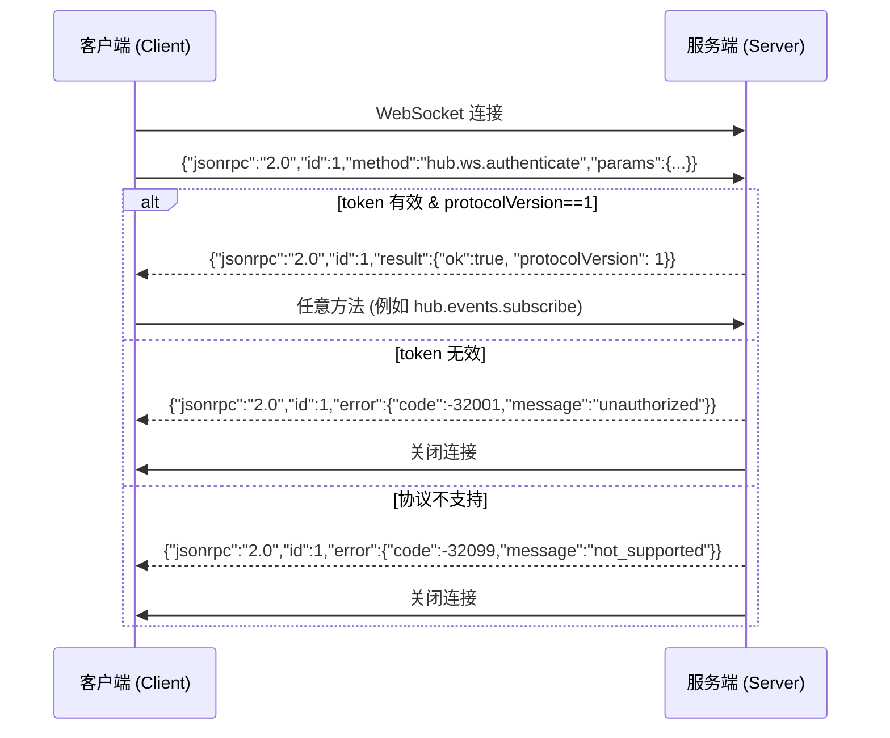
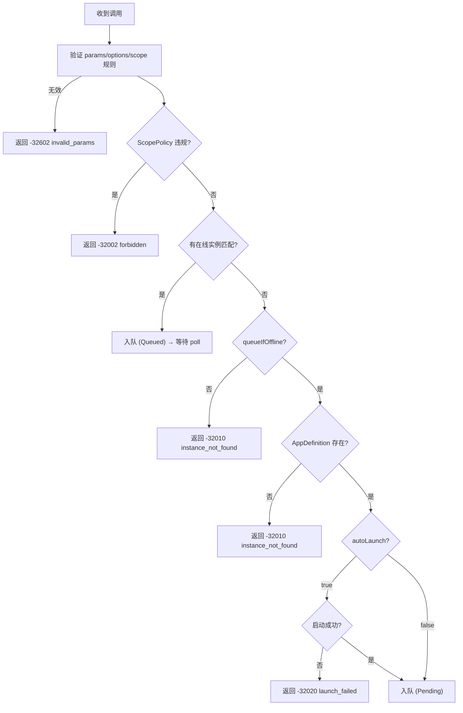

# DevHub 协议规范 v1.0.1

**状态**：最终版 (Final)
**日期**：2026-01-31
**适用范围**：DevHub Hub v1.x，SDKs（任何语言）

---

## 1. 简介 (Introduction)

### 1.1 目的
本规范定义了 DevHub 的协议 —— 这是一个**每用户本地守护进程 (per-user local daemon)**，用于实现：
- 应用实例注册与发现
- 跨工具方法调用编排
- 基于 `scope` 的工作区隔离
- 用于 UI/监控的事件订阅

### 1.2 范围
以下对象**必须**使用本规范：
- DevHub Hub 的实现
- 所有语言的 SDK（.NET, JS/TS 等）
- 合规性测试套件

### 1.3 非目标 (Non-Goals)
- 跨机器通信
- 强一致性保证
- 多用户授权

---

## 2. 合规性关键词 (RFC 2119)

| 关键词       | 含义                           |
| ------------ | ------------------------------ |
| **MUST**     | 必须执行的行为；违反即为不合规 |
| **SHOULD**   | 建议/应当；若偏离需有正当理由  |
| **MAY**      | 可选能力                       |
| **MUST NOT** | 禁止/不得执行的行为            |

---

## 3. 传输与消息格式

### 3.1 JSON-RPC 2.0 基准
所有消息**必须**符合 [JSON-RPC 2.0](https://www.jsonrpc.org/specification) 规范，且**必须**为 UTF-8 编码的 JSON 文本。

#### 3.1.1 请求 (Request)
```json
{
  "jsonrpc": "2.0",
  "id": "string | number",
  "method": "string",
  "params": "object | array (optional)"
}
```

- 对于期望响应的请求，`id` **必须**存在，且**必须**是 **string** 或 **number**。
- 通知 (Notifications) **必须省略** `id`（即 `id` **不得**存在）。
  - **不得**使用 `"id": null` 作为“通知标记”。
- `params` **可以**省略。
- **不得**支持批量请求（根节点为 `array`）。
  - 如果传入的 JSON 根节点是数组，Hub **必须**返回一个**单条** JSON-RPC 错误响应，包含：
    - `error.code = -32600` (`invalid_request`)
    - `id = null`

#### 3.1.2 通知 (Notification) (客户端 → 服务端 或 WS 上的服务端 → 客户端)
```json
{
  "jsonrpc": "2.0",
  "method": "string",
  "params": "object | array (optional)"
}
```

#### 3.1.3 成功响应 (Success Response)
```json
{
  "jsonrpc": "2.0",
  "id": "<与请求相同>",
  "result": "object"
}
```
- 对于所有 `hub.*` 方法，`result` **必须**是一个 JSON 对象。

#### 3.1.4 错误响应 (Error Response)
```json
{
  "jsonrpc": "2.0",
  "id": "<与请求相同，若无法解析则为 null>",
  "error": {
    "code": "integer",
    "message": "string",
    "data": "object (optional)"
  }
}
```
- 如果请求不是可解析的 JSON，Hub **必须**返回 `-32700 parse_error` 且 `id: null`。

---

### 3.2 HTTP 传输

| 属性            | 要求                                       |
| --------------- | ------------------------------------------ |
| 端点 (Endpoint) | `POST /rpc` (基准 URL 来自 `hub.json`)     |
| `Content-Type`  | **必须**是 `application/json` (允许字符集) |
| HTTP 状态       | 即使出错，也**必须**始终返回 `200 OK`      |
| 错误信号        | **必须**使用 JSON-RPC `error` 字段         |

---

### 3.3 WebSocket 传输

| 属性       | 要求                                                                    |
| ---------- | ----------------------------------------------------------------------- |
| 端点       | 连接到 `hub.json` 中的 `wsUrl` (原样使用)                               |
| 认证       | **必须**将 `hub.ws.authenticate` 作为第一条消息                         |
| 预认证行为 | **当 `id` 存在时**，**必须**以 `-32001 unauthorized` 拒绝所有非认证方法 |
| 消息格式   | JSON-RPC 2.0 对象；服务端**可以**在认证后发送通知                       |

**预认证处理顺序（规范性）**：
1. Hub **必须**解析 JSON 文本。
   - 若解析失败：返回 `-32700 parse_error` 且 `id: null`（随后**可以**关闭连接）。
2. Hub **必须**验证 JSON-RPC 信封结构。
   - 若无效：返回 `-32600 invalid_request`（当无法确定 `id` 时使用 `id: null`；随后**可以**关闭）。
3. 如果消息是 JSON-RPC 请求/通知，且 `method != hub.ws.authenticate`，且连接未认证：
   - 如果 `id` 存在：返回 `-32001 unauthorized`。
   - 如果 `id` 不存在（通知）：Hub **必须**关闭连接（因为它无法发送 JSON-RPC 错误响应）。

---

## 4. 运行时发现、认证与安全边界

### 4.1 运行时文件与发现（规范性）

#### 4.1.1 运行时目录
- 默认 (Windows): `%LOCALAPPDATA%\DevHub\runtime\`
- SDKs **应当**支持通过环境变量 `DEVHUB_RUNTIME_DIR` 覆盖运行时目录（主要用于测试工具/便携式安装）。

#### 4.1.2 `hub.json` (发现文件)
Hub **必须**在 `${runtimeDir}\hub.json` 写入发现文件。该文件**必须**通过 §5.4 中定义的 `HubRuntime` Schema 验证。

示例：
```json
{
  "protocolVersion": 1,
  "hubVersion": "1.0.1",
  "pid": 47231,
  "httpBaseUrl": "http://127.0.0.1:47231",
  "wsUrl": "ws://127.0.0.1:47231/ws",
  "tokenFile": "C:\\Users\\me\\AppData\\Local\\DevHub\\runtime\\token.txt",
  "startedAtUtc": "2026-01-30T12:34:56Z"
}
```

规范性要求：
- 本规范的 `protocolVersion` **必须**为 `1`。
- `httpBaseUrl` **不得**包含末尾斜杠。
- `wsUrl` **必须**是绝对 WebSocket URL (`ws://` 或 `wss://`) 且**不得**包含末尾斜杠。
- `httpBaseUrl` 和 `wsUrl` **必须**指向环回地址（`127.0.0.1` 和/或 `localhost`；实现**可以**额外使用 `::1`）。
- `tokenFile` **必须**是绝对路径。
- Hub **必须**原子性地更新 `hub.json`（写入临时文件 + 替换），以避免撕裂读取 (torn reads)。
- `hub.json` **必须**拥有操作系统 ACL，限制仅当前用户访问。
- 客户端**必须**使用 `hub.json` 作为权威的端点源，**不得**假设固定端口或固定 WS 路径。

#### 4.1.3 `token.txt`
- 默认位置：`${runtimeDir}\token.txt`（也可通过 `hub.json.tokenFile` 发现）
- 文件内容：单个 Bearer Token 字符串（UTF-8 文本）。客户端在读取时**应当**修剪末尾的 `\r\n`/空白字符。
- Token 生命周期：Token **应当**在 Hub 启动时重新生成（“每 Hub 会话”）。旧 Token **必须**被拒绝。

#### 4.1.4 AppDefinition 存储 (Windows v1)
- 默认位置：`%LOCALAPPDATA%\DevHub\apps\definitions\`
- 每个定义**必须**是一个名为 `{appId}.json` 的 JSON 文件，且**必须**通过 `AppDefinition` Schema (§5.1) 验证。
- Hub **必须**忽略不符合命名规则或 Schema 验证失败的文件（并**应当**记录诊断日志）。

> 注意：非 Windows 文件系统位置在 v1 中由实现定义；除非使用了 `DEVHUB_RUNTIME_DIR`，否则合规性测试假设使用 Windows 默认路径。

---

### 4.2 HTTP 标头（必须存在）

| 标头                       | 格式             | 描述                                                                    |
| -------------------------- | ---------------- | ----------------------------------------------------------------------- |
| `Authorization`            | `Bearer {token}` | 从 `hub.json.tokenFile`（或默认 `${runtimeDir}\token.txt`）读取的 Token |
| `X-DevHub-Protocol`        | `"1"`            | 协议版本；HTTP 标头值为字符串；**必须**严格为 `"1"`                     |
| `X-DevHub-ClientId`        | string           | 逻辑客户端标识 (`DevHubUI`, `VSPlugin` 等)                              |
| `X-DevHub-ClientSessionId` | UUID string      | RFC 4122 UUID；客户端重启时**必须**改变                                 |

缺失/无效标头**必须**按如下方式处理：
- 缺失/无效 `Authorization`: `-32001 unauthorized`
- 缺失/无效 `X-DevHub-Protocol`: `-32099 not_supported`
- 缺失 `X-DevHub-ClientId` 或 `X-DevHub-ClientSessionId`: `-32600 invalid_request` 且 `error.data.reason="missing_header"`

---

### 4.3 WebSocket 认证流程

`hub.ws.authenticate` **必须**是第一条 WS 消息，且**必须**是 JSON-RPC 请求（即包含 `id`）。



---

### 4.4 安全边界
- Hub **必须**仅在环回地址（`127.0.0.1` / `localhost` 和/或 `::1`）上监听。
- v1 版本**不得**支持跨用户访问（Token 是边界）。
- `token.txt` 和 `hub.json` 的文件 ACL 要求在 §4.1.2 和 §4.1.3 中是规范性的。

---

## 5. 数据模型 (附 JSON Schema)

### 5.1 AppDefinition
```json
{
  "$schema": "http://json-schema.org/draft-07/schema#",
  "$id": "https://devhub.spec/v1/app-definition.json",
  "type": "object",
  "required": ["appId", "displayName", "scopePolicy"],
  "properties": {
    "appId": { "type": "string", "pattern": "^[a-z0-9][a-z0-9.-]*$" },
    "displayName": { "type": "string" },
    "description": { "type": "string" },
    "scopePolicy": { "type": "string", "enum": ["any", "globalOnly", "required"] },
    "capabilities": {
      "type": "object",
      "properties": {
        "rpc": { "type": "boolean" },
        "events": { "type": "boolean" }
      }
    },
    "launch": {
      "type": "object",
      "required": ["exePath"],
      "properties": {
        "exePath": { "type": "string" },
        "argsTemplate": { "type": "string" },
        "workingDirectory": { "type": "string" },
        "dedupeKeyTemplate": { "type": "string" }
      }
    }
  }
}
```

---

### 5.2 AppInstance
```json
{
  "$schema": "http://json-schema.org/draft-07/schema#",
  "$id": "https://devhub.spec/v1/app-instance.json",
  "type": "object",
  "required": ["instanceId", "appId", "pid", "registeredAtUtc", "lastSeenUtc", "invoke"],
  "properties": {
    "instanceId": {
      "type": "string",
      "maxLength": 256,
      "pattern": "^[a-zA-Z0-9._:-]+$"
    },
    "appId": { "type": "string" },
    "scope": { "type": ["string", "null"] },
    "pid": { "type": "integer", "minimum": 1 },
    "registeredAtUtc": { "type": "string", "format": "date-time" },
    "lastSeenUtc": { "type": "string", "format": "date-time" },
    "invoke": {
      "type": "object",
      "required": ["poll", "respond"],
      "properties": {
        "poll": { "type": "boolean" },
        "respond": { "type": "boolean" }
      }
    },
    "meta": { "type": "object" }
  }
}
```

#### 5.2.1 AppInstanceRegistration（规范性）
`hub.apps.registerInstance.params.instance` **必须**符合以下形状（服务端管理的时间戳已省略）：

```json
{
  "$schema": "http://json-schema.org/draft-07/schema#",
  "$id": "https://devhub.spec/v1/app-instance-registration.json",
  "type": "object",
  "required": ["instanceId", "appId", "pid", "invoke"],
  "properties": {
    "instanceId": {
      "type": "string",
      "maxLength": 256,
      "pattern": "^[a-zA-Z0-9._:-]+$"
    },
    "appId": { "type": "string" },
    "scope": { "type": ["string", "null"] },
    "pid": { "type": "integer", "minimum": 1 },
    "invoke": {
      "type": "object",
      "required": ["poll", "respond"],
      "properties": {
        "poll": { "type": "boolean" },
        "respond": { "type": "boolean" }
      }
    },
    "meta": { "type": "object" }
  }
}
```

---

### 5.3 Invocation
```json
{
  "$schema": "http://json-schema.org/draft-07/schema#",
  "$id": "https://devhub.spec/v1/invocation.json",
  "type": "object",
  "required": ["invocationId", "appId", "target", "method", "kind", "createdAtUtc", "caller"],
  "properties": {
    "invocationId": {
      "type": "string",
      "maxLength": 256,
      "pattern": "^invk-[a-zA-Z0-9._:-]+$"
    },
    "appId": { "type": "string" },
    "target": {
      "type": "object",
      "properties": {
        "scope": { "type": ["string", "null"] },
        "instanceId": { "type": ["string", "null"] }
      }
    },
    "method": { "type": "string" },
    "args": { "type": ["object", "array"] },
    "kind": { "type": "string", "enum": ["request", "notify"] },
    "createdAtUtc": { "type": "string", "format": "date-time" },
    "options": {
      "type": "object",
      "properties": {
        "ttlMs": { "type": "integer", "minimum": 1000 },
        "waitTimeoutMs": { "type": "integer", "minimum": 1 },
        "queueIfOffline": { "type": "boolean" },
        "autoLaunch": { "type": "boolean" }
      }
    },
    "delivery": {
      "type": "object",
      "properties": {
        "leaseSeconds": { "type": "integer", "minimum": 1 },
        "attempt": { "type": "integer", "minimum": 1 }
      }
    },
    "caller": {
      "type": "object",
      "required": ["clientId", "clientSessionId"],
      "properties": {
        "clientId": { "type": "string" },
        "clientSessionId": { "type": "string" }
      }
    }
  }
}
```

---

### 5.4 HubRuntime (`hub.json`)
```json
{
  "$schema": "http://json-schema.org/draft-07/schema#",
  "$id": "https://devhub.spec/v1/hub-runtime.json",
  "type": "object",
  "required": ["protocolVersion", "pid", "httpBaseUrl", "wsUrl", "tokenFile", "startedAtUtc"],
  "properties": {
    "protocolVersion": { "type": "integer", "enum": [1] },
    "hubVersion": { "type": "string" },
    "pid": { "type": "integer", "minimum": 1 },
    "httpBaseUrl": { "type": "string", "format": "uri" },
    "wsUrl": { "type": "string", "format": "uri" },
    "tokenFile": { "type": "string" },
    "startedAtUtc": { "type": "string", "format": "date-time" }
  }
}
```

---

### 5.5 Scope 规则（规范性）

| 输入         | 解释                                   | 禁止/无效值             |
| ------------ | -------------------------------------- | ----------------------- |
| 省略字段     | 全局 scope                             | —                       |
| `null`       | 全局 scope                             | —                       |
| 空字符串     | **无效**                               | `""`                    |
| 非空字符串   | 工作区级 scope（区分大小写，精确匹配） | `"global"` 字符串字面量 |
| **路由规则** | 当指定了 scope 时，**不得**回退到全局  | —                       |

---

## 6. RPC 方法

### 6.1 约定（规范性）
- 所有 `hub.*` 方法**必须**使用 **object** 参数（命名参数）。如果 params 是数组，Hub **必须**返回 `-32602 invalid_params`。
- 对于所有成功的 `hub.*` 调用，`result` **必须**是一个 JSON 对象，且至少包含：
  ```json
  { "ok": true }
  ```
  **可以**包含其他字段。
- 所有错误**必须**使用 §8 中定义的 JSON-RPC `error` 对象返回。

**术语（规范性）**：
- “指定了 `target.scope`” 指 `target.scope` 是一个**非空字符串**（且**必须**符合 §5.5 的有效性）。
- “指定了 `target.instanceId`” 指 `target.instanceId` 是一个**非 null 字符串**。
  - 空字符串**应当**被拒绝为 `-32602 invalid_params`。

### 6.2 方法矩阵

| 方法                          | HTTP | WS (认证后)      | 重试安全* | 副作用                                       |
| ----------------------------- | ---- | ---------------- | --------- | -------------------------------------------- |
| `hub.ping`                    | ✓    | ✓                | ✓         | 无                                           |
| `hub.ws.authenticate`         | ✗    | ✓ (仅限首条消息) | ✓         | 绑定客户端身份到 WS                          |
| `hub.apps.listDefinitions`    | ✓    | ✓                | ✓         | 无                                           |
| `hub.apps.getDefinition`      | ✓    | ✓                | ✓         | 无                                           |
| `hub.apps.registerInstance`   | ✓    | ✗                | ✗         | 更新或插入 (Upsert) 实例；更新 `lastSeenUtc` |
| `hub.apps.heartbeat`          | ✓    | ✗                | ✓         | 更新 `lastSeenUtc`                           |
| `hub.apps.unregisterInstance` | ✓    | ✗                | ✓         | 移除实例                                     |
| `hub.apps.listInstances`      | ✓    | ✓                | ✓         | 无                                           |
| `hub.apps.launch`             | ✓    | ✗                | ✗         | 启动进程（若未运行）                         |
| `hub.invoke.notify`           | ✓    | ✗                | ✗         | 调用入队                                     |
| `hub.invoke.request`          | ✓    | ✗                | ✗         | 入队 + 等待响应                              |
| `hub.invoke.poll`             | ✓    | ✗                | ✗         | 认领调用（租约开始）                         |
| `hub.invoke.respond`          | ✓    | ✗                | ✗         | 完成调用                                     |
| `hub.events.subscribe`        | ✗    | ✓                | ✗         | 创建订阅                                     |
| `hub.events.unsubscribe`      | ✗    | ✓                | ✓         | 移除订阅                                     |

\* “重试安全”意味着调用者可以在传输失败时安全地重试，而不会创建重复的持久化资源。这并非严格的 HTTP 幂等性。

> **注意**：调用方法（`poll`/`respond`）有意不支持 WS 传输，以避免被调用方 (callee) 侧的 WS 连接状态复杂化。

---

### 6.3 方法定义

#### 6.3.1 `hub.ping`
**Params (可选)**: `{ "echo": any }`
**Result**:
```json
{ "ok": true, "serverTimeUtc": "2026-01-30T12:34:56Z", "echo": "..." }
```

#### 6.3.2 `hub.ws.authenticate` (仅限 WS)
**Params**:
```json
{
  "token": "string",
  "protocolVersion": 1,
  "clientId": "string",
  "clientSessionId": "string"
}
```
**Result**:
```json
{ "ok": true, "protocolVersion": 1 }
```

#### 6.3.3 `hub.apps.listDefinitions`
**Params**: `{}` (或省略)
**Result**:
```json
{ "ok": true, "definitions": [ /* AppDefinition[] */ ] }
```

#### 6.3.4 `hub.apps.getDefinition`
**Params**:
```json
{ "appId": "test.app" }
```
**Result**:
```json
{ "ok": true, "definition": { /* AppDefinition */ } }
```
**Errors**: `-32014 app_definition_not_found`

#### 6.3.5 `hub.apps.registerInstance` (仅限 HTTP)
客户端**必须**生成 `instanceId`，使其在进程生命周期内唯一（**应当**在进程重启时改变）。

**Params**:
```json
{
  "instance": {
    "appId": "test.app",
    "instanceId": "inst-123",
    "scope": null,
    "pid": 12345,
    "invoke": { "poll": true, "respond": true },
    "meta": {}
  }
}
```

规范性要求：
- `params.instance` **必须**符合 `AppInstanceRegistration` (§5.2.1)。
- Hub **必须**在服务端设置 `registeredAtUtc` 和 `lastSeenUtc`。
- Hub **必须**在每次成功的 `registerInstance` 时更新 `lastSeenUtc`。
- Hub **必须**根据 §5.5 验证 `scope`，并（如果定义存在）强制执行 `AppDefinition.scopePolicy`。违规**必须**返回 `-32002 forbidden`。

**Result**:
```json
{ "ok": true, "instance": { /* AppInstance */ } }
```

#### 6.3.6 `hub.apps.heartbeat` (仅限 HTTP)
**Params**:
```json
{ "instanceId": "inst-123" }
```
**Result**:
```json
{ "ok": true, "lastSeenUtc": "2026-01-30T12:34:56Z" }
```
**Errors**: `-32010 instance_not_found`

#### 6.3.7 `hub.apps.unregisterInstance` (仅限 HTTP)
**Params**:
```json
{ "instanceId": "inst-123" }
```
**Result**:
```json
{ "ok": true }
```
幂等：如果实例不存在，Hub **必须**仍然返回 `{ "ok": true }`。

#### 6.3.8 `hub.apps.listInstances`
**Params (可选)**:
```json
{
  "appId": "test.app",
  "scope": null,
  "includeOffline": false,
  "includeAllScopes": false
}
```
**Result**:
```json
{ "ok": true, "instances": [ /* AppInstance[] */ ] }
```
规范性行为：
- 如果 `includeAllScopes` 为 `true`，Hub **必须**忽略 `scope` 参数并返回所有 scope 的实例。
- 如果 `includeAllScopes` 为 `false`（或省略），Hub **必须**按 `scope` 过滤（如果省略则默认为 global）。
- `includeOffline` 默认为 `false`。

#### 6.3.9 `hub.apps.launch` (仅限 HTTP)
**Params**:
```json
{
  "appId": "test.app",
  "scope": null,
  "dedupeKey": "optional-key",
  "waitForRegisterMs": 3000
}
```

**Result**:
```json
{
  "ok": true,
  "status": "started",
  "pid": 12345,
  "launchId": "..."
}
```

规范性行为：
- `status` **必须**是以下之一：`started`, `starting`, `already_running`。
- “Already running” 定义为“存在匹配 `appId` 和 `scope` 的**在线**已注册实例” 或 “具有相同 `dedupeKey` 的启动正在进行中”。
- Hub **必须**维护一个 `dedupeKey` 的去重窗口（默认 30 秒）。在此窗口期间，具有相同 key 的并发启动**必须**返回 `already_running`。
- 如果 `dedupeKey` 被省略，Hub **必须**使用 `AppDefinition.launch.dedupeKeyTemplate` 生成它。
- **模板替换**：Hub **必须**支持在 `dedupeKeyTemplate` 和 `argsTemplate` 中使用以下占位符：
  - `{appId}`: 应用 ID。
  - `{scope}`: 请求的 scope（如果是 global 则为空字符串）。
  - `{scopeOrGlobal}`: 请求的 scope，如果 scope 为 null/省略，则为字面量字符串 `global`。
  - `{httpBaseUrl}`: Hub 的 HTTP 基准 URL (例如 `http://127.0.0.1:47231`)。
- 如果 `AppDefinition.launch.dedupeKeyTemplate` 被省略或为 null，Hub **必须**使用默认模板：`{appId}:{scopeOrGlobal}`。
- 如果 `waitForRegisterMs > 0`，Hub **应当**等待实例注册，最长等待该时长。如果超时但进程已启动，返回 `status: "starting"`。
- Hub **必须**读取 `AppDefinition.launch.exePath`。如果定义缺失：`-32014`。如果进程创建失败：`-32020`。

#### 6.3.10 `hub.invoke.notify` (仅限 HTTP)
**Params**:
```json
{
  "appId": "test.app",
  "target": { "scope": null, "instanceId": null },
  "method": "test.ping",
  "args": {},
  "options": {
    "ttlMs": 60000,
    "queueIfOffline": true,
    "autoLaunch": true
  }
}
```

**Result**:
```json
{ "ok": true, "invocationId": "invk-..." }
```

验证与默认值：
- 如果省略，默认值：`ttlMs=60000`, `queueIfOffline=true`。
- `autoLaunch` 默认为 `true`，**除非** `target.instanceId` 被**指定**（非 null 字符串），此时它默认为 `false`。
- 如果 `target.instanceId` 被**指定** 且 `options.autoLaunch` 显式设置为 `true`，Hub **必须**返回 `-32602 invalid_params`。
- 如果 `options.autoLaunch` 为 true，则 `options.queueIfOffline` **必须**为 true（否则 `-32602 invalid_params`）。

#### 6.3.11 `hub.invoke.request` (仅限 HTTP)
**Params**: 形状与 `hub.invoke.notify` 相同，加上：
```json
"options": {
  "ttlMs": 300000,
  "waitTimeoutMs": 120000,
  "queueIfOffline": true,
  "autoLaunch": true
}
```

**Success Result**:
```json
{ "ok": true, "invocationId": "invk-...", "value": {} }
```

**Errors**:
- `-32012 invocation_timeout`: 当 `waitTimeoutMs` 在完成前耗尽时
  - Hub **必须**取消该调用（被调用方**应当**不会在之后收到它；迟到的 `respond` **必须**被拒绝）
- `-32011 invocation_expired`: 当 `ttlMs` 在投递/响应前耗尽时
- `-32050 invocation_failed`: 当被调用方以应用错误响应时（详情在 `error.data.calleeError` 中）
- 加上路由/认证/验证错误 (§8)

验证：
- 如果省略，默认值：`ttlMs=300000`, `waitTimeoutMs=120000`, `queueIfOffline=true`, `autoLaunch=true`。
- `waitTimeoutMs` **必须** <= `ttlMs`。

#### 6.3.12 `hub.invoke.poll` (仅限 HTTP)
**Params**:
```json
{
  "instanceId": "inst-123",
  "maxCount": 10,
  "waitMs": 25000
}
```

**Result**:
```json
{
  "ok": true,
  "serverTimeUtc": "2026-01-30T12:34:56Z",
  "items": [
    {
      "invocationId": "invk-...",
      "appId": "test.app",
      "target": { "scope": null, "instanceId": null },
      "method": "test.ping",
      "args": {},
      "kind": "notify",
      "createdAtUtc": "2026-01-30T12:34:56Z",
      "caller": { "clientId": "DevHubUI", "clientSessionId": "..." },
      "delivery": { "leaseSeconds": 30, "attempt": 1 },
      "options": { "ttlMs": 60000 }
    }
  ]
}
```

规范性行为：
- Hub **必须**要求实例在轮询前已注册 (`hub.apps.registerInstance`)；否则 `-32010 instance_not_found`。
- Hub **必须**强制实例具有 `invoke.poll==true`；否则 `-32002 forbidden`。
- Hub **必须**支持长轮询 (Long Polling)：如果没有可用项，Hub **必须**在返回空列表前等待最多 `waitMs`。
- 成功的 `poll` **必须**更新实例的 `lastSeenUtc`。
- 租约时长在每个项目的 `delivery.leaseSeconds` 中返回。

#### 6.3.13 `hub.invoke.respond` (仅限 HTTP)
**Params** (`value` 或 `error` 中**必须**恰好存在一个):
```json
{
  "instanceId": "inst-123",
  "invocationId": "invk-...",
  "value": {}
}
```

来自被调用方的错误响应：
```json
{
  "instanceId": "inst-123",
  "invocationId": "invk-...",
  "error": { "code": 1001, "message": "app_error", "data": {} }
}
```

**Result**:
```json
{ "ok": true }
```

规范性行为：
- Hub **必须**要求实例已注册；否则 `-32010 instance_not_found`。
- Hub **必须**强制实例具有 `invoke.respond==true`；否则 `-32002 forbidden`。
- 成功的 `respond` **必须**更新实例的 `lastSeenUtc`。

**Errors**:
- `-32030 delivery_conflict`: 如果租约无效/过期、错误的实例响应、或重复响应
- `-32011 invocation_expired`: 如果调用已过期/取消/超时
- `-32602 invalid_params`: 载荷格式错误

#### 6.3.14 `hub.events.subscribe` (仅限 WS)
**Params**:
```json
{ "types": ["app.instance.registered", "invocation.completed"] }
```
如果 `types` 被省略或为空，则订阅所有事件。

**Result**:
```json
{ "ok": true, "subscriptionId": "sub-..." }
```

**支持的事件类型**:
- `app.instance.registered`
- `app.instance.unregistered`
- `invocation.queued`
- `invocation.delivered`
- `invocation.completed`
- `invocation.failed`

#### 6.3.15 `hub.events.unsubscribe` (仅限 WS)
**Params**:
```json
{ "subscriptionId": "sub-..." }
```
**Result**:
```json
{ "ok": true }
```
幂等：取消订阅一个未知的 `subscriptionId` **必须**仍然返回 `{ "ok": true }`。

#### 6.3.16 服务端 → 客户端事件投递 (仅限 WS)
Hub **必须**将订阅的事件作为 JSON-RPC 通知投递：

```json
{
  "jsonrpc": "2.0",
  "method": "hub.event",
  "params": {
    "subscriptionId": "sub-...",
    "type": "app.instance.registered",
    "timeUtc": "2026-01-30T12:34:56Z",
    "payload": {
      "invocationId": "...",
      "appId": "asset.indexer",
      "instanceId": "asset.indexer:pid-12345:..."
    }
  }
}
```

事件是尽力而为 (best-effort) 且非持久化的；Hub **可以**在负载过高时丢弃事件。

---

## 7. 调用生命周期与路由

### 7.1 路由决策矩阵（规范性）


路由规则：
- 如果提供了 `target.instanceId`，Hub **必须**仅路由到该 instanceId（无回退）。
- 如果 `target.scope` 是非空字符串，Hub **必须**仅路由到该 scope（无回退）。
- 当多个实例匹配一个 scope/全局队列时，投递遵循“先轮询者先得 (first poll wins)”。
- **挂起队列约束**：如果 `appId` 不存在 `AppDefinition`，Hub **不得**将调用入队，即使 `queueIfOffline` 为 true。在此情况下，**必须**返回 `-32010 instance_not_found`。

### 7.2 调用状态机

```mermaid
stateDiagram-v2
    [*] --> Created
    Created --> Queued: 已接受
    Created --> Rejected: 验证/禁止/无路由 + !queueIfOffline

    Queued --> Pending: 无在线实例
    Queued --> Delivered: 被调用方轮询 (租约开始)

    Pending --> Delivered: 匹配实例轮询
    Pending --> Expired: ttlMs 耗尽
    Pending --> Timeout: waitTimeoutMs 耗尽 (仅 request; 取消)

    Delivered --> Completed: 被调用方响应 (成功)
    Delivered --> Failed: 被调用方响应 (错误)
    Delivered --> Requeued: 租约过期且 ttlMs 未耗尽 (尝试次数++)
    Delivered --> Expired: ttlMs 耗尽
    Delivered --> Timeout: waitTimeoutMs 耗尽 (仅 request; 取消)

    Requeued --> Queued

    Completed --> [*]
    Failed --> [*]
    Expired --> [*]
    Timeout --> [*]
    Rejected --> [*]
```


### 7.3 关键时序约束

| 参数                     | 默认 (notify) | 默认 (request) | 约束                                          |
| ------------------------ | ------------- | -------------- | --------------------------------------------- |
| `ttlMs`                  | 60,000 ms     | 300,000 ms     | **必须** ≥ 1,000 ms                           |
| `waitTimeoutMs`          | N/A           | 120,000 ms     | **必须** ≤ `ttlMs`                            |
| `leaseSeconds`           | 30 s (固定)   | 30 s (固定)    | 由 Hub 在 `poll` 时分配                       |
| 在线阈值                 | 30 s          | 30 s           | `now - lastSeenUtc ≤ 30s`                     |
| 去重窗口                 | 30 s          | 30 s           | 启动去重窗口                                  |
| `maxCount` (poll 默认值) | 10            | 10             | **必须**为 1..100 (超出范围 = invalid_params) |

---

## 8. 错误代码

### 8.1 标准 JSON-RPC 错误

| 代码   | 名称               | 条件                            |
| ------ | ------------------ | ------------------------------- |
| -32700 | `parse_error`      | 无效的 JSON 文本                |
| -32600 | `invalid_request`  | 无效的 JSON-RPC 结构 / 批量请求 |
| -32601 | `method_not_found` | 方法未找到                      |
| -32602 | `invalid_params`   | 参数缺失/无效                   |
| -32603 | `internal_error`   | 内部服务器错误                  |

### 8.2 DevHub 特定错误

| 代码   | 名称                       | 何时返回                            | `error.data` (对象)                                                                                                            |
| ------ | -------------------------- | ----------------------------------- | ------------------------------------------------------------------------------------------------------------------------------ |
| -32001 | `unauthorized`             | 无效/缺失 Token                     | `reason`: `"missing_token"` 或 `"invalid_token"`                                                                               |
| -32002 | `forbidden`                | ScopePolicy 违规 / 不允许的操作     | `reason`: `"scope_policy_violation"`, `"rpc_disabled"`, `"poll_not_enabled"`, `"respond_not_enabled"`; 加上上下文 context 字段 |
| -32010 | `instance_not_found`       | 无路由 + !queueIfOffline / 未知实例 | `reason`: `"offline_no_queue"`, `"unknown_instance"`, `"target_instance_missing"`                                              |
| -32011 | `invocation_expired`       | TTL 耗尽 / 已取消的调用被迟延使用   | `invocationId?`: string; `elapsedMs?`: number                                                                                  |
| -32012 | `invocation_timeout`       | `waitTimeoutMs` 耗尽 (仅 request)   | `invocationId?`: string; `elapsedMs`: number                                                                                   |
| -32014 | `app_definition_not_found` | 定义文件缺失 / 启动所需             | `appId?`: string                                                                                                               |
| -32020 | `launch_failed`            | 进程启动失败 / 启动配置不可用       | `reason?`: string; `exitCode?`: number 或 null; `stderr?`: string                                                              |
| -32030 | `delivery_conflict`        | 重复 respond 或租约违规             | `currentLeaseHolder?`: string; `invocationId?`: string                                                                         |
| -32040 | `rate_limited`             | 速率限制或资源上限超标              | `reason?`: string                                                                                                              |
| -32050 | `invocation_failed`        | 被调用方以应用错误响应 (request)    | `invocationId`: string; `calleeError`: `{ code:int, message:string, data?:object }`                                            |
| -32099 | `not_supported`            | 协议版本不匹配 / 缺失协议标头       | `expected`: 1; `received?`: string/number/null; `reason`: `"missing"` 或 `"mismatch"`                                          |

> **注意**：`-32013 instance_offline` 被有意省略；请使用 `-32010 instance_not_found` 配合 `data.reason` 进行诊断。

### 8.3 规范化 `error.message` 字符串（规范性）
为了合规，Hub **必须**将 `error.message` 设置为与上表中 `名称` 字符串完全一致。

---

## 9. 版本控制与兼容性

### 9.1 版本标识符
- 协议版本通过 `X-DevHub-Protocol` 标头 (HTTP) 或 `protocolVersion` 参数 (WS auth) 信号传递
- 当前协议版本：`1`

### 9.2 向后兼容规则

| 变更类型                       | v1.x 中允许? | 客户端影响                         |
| ------------------------------ | ------------ | ---------------------------------- |
| 向响应添加可选字段             | ✓            | **必须**忽略未知字段               |
| 添加新错误代码                 | ✓            | **必须**将未知代码作为通用错误处理 |
| 添加新 RPC 方法                | ✓            | **可以**忽略不支持的方法           |
| 改变字段类型/语义              | ✗            | 破坏性；需要 v2                    |
| 移除字段                       | ✗            | 破坏性；需要 v2                    |
| 收紧验证（拒绝以前接受的输入） | ✗            | 破坏性；需要 v2                    |

### 9.3 版本不匹配时的 Hub 行为
- 如果 `X-DevHub-Protocol` 缺失或不等于 `1`：**必须**返回 `-32099 not_supported` 且 `data.expected=1`
- Hub **不得**尝试协议协商

---

## 10. 合规性测试基准

### 10.1 必需的测试类别
| 类别                  | 测试数量 (最少) | 描述                                   |
| --------------------- | --------------- | -------------------------------------- |
| 发现 (Discovery)      | 3               | `hub.json` 解析，Token 发现            |
| 认证 (Authentication) | 5               | 有效/无效 Token，缺失标头，WS 认证流程 |
| AppDefinition         | 4               | 列出/获取（有/无定义）                 |
| AppInstance           | 8               | 注册/心跳/注销/列出（包含 scope 变体） |
| Invocation (notify)   | 6               | 在线/离线/队列/自动启动路径            |
| Invocation (request)  | 10              | 完整往返 + 超时/租约/TTL 边缘情况      |
| 事件 (Events)         | 4               | 订阅/取消订阅 + 断开连接清理           |
| 错误处理              | 12              | 所有错误代码及其正确的 `data` 字段     |

### 10.2 签名测试向量格式
每个测试向量**必须**是一个 JSON 文件，包含：

```json
{
  "id": "invoke.request.timeout.wait_exceeds_ttl",
  "description": "waitTimeoutMs > ttlMs MUST be rejected at call time",
  "transport": "http",
  "http": {
    "headers": {
      "X-DevHub-Protocol": "1",
      "X-DevHub-ClientId": "Conformance",
      "X-DevHub-ClientSessionId": "00000000-0000-0000-0000-000000000000",
      "Authorization": "Bearer ${TOKEN}"
    }
  },
  "request": {
    "jsonrpc": "2.0",
    "id": 1,
    "method": "hub.invoke.request",
    "params": {
      "appId": "test.app",
      "target": { "scope": null },
      "method": "test.ping",
      "args": {},
      "options": {
        "ttlMs": 5000,
        "waitTimeoutMs": 10000
      }
    }
  },
  "expectedResponse": {
    "jsonrpc": "2.0",
    "id": 1,
    "error": {
      "code": -32602,
      "message": "invalid_params",
      "data": { "reason": "waitTimeoutMs must be <= ttlMs" }
    }
  },
  "tags": ["invocation", "validation", "boundary"]
}
```

### 10.3 合规标准
当且仅当满足以下条件时，实现即为合规：
1. 通过本规范中 100% 的 MUST 级别断言
2. 通过官方合规套件中 100% 的测试向量
3. 生成的 JSON 响应在语义上等同于预期响应（**必须**忽略 JSON 对象键顺序和空白字符）

---

## 11. 安全考量

### 11.1 威胁模型 (v1 范围)
| 威胁                | 缓解措施                                                                                      |
| ------------------- | --------------------------------------------------------------------------------------------- |
| 本地用户 Token 窃取 | `token.txt` / `hub.json` 上的操作系统 ACL（仅限当前用户）                                     |
| 跨用户访问          | 仅监听环回地址；Token 是每用户机密                                                            |
| 恶意 AppDefinition  | 用户负责 `%LOCALAPPDATA%\DevHub\apps\definitions\` 的完整性；Hub **不**对启动的进程进行沙盒化 |
| 重放攻击            | Token 是每 Hub 会话的；短寿命的调用限制了影响                                                 |

### 11.2 超出范围 (v1)
- 启动应用的进程沙盒化
- 定义签名/验证
- 超出操作系统 ACL 的跨用户隔离

---

## 附录 A：完整 JSON Schema 包

[下载完整 Schema 包 (ZIP)](schemas/v1/devhub-schemas-v1.0.1.zip) 包含：
- `app-definition.json`
- `app-instance.json`
- `invocation.json`
- `hub-runtime.json`
- `rpc-request.json`
- `rpc-response.json`
- `error-response.json`

所有 Schema 均符合 Draft-07 标准，并包含用于工具集成的 `$id` URI。

---

## 附录 B：合规性测试运行示例

```bash
# 针对本地 Hub 运行官方合规套件
devhub-conformance-cli \
  --hub-url http://127.0.0.1:47231 \
  --token-file %LOCALAPPDATA%\DevHub\runtime\token.txt \
  --suite v1.0.1

# 输出:
PASS  discovery.hub_json_parsable
PASS  auth.missing_token_returns_unauthorized
PASS  auth.invalid_protocol_version
...
FAIL  invocation.request.timeout.wait_exceeds_ttl
      Expected error.code=-32602, got 200 with result.ok=true
```