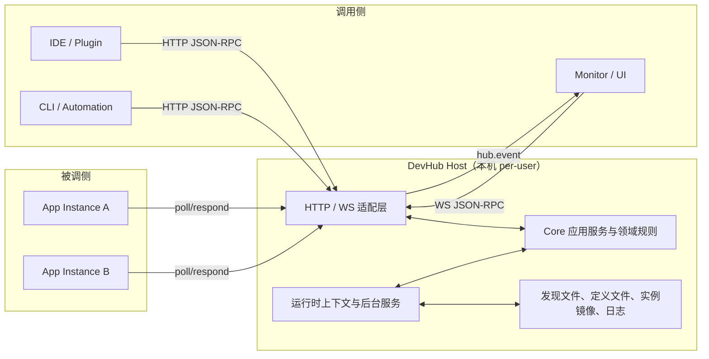

# DevHub 协议与架构说明

本文档只说明 DevHub 的模块边界、设计取舍与长期演进原则。

- 协议字段、错误语义、状态转换、序列化契约与测试断言请查阅 [Spec.md](../spec/Spec.md)。
- 文档导航与权威入口划分请查阅 [docs/README.md](../README.md)。

## 1. 架构目标

DevHub 面向本机单用户场景，为多个工具、插件和桌面入口提供统一的：

- 运行时发现与鉴权
- 应用定义与实例管理
- 应用启动与调用编排
- WebSocket 事件订阅与通知

架构目标不是覆盖所有可能场景，而是在本机闭环内维持清晰边界、稳定契约和可验证行为。跨机器协调、强一致持久队列、复杂权限系统与分布式锁不属于当前架构范围。

## 2. 权威边界

| 主题 | 权威入口 | 说明 |
| --- | --- | --- |
| 协议契约 | [Spec.md](../spec/Spec.md) | 定义公开字段、状态机、错误码、方法语义与版本化资产 |
| 架构边界 | 本文档 | 说明模块分工、设计取舍与长期演进原则 |
| 稳定使用方式 | `docs/guides/` | 面向接入方、开发者与协作者的当前有效做法 |
| 运维与发布 | `docs/operations/` | 面向部署、排障、发布与回滚场景的操作入口 |

## 3. 系统上下文



整体结构围绕两条主线组织：

- `Core` 负责传输无关的应用服务、领域结果、领域事件和业务规则。
- `Host` 负责 HTTP / WebSocket 协议适配、运行时资源管理和后台生命周期。

## 4. Host 架构分层

### 4.1 Core 应用服务层

`host/src/DevHub.Core/` 负责：

- typed command / query / result 模型
- 应用定义、实例、调用与事件相关的领域规则
- 传输无关的领域事件发布接口
- 可被白盒测试直接验证的业务失败语义

这层不负责：

- 解析 `JsonElement`
- 构造 JSON-RPC 响应
- 保存 WebSocket 连接状态
- 管理后台 `Timer` 或回读 `hub.json`

这样做的原因是把“业务规则是否正确”与“协议入口如何承载”拆成两个独立演进面，降低跨层耦合和测试复杂度。

### 4.2 Host 适配层

`host/src/DevHub.Host/` 中的适配层负责：

- JSON-RPC 方法分发、参数读取与输入校验
- 领域结果到线协议错误码 / 响应载荷的映射
- HTTP 鉴权、WebSocket 鉴权和请求上下文装配
- `hub.event` 通知组装与事件订阅桥接

适配层直接面向公开协议，因此必须严格对齐 `Spec.md`。任何协议层错误处理、参数默认值、错误码映射和序列化契约都应在这一层显式实现，而不是下沉到 `DevHub.Core`。

### 4.3 Host 生命周期层

Host 生命周期层负责把运行时资源纳入 ASP.NET Core 的托管模型：

- `IHostedService` / `BackgroundService` 管理实例清理、超时扫描和其他周期任务
- 运行时上下文提供当前绑定地址、数据根目录和发现文件输出位置
- 启动编排直接消费 Host 内部运行时上下文，而不是把 `runtime/hub.json` 当成自身输入源

这里的核心取舍是：对外暴露的发现文件是客户端入口，不应反向变成 Host 内部编排的依赖。

### 4.4 事件交付模型

事件链路采用“Core 发布领域事件，Host 维护连接级投递状态”的分工：

- `DevHub.Core` 只生成传输无关的事件内容
- `DevHub.Host` 维护认证状态、订阅集合、待投递队列与交付等待信号
- `hub.event` 只在 Host 会话服务中生成与发送

这一设计避免把连接生命周期、订阅授权和队列状态泄漏到领域层，也让 WebSocket 回归测试可以聚焦在 Host 适配层完成。

## 5. SDK 边界策略

三套 SDK 不追求完全一致的内部结构，但统一遵循三条原则：

1. 稳定公共面默认面向能力入口，而不是面向 transport / session 实现。
2. 共享会话身份、参数构造和本地防御式校验在同语言的 HTTP / WS 路径之间保持一致。
3. 鉴权材料、运行时发现细节与原始连接状态停留在内部协作层，不直接暴露为顶层客户端可读状态。

各语言的具体落点：

- `.NET SDK`：默认通过标准 `HttpClient` 管道接入 HTTP，公开面集中在 `DevHubClient`、`DevHubEventsClient` 和必要的窄扩展 seam。
- `JS/TS SDK`：根入口保持浏览器安全，Node.js 文件系统发现通过 `@devhub/sdk-javascript/runtime` 子路径暴露；顶层运行时视图默认脱敏。
- `Python SDK`：WebSocket session 只负责连接与消息收发，`DevHubEvent` 解析与共享 payload builder 位于更高层的协议适配逻辑。

## 6. 测试架构

测试分层围绕公开边界组织：

- `host/tests/whitebox/`：验证 Core 与 Host 内部边界、业务规则和适配映射
- `host/tests/blackbox/`：以真实 Host 进程和数据目录验证对外协议闭环
- `host/tests/conformance/`：以版本化向量锁定公开契约
- `sdks/*/tests/`：验证各语言 SDK 的公开面、共享契约和与 Host 的协作行为
- `apps/monitor`：独立验证桌面入口的前端、原生后端与 Host 连接链路

测试边界的核心原则是：协议与客户端可观察行为由黑盒 / conformance 锁定，白盒测试用于验证难以从协议表面直接定位的模块内职责。

## 7. 文档治理原则

文档分工与架构边界保持一致：

- `spec/` 负责协议事实
- `architecture/` 负责结构与取舍
- `guides/` 负责当前有效做法
- `operations/` 负责部署、排障、发布与回滚

这样做的目的不是增加文档数量，而是避免多个文档同时维护同一主题的并行副本。

## 8. 长期演进原则

- 保持 `Spec.md` 单一权威，避免用实现细节反推协议。
- 优先解决跨层耦合和职责混杂的根因，不用临时补丁掩盖结构问题。
- 在未正式发布的稳定公共面上允许做必要收敛，但必须同步更新测试和文档。
- 若后续需要新的阶段任务或治理议题，应通过新的里程碑文档表达，不把阶段状态长期保留在架构文档中。

### 16.2 WS 认证 + 订阅示例（伪代码）
```js
const ws = new WebSocket("ws://127.0.0.1:47231/ws");

ws.onopen = () => {
  // 必须第一条：authenticate
  ws.send(JSON.stringify({
    jsonrpc: "2.0",
    id: "1",
    method: "hub.ws.authenticate",
    params: {
      token: "<token>",
      protocolVersion: 1,
      clientId: "DevHubUI",
      clientSessionId: "a1b2c3..."
    }
  }));
};

ws.onmessage = (e) => {
  const msg = JSON.parse(e.data);

  // authenticate ok 后再 subscribe
  if (msg.id === "1" && msg.result?.ok) {
    ws.send(JSON.stringify({
      jsonrpc: "2.0",
      id: "2",
      method: "hub.events.subscribe",
      params: { types: ["invocation.completed", "app.instance.registered"] }
    }));
  }

  // event push
  if (msg.method === "hub.event") {
    console.log("event:", msg.params);
  }
};
```
