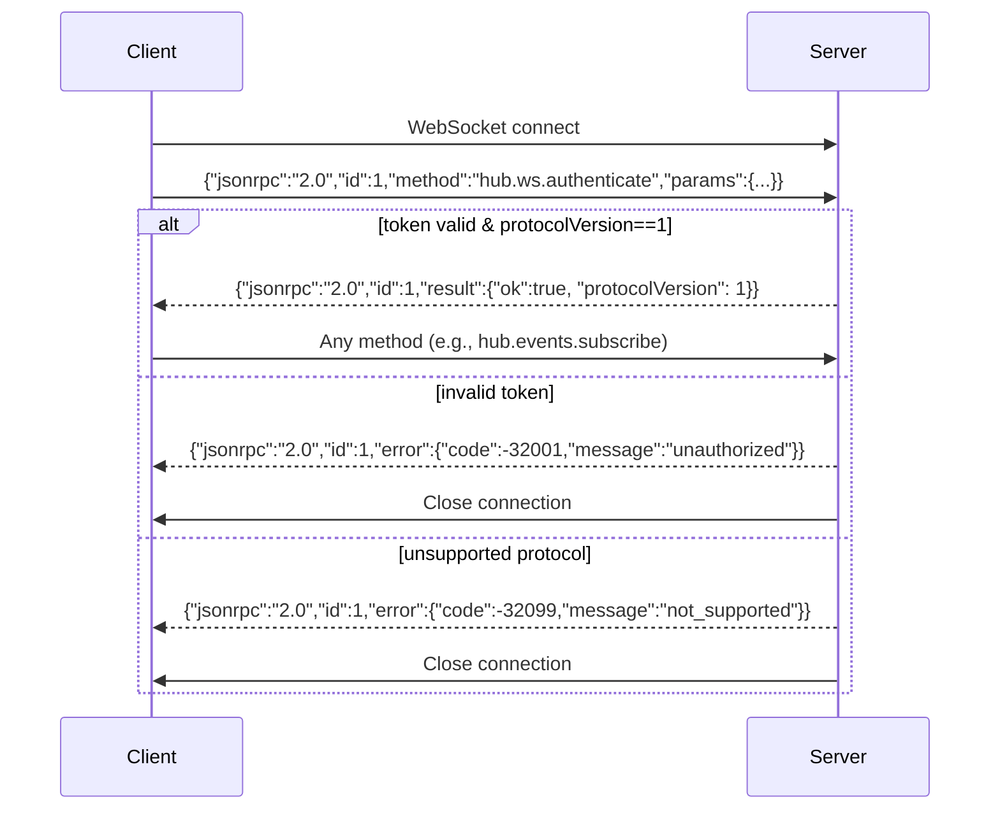
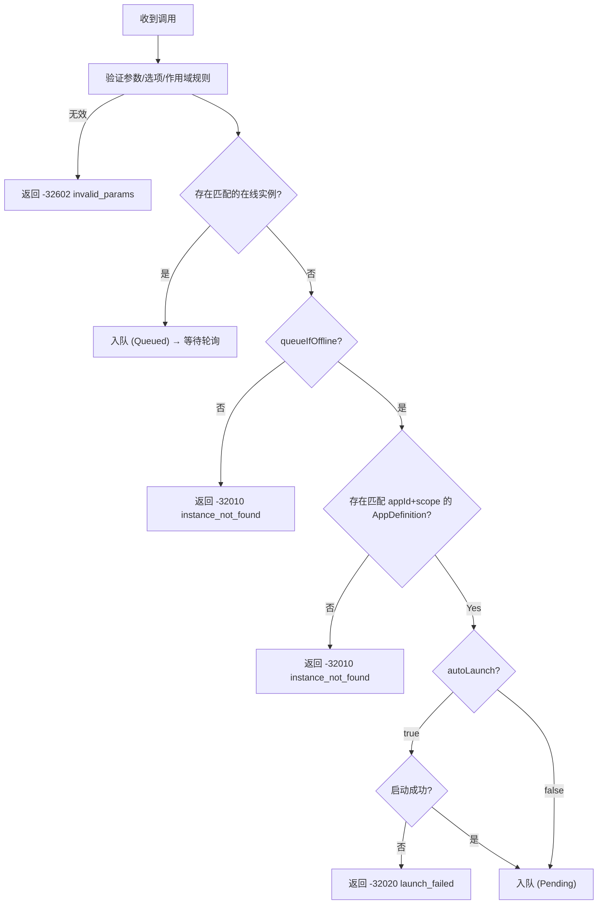
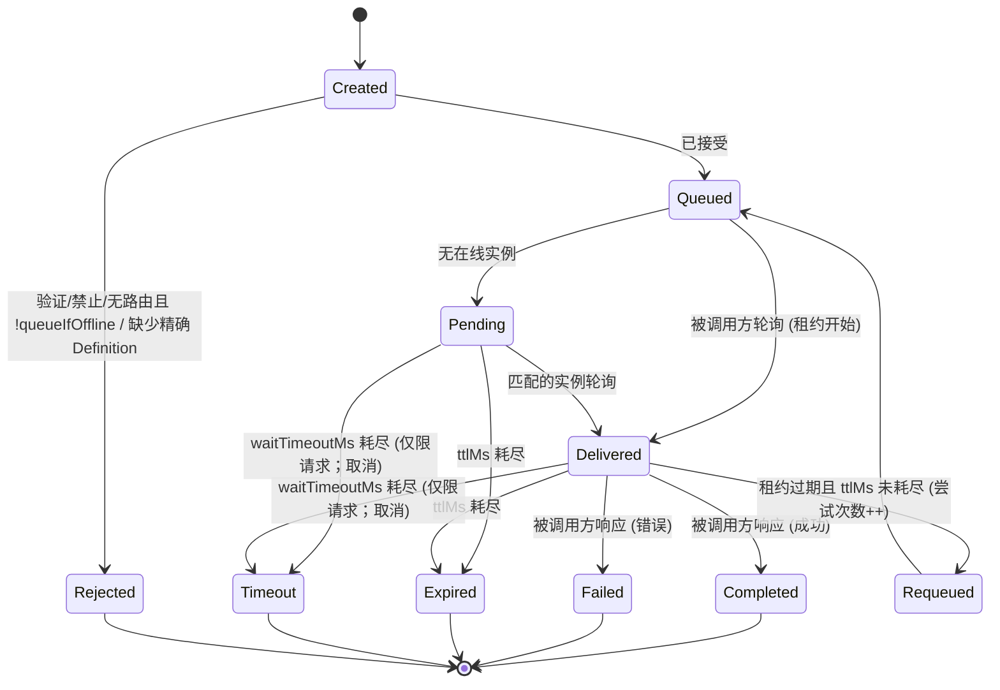

# DevHub 协议规范 v1.0.1

**定位**：DevHub Hub v1.x 的权威协议基线
**日期**：2026-03-28
**适用范围**：DevHub Hub v1.x、任意语言 SDK

---

## 1. 引言

### 1.1 目的
本规范定义了 DevHub 的协议：一个 **per-user 本地守护进程**，用于实现：
- 注册与发现应用实例
- 编排跨工具方法调用
- 由 `scope` 实现的工作区隔离
- 用于 UI / 监控的事件订阅

### 1.2 范围
**必须**由以下各方遵循：
- DevHub Hub 实现（含简单身份验证）
- 所有语言 SDK（.NET、JS/TS、Python 等）
- 符合性测试套件

### 1.3 非目标
- 跨机器通信
- 强一致性保证
- 多用户授权
- 复杂身份验证

### 1.4 规范治理口径
本规范同时承担两类职责：
- **协议核心契约**：直接定义“本机 per-user 多工具编排闭环”所必需的公开行为。Host、SDK、测试、Schema、示例与接入文档都**必须**对齐这些条款；发现偏差时，默认应优先修正实现或测试，而不是通过临时特判掩盖问题。
- **兼容性与仓库治理约束**：定义 v1.x 兼容口径、发现字段稳定性、对外资产版本管理与 conformance 门禁的维护原则。若这些条款与纠正核心协议基线发生冲突，**必须**同步更新实现、测试、Schema、示例、README 与接入文档，并以收敛后的规范文本为唯一依据。

本规范中的 MUST / MUST NOT 按以下原则解释：
- 凡直接约束传输、发现、鉴权、作用域路由、方法语义、状态机、错误语义与安全边界的条款，属于“核心目标必需约束”。
- 凡主要约束 v1.x 兼容承诺、对外资产版本管理或 conformance 门禁口径的条款，属于“兼容性与仓库治理约束”。
- 凡仅服务示例组织、资产打包或仓库发布流程的说明，不应被视为额外的协议能力。

当前分类结果如下：
- `§1.1` / `§1.3` 的目标与非目标、`§3` 至 `§8` 的协议行为条款，以及 `§11` 的安全边界条款，按“核心目标必需约束”执行。
- `§4.1.2` 中关于 `hub.json` 字段稳定性的表述、`§9` 的兼容承诺条款，以及 `§10` 的 conformance 门禁口径，按“兼容性与仓库治理约束”处理。
- 附录、示例命令、版本化 Schema / 协议示例的组织说明等内容，默认视为实现细节或发布策略说明，不单独构成额外的协议能力。

当某条约束是否应被冻结存在争议时，以“它是否直接服务本机单用户多工具编排闭环”为判断标准；若不是，则优先视为兼容性与仓库治理约束。

---

## 2. 符合性关键字 (RFC 2119)

| 关键字                  | 含义                             |
| ----------------------- | -------------------------------- |
| **必须** (**MUST**)     | 强制性行为；违反即视为不符合规范 |
| **应该** (**SHOULD**)   | 推荐行为；偏离需有正当理由       |
| **可以** (**MAY**)      | 可选功能                         |
| **禁止** (**MUST NOT**) | 禁止的行为                       |

---

## 3. 传输与消息格式

### 3.1 JSON-RPC 2.0 基准
所有消息**必须**符合 [JSON-RPC 2.0](https://www.jsonrpc.org/specification) 规范，且**必须**为 UTF-8 编码的 JSON 文本。

#### 3.1.1 请求
```json
{
  "jsonrpc": "2.0",
  "id": "string | supported integer number",
  "method": "string",
  "params": "object | array (optional)"
}
```

- 期望响应的请求**必须**包含 `id`，且**必须**为 **string** 或受支持的整数 `number`。
- numeric `id` **必须**满足以下全部条件：
  - 值语义上是整数，**不得**为小数。
  - 必须处于 Host 运行时可无损往返的受支持范围内；Host 的运行时边界采用有符号 64 位整数（`Int64`）范围。
  - Host 对其进行解析、存储并回写响应时，**不得**发生值变化。
- 若 numeric `id` 为小数、超出 Host 支持范围，或无法被 Host 无损解析并回写，Hub **必须**返回 `-32600 invalid_request`，且 `id = null`。
- 通知**必须省略** `id`（即**禁止**存在 `id` 字段）。
  - **禁止**使用 `"id": null` 作为“通知标记”。
- `params` **可以**省略。
- **禁止**支持批量请求（以 `array` 为根）。
  - 如果输入的 JSON 根是数组，Hub **必须**返回一个**单一**的 JSON-RPC 错误响应：
    - `error.code = -32600` (`invalid_request`)
    - `id = null`

#### 3.1.2 通知（客户端 → 服务端 或 服务端 → 客户端 在 WS 上）
```json
{
  "jsonrpc": "2.0",
  "method": "string",
  "params": "object | array (optional)"
}
```

#### 3.1.3 成功响应
```json
{
  "jsonrpc": "2.0",
  "id": "<与请求相同>",
  "result": "object"
}
```
- 所有 `hub.*` 方法的 `result` **必须**是一个 JSON 对象。

#### 3.1.4 错误响应
```json
{
  "jsonrpc": "2.0",
  "id": "<与请求相同，若无法解析则为 null>",
  "error": {
    "code": "integer",
    "message": "string",
    "data": "object (optional)"
  }
}
```
- 如果请求不是可解析的 JSON，Hub **必须**返回 `-32700 parse_error` 和 `id: null`。

---

### 3.2 HTTP 传输

| 属性            | 要求                                                                                                      |
| --------------- | --------------------------------------------------------------------------------------------------------- |
| 端点 (Endpoint) | `/rpc`（基础 URL 来自 `hub.json`）；JSON-RPC 请求使用 `POST`，浏览器 / WebView 预检使用 `OPTIONS`        |
| `Content-Type`  | `POST /rpc` 的请求体 **必须**为 `application/json`（允许指定字符集）                                      |
| HTTP 状态码     | `POST /rpc` 即使发生错误也**必须**始终返回 `200 OK`；`OPTIONS /rpc` 预检成功时**必须**返回 `204 No Content` |
| 错误信号        | `POST /rpc` **必须**使用 JSON-RPC 的 `error` 字段；`OPTIONS /rpc` **不得**返回 JSON-RPC 响应体           |

规范性要求：
- 当 `POST /rpc` 承载**带 `id`** 的 JSON-RPC request 时，Host **必须**返回 JSON-RPC `result` 或 JSON-RPC `error`。
- `POST /rpc` 的处理顺序**必须**固定为：HTTP 传输层校验、JSON-RPC 信封校验、方法分发。`Content-Type`、`Authorization`、`X-DevHub-Protocol`、`X-DevHub-ClientId` 与 `X-DevHub-ClientSessionId` 校验**必须**先于 JSON-RPC notification 空响应语义执行。
- `Authorization` 校验**必须**先于请求体 JSON 解析执行；当 `Authorization` 缺失或无效时，Host **必须**返回 `-32001 unauthorized` 且 `id = null`，即使请求体不是可解析的 JSON。
- 当 `POST /rpc` 的 HTTP 传输层校验失败时，Host **必须**返回对应 JSON-RPC `error` 响应，即使请求体是省略 `id` 的 JSON-RPC notification。此类请求**不得**进入 RPC 方法处理；若失败发生在 JSON-RPC 信封解析前，错误响应的 `id` **必须**为 `null`。
- 当 `POST /rpc` 承载省略 `id` 的 JSON-RPC notification，且 HTTP 传输层校验通过、JSON-RPC 信封合法、方法处理已接受该 notification 时，Host **必须**返回空的 `200 OK` 响应体，**不得**返回 JSON-RPC `result` 或 `error`。
- `OPTIONS /rpc` **必须**作为浏览器 / WebView 直连 Host 的预检入口单独处理，**不得**进入 JSON-RPC 请求体验证、协议头校验或 Bearer Token 鉴权链路。
- 当 `OPTIONS /rpc` 请求同时携带 `Origin` 和 `Access-Control-Request-Method: POST` 时，Host **必须**将其视为有效预检，并在响应中声明允许的方法 `POST`、`OPTIONS`。
- 上述预检成功响应 **必须**返回与请求 `Origin` 完全一致的 `Access-Control-Allow-Origin`，并 **必须**返回 `Vary: Origin`。
- 上述预检响应 **必须**允许至少以下请求头：`Authorization`、`Content-Type`、`X-DevHub-Protocol`、`X-DevHub-ClientId`、`X-DevHub-ClientSessionId`。
- `OPTIONS /rpc` 预检成功时 **不得**要求 `Authorization`、JSON-RPC body 或其他仅适用于 `POST /rpc` 的业务字段。
- 当 `POST /rpc` 请求携带 `Origin` 时，无论响应是 JSON-RPC `result` 还是 JSON-RPC `error`，Host **必须**返回与请求 `Origin` 完全一致的 `Access-Control-Allow-Origin`，并 **必须**返回 `Vary: Origin`。
- 上述浏览器 / WebView 直连规则仅适用于 `/rpc`；WebSocket 传输行为仍以本规范 §3.3、§4.3 为准。

---

### 3.3 WebSocket 传输

| 属性            | 要求                                                                       |
| --------------- | -------------------------------------------------------------------------- |
| 端点 (Endpoint) | 连接到 `hub.json` 中的 `wsUrl`（原样使用）                                 |
| 身份验证        | **必须**使用 `hub.ws.authenticate` 作为第一条消息                          |
| 鉴权前行为      | 当**存在** `id` 时，**必须**拒绝所有非鉴权方法并返回 `-32001 unauthorized` |
| 消息格式        | JSON-RPC 2.0 对象；服务端可在鉴权后发送通知                                |

**鉴权前处理顺序（规范性）**：
1. Hub **必须**解析 JSON 文本。
   - 解析失败：返回 `-32700 parse_error` 且 `id: null`（随后**可以**关闭连接）。
2. Hub **必须**验证 JSON-RPC 信封结构。
   - 若无效：返回 `-32600 invalid_request`（无法确定 `id` 时使用 `id: null`；随后**可以**关闭）。
3. 如果消息是 `method != hub.ws.authenticate` 的 JSON-RPC 请求/通知且连接未通过鉴权：
   - 如果存在 `id`：返回 `-32001 unauthorized`。
   - 如果不存在 `id`（通知）：Hub **必须**关闭连接（因为无法发送 JSON-RPC 错误响应）。

---

## 4. 运行时发现、身份验证与安全边界

### 4.1 运行时文件与发现（规范性）

#### 4.1.1 运行时数据根目录

**路径分隔符约定**：本文档中的路径示例统一使用 `/` 作为分隔符。Windows 平台实现时应将 `/` 替换为 `\`（例如 `C:/Users/me/...` → `C:\Users\me\...`）。

Host 与 SDK **必须**按以下优先级解析数据根目录：
1. 显式配置的数据根目录参数（若该实现提供此能力）。
2. 环境变量 `DEVHUB_DATA_DIR`。
3. 平台默认数据根目录。

标准目录布局固定如下：

```text
${dataDir}/
├── runtime/
│   ├── hub.json
│   └── token.txt
├── apps/
│   └── definitions.json
└── logs/
```

| 平台        | 建议运行时数据根目录                              | 完整路径（供参考）                     |
| :---------- | :---------------------------------------------- | :------------------------------------- |
| **Windows** | `%LOCALAPPDATA%/DevHub/`                        | `<User>/AppData/Local/DevHub/`         |
| **macOS**   | `~/Library/Application Support/DevHub/`         | 与标准路径相同                         |
| **Linux**   | `$XDG_DATA_HOME/DevHub/`                        | `~/.local/share/DevHub/`               |

规范性要求：
- 单实例粒度**必须**为“当前 OS 用户 + 规范化后的 `${dataDir}`”；同一用户在同一 `${dataDir}` 下只允许一个 Host，不同 `${dataDir}` 可并行运行。

#### 4.1.2 `hub.json`（发现文件）
Hub **必须**在 `${dataDir}/runtime/hub.json` 写入发现文件。该文件**必须**符合 §5.4 定义的 `HubRuntime` 架构。

示例：
```json
{
  "protocolVersion": 1,
  "hubVersion": "1.0.1",
  "pid": 47231,
  "httpBaseUrl": "http://127.0.0.1:47231",
  "wsUrl": "ws://127.0.0.1:47231/ws",
  "tokenFile": "C:/Users/me/AppData/Local/DevHub/runtime/token.txt",
  "startedAtUtc": "2026-01-30T12:34:56Z",
  "runtimeTuning": {
    "leaseSeconds": 30,
    "onlineThresholdSeconds": 30,
    "launchDedupeWindowSeconds": 30,
    "launchRegisterTimeoutSeconds": 30
  }
}
```

规范性要求：
- 本规范的 `protocolVersion` **必须**为 `1`。
- 在当前基线下，Host 与客户端 **必须**使用 §5.4 定义的 `hub.json` 架构。若 `hub.json` 字段集合为纠正核心目标偏差而确需变更，**必须**同步更新 §5.4、Schema、协议示例、SDK、测试与接入文档；兼容性处理规则见 §9.2。
- `hubVersion` 若存在，**必须**为字符串；该字段用于发现阶段诊断，已连接状态下的权威运行版本查询以 §6.3.1A `hub.getVersion` 为准。
- `httpBaseUrl` **必须**是 HTTP(S) origin，只能包含 scheme、回环 host 与可选端口；**禁止**包含 path、query、fragment、userinfo 或末尾斜杠。客户端派生 RPC 端点时固定追加 `/rpc`。
- `wsUrl` **必须**是 WebSocket 绝对 URL （`ws://` 或 `wss://`），路径固定为 `/ws`，只能包含 scheme、回环 host、可选端口与该路径；**禁止**包含 query、fragment、userinfo、自定义路径或末尾斜杠。
- `httpBaseUrl` 和 `wsUrl` **必须**指向回环地址（`127.0.0.1` 和/或 `localhost`；实现也**可以**额外使用 `::1`）。
- `tokenFile` **必须**是绝对路径。
- `runtimeTuning` **必须**存在，且 `leaseSeconds`、`onlineThresholdSeconds`、`launchDedupeWindowSeconds`、`launchRegisterTimeoutSeconds` **必须**为大于等于 1 的整数；未显式配置时默认值均为 `30`。
- Hub **必须**原子化地更新 `hub.json`（先写临时文件再替换）以避免读取不完整。
- `hub.json` **必须**具有 OS ACL，限制仅当前用户可访问。
- 客户端**必须**将 `hub.json` 作为权威端点来源，**禁止**假设固定的端口；WebSocket 客户端**必须**原样连接 `wsUrl`，并拒绝不符合固定 `/ws` 端点形状的发现文件。

#### 4.1.3 `token.txt`
- 默认位置：`${dataDir}/runtime/token.txt`（也可通过 `hub.json.tokenFile` 发现）
- 文件内容：单个持有者令牌 (bearer token) 字符串（UTF-8 文本）。客户端读取时**应该**修剪末尾的 `\r\n` 和空白字符。
- 令牌有效期：令牌**应该**在 Hub 启动时重新生成（“每个 Hub 会话一次”）。旧令牌**必须**被拒绝。

#### 4.1.4 AppDefinition 存储 (v1)
- 默认位置：`${dataDir}/apps/definitions.json`
- Definition 目录索引文件**必须**由 `${dataDir}` 固定派生，不提供独立覆盖环境变量。
- Definition 目录索引根对象**必须**包含显式 `version` 字段，当前版本固定为 `1`。
- Definition 目录索引根对象**必须**能够表达零个或多个可加载的 Definition 记录；本规范不要求内部采用固定 `appId` 分组结构，也不要求使用固定 `scopes` 嵌套字段。
- 每个有效 Definition 记录**必须**通过 payload 中显式的 `appId` 与 `scope` 共同唯一标识同一组 `appId + scope` 复合身份；其中 `scope = ""` 表示 Global Definition，`scope = "global"` 等显式作用域与 Global Definition **必须**保持可并存且可精确寻址。
- Definition 条目的 JSON 负载**必须**符合 `AppDefinition` 架构 (§5.1)；持久化与读取结果中的 `appId` / `scope` **必须**按 canonical 原值保留，**不得**通过文件名编码、`scopeKey`、路径转义或大小写折叠推导身份。
- 当 `${dataDir}/apps/definitions.json` 缺失时，Hub **必须**将当前 Definition 清单视为空集合。
- 当目录索引顶层结构无效、缺失 `version` 或无法表达可加载的 Definition 记录集合时，Hub **必须**将当前 Definition 清单视为空集合。
- 当目录索引顶层结构有效但某个 Definition 记录无效时，Hub **必须**仅忽略该无效记录，并继续加载其他合法 Definition。
- 当同一 Definition 清单中存在多个有效记录声明相同 `appId + scope` 时，Hub **必须**使用稳定、可重复的规则选择至多一个 live Definition，并且 `hub.apps.listDefinitions` **不得**返回重复的 `appId + scope`。
- Hub 写入 Definition 清单时**必须**使用原子写入语义，并且后续读取、`hub.apps.listDefinitions` 与 `hub.apps.getDefinition` 的可观察结果**必须**按有效 Definition 的 `appId` ordinal 升序稳定返回；同一 `appId` 内 Global Definition 在前，其余 Definition 按 `scope` ordinal 升序返回。

> 注意：符合性测试假设使用平台默认值，除非显式配置了 `DEVHUB_DATA_DIR` 或等价的数据根目录参数。

---

### 4.2 HTTP 请求头（`POST /rpc` **必须**存在）

| 请求头                     | 格式             | 描述                                                                    |
| -------------------------- | ---------------- | ----------------------------------------------------------------------- |
| `Authorization`            | `Bearer {token}` | 从 `hub.json.tokenFile`（或默认的 `${dataDir}/runtime/token.txt`）读取的令牌 |
| `X-DevHub-Protocol`        | `"1"`            | 协议版本；HTTP 请求头值为字符串；**必须**精确为 `"1"`                   |
| `X-DevHub-ClientId`        | string           | 逻辑客户端身份（如 `DevHubUI`, `VSPlugin` 等）                          |
| `X-DevHub-ClientSessionId` | UUID string      | canonical UUID 文本格式（`8-4-4-4-12`）；**必须**在客户端重启时更改     |

缺失/无效请求头的处理方式：
- 缺失/无效 `Authorization`：返回 `-32001 unauthorized`
- 缺失/无效 `X-DevHub-Protocol`：返回 `-32099 not_supported`
- 缺失 `X-DevHub-ClientId` 或 `X-DevHub-ClientSessionId`：返回 `-32600 invalid_request` 且 `error.data.reason="missing_header"`
- `X-DevHub-ClientSessionId` 存在但不是合法 UUID string：返回 `-32600 invalid_request` 且 `error.data.reason="invalid_header"`、`error.data.header="X-DevHub-ClientSessionId"`

浏览器 / WebView 的 `OPTIONS /rpc` 预检请求不适用本节要求；其行为由 §3.2 的 HTTP 传输规则定义。

---

### 4.3 WebSocket 身份验证流程

`hub.ws.authenticate` **必须**是第一条 WS 消息，且**必须**是一个 JSON-RPC 请求（即包含 `id`）。



---

### 4.4 安全边界
- Hub **必须**仅监听回环地址（`127.0.0.1` / `localhost` 和/或 `::1`）。
- v1 **禁止**跨用户访问（令牌是边界）。
- §4.1.2 和 §4.1.3 中关于 `token.txt` 和 `hub.json` 的文件 ACL 要求是规范性的。

---

## 5. 数据模型（含 JSON Schema）

### 5.1 AppDefinition
```json
{
  "$schema": "http://json-schema.org/draft-07/schema#",
  "$id": "https://devhub.spec/v1/app-definition.json",
  "type": "object",
  "required": ["appId", "scope", "displayName"],
  "properties": {
    "appId": { "type": "string", "pattern": "^[A-Za-z0-9_](?:[A-Za-z0-9_.-]*[A-Za-z0-9_])?$" },
    "scope": {
      "type": "string",
      "pattern": "^$|^[A-Za-z0-9_](?:[A-Za-z0-9_.-]*[A-Za-z0-9_])?$"
    },
    "displayName": { "type": "string", "pattern": ".*\\S.*" },
    "description": { "type": "string" },
    "capabilities": {
      "type": "object",
      "properties": {
        "rpc": { "type": "boolean" },
        "events": { "type": "boolean" }
      }
    },
    "launch": {
      "type": "object",
      "properties": {
        "exePath": { "type": "string" },
        "args": {
          "type": "array",
          "items": { "type": "string" }
        },
        "argsTemplate": { "type": "string" },
        "workingDirectory": { "type": "string" },
        "dedupeKeyTemplate": { "type": "string" }
      }
    }
  }
}
```

#### 5.1.1 AppDefinition 语义（规范性）
- `AppDefinition` 的公开身份**必须**是复合键 `(appId, scope)`；其中 Global Definition **必须**使用 `scope = ""` 表示，显式作用域 Definition **必须**使用满足 canonical `scope` grammar 的非空字符串表示。
- `displayName` **必须**是至少包含一个非空白字符的字符串；空字符串或仅包含空白字符的字符串都**不得**视为合法值。
- 持久化 Definition payload **必须**显式包含 `scope` 字段；省略 `scope`、使用 `scope = null` 或使用任何未通过 canonical `scope` grammar 的字符串都**不得**视为合法的持久化 Definition 形状。
- Definition 持久化与读取**必须**以显式 `scope` 字段作为唯一作用域身份，公开协议中的 `scope` 字段**必须**继续回传原始 canonical `scope`，不得改写为其他存储层派生值。
- `hub.apps.listDefinitions` **必须**支持参数 `{ appId?: string, scope: string|null }`；其中 `scope` 字段**必须**显式出现。`appId` 省略时，结果**必须**覆盖所有应用；当 `scope = null` 时，结果**必须**不按作用域过滤；当 `scope = ""` 时，结果**必须**只包含 Global Definition；当 `scope` 为其他合法字符串时，结果**必须**只包含该精确作用域的 Definition。
- `hub.apps.getDefinition` 与 `hub.apps.deleteDefinition` **必须**按精确的 `appId + scope` 查找 Definition，**不得**仅按 `appId` 模糊定位；这两个接口都**必须**要求显式提供合法字符串 `scope`。
- `AppDefinition` 不定义作用域白名单或强制模式；`scope` 的解释与路由行为统一由 §5.5 定义。
- `launch` **可以**省略；`launch.exePath` **可以**省略，也**可以**是空字符串或仅包含空白字符的字符串。Definition 校验和写入**不得**仅因 Definition 当前不可启动而失败；启动阶段按 §6.3.12 报告缺失启动配置。
- 如果提供 `launch.args`，其值**必须**是字符串数组。数组中的每个元素表示一个独立 argv 参数，并按 §6.3.12 的模板规则独立展开。
- 如果同时提供 `launch.args` 与 `launch.argsTemplate`，启动阶段**必须**使用 `launch.args`，并忽略 `launch.argsTemplate`。
- 如果省略 `capabilities` 或 `capabilities.rpc`，默认值为 `true`。
  - 如果精确匹配请求 `appId + scope` 的 `AppDefinition` 存在且 `capabilities.rpc` 为 `false`，Hub **必须**拒绝该 `appId + scope` 的 `hub.invoke.notify` 和 `hub.invoke.request` 调用，返回 `-32002 forbidden` 且 `error.data.reason="rpc_disabled"`。
  - Hub **不得**因同一 `appId` 下其他 `scope` 的 `AppDefinition.capabilities.rpc=false` 拒绝当前 `appId + scope` 的调用。
- `capabilities.events` 保留供未来使用；在 v1 中，Hub **必须**忽略它。

#### 5.1.2 ValidationIssue（规范性）
Hub 在 `hub.apps.validateDefinition` 的成功结果，以及 `hub.apps.upsertDefinition` 因定义校验失败返回的 `error.data.errors` 中使用的 `ValidationIssue` **必须**符合以下结构：

```json
{
  "$schema": "http://json-schema.org/draft-07/schema#",
  "$id": "https://devhub.spec/v1/validation-issue.json",
  "type": "object",
  "required": ["path", "code", "message"],
  "properties": {
    "path": { "type": "string" },
    "code": { "type": "string" },
    "message": { "type": "string" }
  }
}
```

规范性语义：
- `path` **必须**指向候选 `AppDefinition` 中的出错字段或逻辑位置，路径起点为 `definition` 根对象。
- `code` **必须**是稳定的机器可读错误标识。
- `message` **必须**是可直接展示给开发者或 GUI 用户的诊断文本。

#### 5.1.3 AppDefinitionValidationResult（规范性）
`hub.apps.validateDefinition` 成功结果中的校验部分 **必须**符合以下结构：

```json
{
  "ok": true,
  "valid": true,
  "errors": []
}
```

规范性语义：
- 当 `valid=true` 时，`errors` **必须**为空数组。
- 当 `valid=false` 时，`errors` **必须**至少包含一项 `ValidationIssue`。

---

### 5.2 AppInstance
```json
{
  "$schema": "http://json-schema.org/draft-07/schema#",
  "$id": "https://devhub.spec/v1/app-instance.json",
  "type": "object",
  "required": ["instanceId", "appId", "scope", "pid", "registeredAtUtc", "lastSeenUtc", "invoke"],
  "properties": {
    "instanceId": {
      "type": "string",
      "maxLength": 256,
      "pattern": "^[A-Za-z0-9_](?:[A-Za-z0-9_.-]*[A-Za-z0-9_])?$"
    },
    "appId": { "type": "string", "pattern": "^[A-Za-z0-9_](?:[A-Za-z0-9_.-]*[A-Za-z0-9_])?$" },
    "scope": {
      "type": "string",
      "pattern": "^$|^[A-Za-z0-9_](?:[A-Za-z0-9_.-]*[A-Za-z0-9_])?$"
    },
    "pid": { "type": "integer", "minimum": 1 },
    "registeredAtUtc": { "type": "string", "format": "date-time" },
    "lastSeenUtc": { "type": "string", "format": "date-time" },
    "invoke": {
      "type": "object",
      "required": ["poll", "respond"],
      "properties": {
        "poll": { "type": "boolean" },
        "respond": { "type": "boolean" }
      }
    },
    "meta": { "type": "object" }
  },
  "allOf": [
    { "not": { "required": ["password"] } },
    { "not": { "required": ["instanceSessionToken"] } }
  ]
}
```

#### 5.2.1 AppInstanceRegistration（规范性）
`hub.apps.registerInstance.params.instance` **必须**符合以下结构（省略服务端管理的时间戳）：

```json
{
  "$schema": "http://json-schema.org/draft-07/schema#",
  "$id": "https://devhub.spec/v1/app-instance-registration.json",
  "type": "object",
  "required": ["instanceId", "appId", "scope", "pid", "invoke"],
  "properties": {
    "instanceId": {
      "type": "string",
      "maxLength": 256,
      "pattern": "^[A-Za-z0-9_](?:[A-Za-z0-9_.-]*[A-Za-z0-9_])?$"
    },
    "appId": { "type": "string", "pattern": "^[A-Za-z0-9_](?:[A-Za-z0-9_.-]*[A-Za-z0-9_])?$" },
    "scope": {
      "type": "string",
      "pattern": "^$|^[A-Za-z0-9_](?:[A-Za-z0-9_.-]*[A-Za-z0-9_])?$"
    },
    "pid": { "type": "integer", "minimum": 1 },
    "invoke": {
      "type": "object",
      "required": ["poll", "respond"],
      "properties": {
        "poll": { "type": "boolean" },
        "respond": { "type": "boolean" }
      }
    },
    "meta": { "type": "object" }
  },
  "allOf": [
    { "not": { "required": ["password"] } },
    { "not": { "required": ["instanceSessionToken"] } }
  ]
}
```

规范性语义：
- `AppInstance` 与 `AppInstanceRegistration` **必须**使用显式字符串 `scope`；其中 `scope = ""` 表示 Global，其他合法非空字符串表示显式作用域。
- `hub.apps.registerInstance` 的 `params.instance.scope` **必须**存在且为合法字符串；省略、`null` 与未通过 canonical `scope` grammar 的字符串都**必须**被拒绝。
- `AppInstance` 与 `AppInstanceRegistration` 的 `appId` 与 `instanceId` **必须**满足 canonical protocol identifier grammar。
- `AppInstanceRegistration` 只描述 `params.instance`；`hub.apps.registerInstance` 的顶层 `password` **不属于** `AppInstanceRegistration`。
- `hub.apps.registerInstance.params.instance.password` 与 `hub.apps.registerInstance.params.instance.instanceSessionToken` **必须**被拒绝；当任一字段出现在 `params.instance` 中时，Hub **必须**返回 `-32602 invalid_params`，且**不得**创建或更新该实例注册状态。
- `password` 与 `instanceSessionToken` **不得**出现在 `AppInstance`、`AppInstanceRegistration`、`hub.apps.getInstance`、`hub.apps.listInstances` 的返回值或任何 `app.instance.*` 事件载荷中。
- `instanceSessionToken` 只属于 `hub.apps.registerInstance` 成功结果顶层字段，以及 `hub.apps.heartbeat`、`hub.apps.unregisterInstance`、`hub.invoke.poll`、`hub.invoke.respond` 的顶层 `params`。

---

### 5.3 Invocation
```json
{
  "$schema": "http://json-schema.org/draft-07/schema#",
  "$id": "https://devhub.spec/v1/invocation.json",
  "type": "object",
  "required": ["invocationId", "appId", "target", "method", "kind", "createdAtUtc", "caller"],
  "properties": {
    "invocationId": {
      "type": "string",
      "maxLength": 256,
      "pattern": "^invk-[a-zA-Z0-9._:-]+$"
    },
    "appId": {
      "type": "string",
      "pattern": "^[A-Za-z0-9_](?:[A-Za-z0-9_.-]*[A-Za-z0-9_])?$"
    },
    "target": {
      "type": "object",
      "required": ["scope"],
      "properties": {
        "scope": {
          "type": "string",
          "pattern": "^$|^[A-Za-z0-9_](?:[A-Za-z0-9_.-]*[A-Za-z0-9_])?$"
        },
        "instanceId": {
          "type": ["string", "null"],
          "maxLength": 256,
          "pattern": "^[A-Za-z0-9_](?:[A-Za-z0-9_.-]*[A-Za-z0-9_])?$"
        }
      }
    },
    "method": { "type": "string" },
    "args": {
      "description": "Any valid JSON value is allowed (object/array/string/number/boolean/null)."
    },
    "kind": { "type": "string", "enum": ["request", "notify"] },
    "createdAtUtc": { "type": "string", "format": "date-time" },
    "options": {
      "type": "object",
      "properties": {
        "ttlMs": { "type": "integer", "minimum": 1000 },
        "waitTimeoutMs": { "type": "integer", "minimum": 1 },
        "queueIfOffline": { "type": "boolean" },
        "autoLaunch": { "type": "boolean" }
      }
    },
    "delivery": {
      "type": "object",
      "required": ["leaseSeconds", "attempt", "leaseToken"],
      "properties": {
        "leaseSeconds": { "type": "integer", "minimum": 1 },
        "attempt": { "type": "integer", "minimum": 1 },
        "leaseToken": { "type": "string", "minLength": 1 }
      }
    },
    "caller": {
      "type": "object",
      "required": ["clientId", "clientSessionId"],
      "properties": {
        "clientId": { "type": "string" },
        "clientSessionId": {
          "type": "string",
          "pattern": "^[0-9a-fA-F]{8}-[0-9a-fA-F]{4}-[0-9a-fA-F]{4}-[0-9a-fA-F]{4}-[0-9a-fA-F]{12}$"
        }
      }
    }
  }
}
```

---

### 5.4 HubRuntime (`hub.json`)
```json
{
  "$schema": "http://json-schema.org/draft-07/schema#",
  "$id": "https://devhub.spec/v1/hub-runtime.json",
  "type": "object",
  "required": ["protocolVersion", "pid", "httpBaseUrl", "wsUrl", "tokenFile", "startedAtUtc", "runtimeTuning"],
  "properties": {
    "protocolVersion": { "type": "integer", "enum": [1] },
    "hubVersion": { "type": "string" },
    "pid": { "type": "integer", "minimum": 1 },
    "httpBaseUrl": {
      "type": "string",
      "format": "uri",
      "pattern": "^https?://(?:[Ll][Oo][Cc][Aa][Ll][Hh][Oo][Ss][Tt]|127\\.0\\.0\\.1|\\[::1\\])(?::[0-9]+)?$"
    },
    "wsUrl": {
      "type": "string",
      "format": "uri",
      "pattern": "^wss?://(?:[Ll][Oo][Cc][Aa][Ll][Hh][Oo][Ss][Tt]|127\\.0\\.0\\.1|\\[::1\\])(?::[0-9]+)?/ws$"
    },
    "tokenFile": {
      "type": "string",
      "oneOf": [
        { "pattern": "^/.+" },
        { "pattern": "^[A-Za-z]:[\\\\/].+" },
        { "pattern": "^\\\\\\\\[^\\\\/]+[\\\\/][^\\\\/]+(?:[\\\\/].+)?$" }
      ]
    },
    "startedAtUtc": { "type": "string", "format": "date-time" },
    "runtimeTuning": {
      "type": "object",
      "required": ["leaseSeconds", "onlineThresholdSeconds", "launchDedupeWindowSeconds", "launchRegisterTimeoutSeconds"],
      "properties": {
        "leaseSeconds": { "type": "integer", "minimum": 1 },
        "onlineThresholdSeconds": { "type": "integer", "minimum": 1 },
        "launchDedupeWindowSeconds": { "type": "integer", "minimum": 1 },
        "launchRegisterTimeoutSeconds": { "type": "integer", "minimum": 1 }
      }
    }
  }
}
```

---

### 5.5 协议标识符规则（规范性）

- **IDENT-01（`appId` canonical grammar）**：所有公开 `appId` **必须**是满足 `^[A-Za-z0-9_](?:[A-Za-z0-9_.-]*[A-Za-z0-9_])?$` 的非空字符串。`.` 与 `-` 只允许出现在内部位置，首尾**必须**是字母、数字或 `_`。Host、Schema、示例与客户端 **不得**对合法值执行大小写折叠、空白修剪或其他隐式规范化。
- **IDENT-02（`instanceId` canonical grammar）**：所有公开 `instanceId` **必须**是长度不超过 256 且满足 `^[A-Za-z0-9_](?:[A-Za-z0-9_.-]*[A-Za-z0-9_])?$` 的非空字符串。内部 `.` **可以**存在；以 `.` 或 `-` 开头或结尾、包含 `:`、空白或其他非法字符的值**必须**被拒绝。
- **IDENT-03（`scope` canonical grammar）**：当 `scope` 或 `target.scope` 以字符串出现时，合法值**必须**满足以下之一：字面量 `""`；或满足 `^[A-Za-z0-9_](?:[A-Za-z0-9_.-]*[A-Za-z0-9_])?$` 的非空字符串。字面量 `""` 是唯一用于显式表示 Global 的值；字面量 `"global"` 只是普通显式作用域字符串。
- **IDENT-04（值按校验后原样保留）**：成功结果、错误载荷、事件载荷与持久化 Definition payload 中的 `appId`、`scope`、`instanceId` **必须**回传通过校验后的原始字符串，不得替换成其他“规范化”值或文件名编码。
- **IDENT-05（Definition 与注册类接口）**：`hub.apps.validateDefinition`、`hub.apps.upsertDefinition`、`hub.apps.getDefinition`、`hub.apps.deleteDefinition` 与 `hub.apps.registerInstance` **必须**要求显式提供合法字符串 `scope`。`scope = null` 或省略 `scope` 在 `validateDefinition` / `upsertDefinition` 中**必须**表现为 `definition_invalid`，在 `getDefinition` / `deleteDefinition` / `registerInstance` 中**必须**返回 `-32602 invalid_params`。
- **IDENT-06（Definition 列表查询）**：对于 `hub.apps.listDefinitions`，`scope` 字段**必须**显式出现。`scope = null` 时**必须**表示“不按 scope 过滤”；`scope = ""` 时**必须**只匹配 Global Definition；当 `scope` 为其他合法字符串时**必须**按精确作用域过滤。省略 `scope` **必须**返回 `-32602 invalid_params`。
- **IDENT-07（实例列表查询）**：对于 `hub.apps.listInstances.scope`，`scope` 字段**必须**显式出现。`scope = null` 时**必须**表示“不按 scope 过滤”；`scope = ""` 时**必须**仅匹配 Global；其他合法非空字符串**必须**按区分大小写的精确匹配处理。省略 `scope` **必须**返回 `-32602 invalid_params`。
- **IDENT-08（非查询接口的请求参数）**：对于 `hub.apps.launch.scope`、`hub.invoke.notify.target.scope` 与 `hub.invoke.request.target.scope`，调用方**必须**显式提供合法字符串 `scope`；即使同时指定了 `target.instanceId` 也没有例外。`scope = null` 或省略 `scope` **必须**返回 `-32602 invalid_params`。`scope = ""` 时表示 Global，其他合法非空字符串按精确作用域处理。
- **IDENT-08A（调用目标实例标识）**：`hub.invoke.notify.target.instanceId` 与 `hub.invoke.request.target.instanceId` 若为非 `null`，**必须**是符合 IDENT-02 的合法 `instanceId` 字符串，包括 256 字符长度上限；非法值**必须**在路由查找前返回 `-32602 invalid_params`，不得通过 `instance_not_found` 表示参数非法。
- **IDENT-09（非法类型）**：`scope` 或 `target.scope` 若存在且类型不是 `string|null`，Hub **必须**返回 `-32602 invalid_params`。

---

## 6. RPC 方法

### 6.1 约定（规范性）
- 除非对应方法定义另有说明，`hub.*` 方法的 `params` 在显式提供时**必须**是**对象**参数（具名参数）。允许省略 `params` 或传 `null` 的情形，**必须**由对应方法定义显式声明；如果参数是数组，Hub **必须**返回 `-32602 invalid_params`。
- `hub.invoke.notify` / `hub.invoke.request` 的 `args` **可以**是任意 JSON 值（`object | array | string | number | boolean | null`）。
- 对于所有成功的 `hub.*` 调用，`result` **必须**是一个至少包含以下内容的 JSON 对象：
  ```json
  { "ok": true }
  ```
  **可以**包含额外字段。
- 所有错误**必须**使用 §8 定义的 JSON-RPC `error` 对象返回。

**术语（规范性）**：
- `hub.invoke.notify` 与 `hub.invoke.request` 的 `target.scope` **必须**存在且其值是一个**合法字符串**（其中 `""` 表示 Global）。
- “指定了 `target.instanceId`” 指 `target.instanceId` 是一个**非 null 字符串**。
  - 空字符串**应该**被拒绝并返回 `-32602 invalid_params`。

### 6.2 方法矩阵

| 方法                          | HTTP | WS (鉴权后)      | 重试安全* | 副作用                            |
| ----------------------------- | ---- | ---------------- | --------- | --------------------------------- |
| `hub.ping`                    | ✓    | ✓                | ✓         | 无                                |
| `hub.getVersion`              | ✓    | ✓                | ✓         | 无                                |
| `hub.ws.authenticate`         | ✗    | ✓ (仅限首条消息) | ✓         | 将客户端身份绑定到 WS             |
| `hub.apps.listDefinitions`    | ✓    | ✓                | ✓         | 无                                |
| `hub.apps.getDefinition`      | ✓    | ✓                | ✓         | 无                                |
| `hub.apps.validateDefinition` | ✓    | ✗                | ✓         | 无                                |
| `hub.apps.upsertDefinition`   | ✓    | ✗                | ✓         | 原子创建/更新定义；刷新快照       |
| `hub.apps.deleteDefinition`   | ✓    | ✗                | ✗         | 删除定义；刷新快照                |
| `hub.apps.registerInstance`   | ✓    | ✗                | ✗         | 更新/插入实例；更新 `lastSeenUtc` |
| `hub.apps.heartbeat`          | ✓    | ✗                | ✓         | 更新 `lastSeenUtc`                |
| `hub.apps.unregisterInstance` | ✓    | ✗                | ✓         | 移除实例                          |
| `hub.apps.listInstances`      | ✓    | ✓                | ✓         | 无                                |
| `hub.apps.getInstance`        | ✓    | ✓                | ✓         | 无                                |
| `hub.apps.launch`             | ✓    | ✗                | ✗         | 启动进程（若未运行）              |
| `hub.invoke.notify`           | ✓    | ✗                | ✗         | 将调用入队                        |
| `hub.invoke.request`          | ✓    | ✗                | ✗         | 入队并等待响应                    |
| `hub.invoke.poll`             | ✓    | ✗                | ✗         | 认领调用（租约开始）              |
| `hub.invoke.respond`          | ✓    | ✗                | ✗         | 完成调用                          |
| `hub.events.subscribe`        | ✗    | ✓                | ✗         | 创建订阅                          |
| `hub.events.unsubscribe`      | ✗    | ✓                | ✓         | 移除订阅                          |

\* “重试安全”意味着调用者在传输失败时**可以**安全重试，而不会创建重复的持久资源。这不等同于严格的 HTTP 幂等性。

> **注意**：调用方法（`poll`/`respond`）有意不支持 WS 传输，以避免被调用侧 WS 连接状态的复杂性。

---

### 6.3 方法定义

#### 6.3.1 `hub.ping`
**参数（可选）**：可以省略 `params`，也可以传 `null` 或对象参数（对象中可包含 `echo` 字段）
**结果**：
```json
{ "ok": true, "serverTimeUtc": "2026-01-30T12:34:56Z", "echo": "..." }
```

规范性行为：
- `params` 省略、`params = null` 或 `params` 为对象时，Hub **必须**接受请求。
- 若 `params` 为对象且存在 `echo` 字段，Hub **可以**在成功响应中回显该字段值。
- 当 `params` 为数组时，Hub **必须**按 §6.1 返回 `-32602 invalid_params`。
- 当 `params` 为 `string`、`number` 或 `boolean` 时，Hub **必须**返回 `-32600 invalid_request`。

#### 6.3.1A `hub.getVersion`
**参数（可选）**：可以省略 `params`，也可以传 `null` 或空对象 `{}`
**结果**：
```json
{ "ok": true, "version": "1.0.1" }
```

规范性行为：
- Host **必须**返回当前运行中的 Host 版本。
- `version` **必须**是非空 `SemVer` 字符串。
- 当 `params` 为数组时，Hub **必须**按 §6.1 返回 `-32602 invalid_params`。
- 当 `params` 为除 `null` 之外的非对象值，或对象中包含任意字段时，Hub **必须**返回 `-32602 invalid_params`。

#### 6.3.2 `hub.ws.authenticate` (仅限 WS)
**参数**：
```json
{
  "token": "string",
  "protocolVersion": 1,
  "clientId": "string",
  "clientSessionId": "uuid-string"
}
```
**结果**：
```json
{ "ok": true, "protocolVersion": 1 }
```

规范性行为：
- `clientSessionId` **必须**是合法 canonical UUID string；否则 Hub **必须**返回 `-32602 invalid_params`，并在返回响应后关闭连接。

#### 6.3.3 `hub.apps.listDefinitions`
**参数**：
```json
{ "appId": "test.app", "scope": null }
```
**结果**：
```json
{ "ok": true, "definitions": [ /* AppDefinition[] */ ] }
```
- `params` **必须**是对象，且**必须**显式包含 `scope` 字段；若 `params` 省略、为空对象或缺失 `scope`，Hub **必须**返回 `-32602 invalid_params`。
- 若提供 `appId`，Hub **必须**先按 `appId` 过滤 Definition 集合；若省略 `appId`，Hub **必须**遍历所有 `appId`。
- 若 `scope = null`，结果中的 `definitions` **必须**包含当前 `appId` 过滤范围内的全部 Definition。
- 若 `scope = ""`，Hub **必须**只返回 Global Definition；若 `scope` 为其他合法字符串，Hub **必须**只返回该精确作用域的 Definition。
- 结果中的 `definitions` **必须**是稳定有序列表：先按 `appId` 的 `StringComparer.Ordinal` 升序；同一 `appId` 下 Global Definition（`scope = ""`）**必须**排在前面，其余 Definition **必须**按 `scope` 的 `StringComparer.Ordinal` 升序。
- 若 `scope` 的类型非法、`scope` 未通过 canonical grammar，或 `appId` 存在但不是字符串或未通过 canonical grammar，Hub **必须**返回 `-32602 invalid_params`。

#### 6.3.4 `hub.apps.getDefinition`
**参数**：
```json
{ "appId": "test.app", "scope": "" }
```
**结果**：
```json
{ "ok": true, "definition": { /* AppDefinition */ } }
```
**错误**：
- `-32602 invalid_params`：当 `scope` 省略、为 `null`、类型非法或未通过 §5.5 字符串验证时。
- `-32014 app_definition_not_found`
- Hub **必须**只返回与请求 `appId + scope` 精确匹配的 Definition，**不得**回退到同一 `appId` 的其他作用域 Definition。
- 当目标 Definition 不存在时，`error.data` **必须**至少回传请求中的 `appId` 与原始 canonical `scope`。

#### 6.3.5 `hub.apps.validateDefinition` (仅限 HTTP)
**参数**：
```json
{
  "definition": {
    "appId": "test.app",
    "scope": "",
    "displayName": "Test App"
  }
}
```

**结果**：
```json
{
  "ok": true,
  "valid": false,
  "errors": [
    {
      "path": "definition.appId",
      "code": "invalid_app_id",
      "message": "appId must match ^[A-Za-z0-9_](?:[A-Za-z0-9_.-]*[A-Za-z0-9_])?$"
    }
  ]
}
```

规范性行为：
- Hub **必须**复用与 `hub.apps.upsertDefinition` 相同的定义校验规则。
- `validateDefinition` **不得**创建、修改或删除任何定义文件，也**不得**刷新内存快照。
- 当候选定义有效时，Hub **必须**返回 `{ "ok": true, "valid": true, "errors": [] }`。
- 当候选定义无效时，Hub **必须**返回 `{ "ok": true, "valid": false, "errors": [ /* ValidationIssue[] */ ] }`。

#### 6.3.6 `hub.apps.upsertDefinition` (仅限 HTTP)
**参数**：
```json
{
  "definition": {
    "appId": "test.app",
    "scope": "",
    "displayName": "Test App"
  }
}
```

**结果**：
```json
{ "ok": true, "definition": { /* AppDefinition */ } }
```

规范性行为：
- Hub **必须**先执行与 `hub.apps.validateDefinition` 完全一致的定义校验。
- 当定义校验通过时，Hub **必须**原子更新 `${dataDir}/apps/definitions.json` 中与 `definition.appId + definition.scope` 精确匹配的 Definition 记录，并在成功后刷新可读取快照。更新后的可观察 Definition 清单**必须**按 `appId` 的 ordinal 升序返回，组内先 Global，再按 `scope` 的 ordinal 升序返回其余记录。
- 成功的 `upsertDefinition` **必须**发布 `app.definition.upserted` 事件。
- 成功结果中的 `definition` **必须**等于最新生效的 `AppDefinition`。
- Hub **必须**以 `definition.appId + definition.scope` 作为写入身份；对同一 `appId` 的其他作用域 Definition **不得**产生隐式覆盖。

**错误**：
- `-32602 invalid_params`：当 `params.definition` 未通过定义校验时，Hub **必须**返回该错误，并在 `error.data.reason="definition_invalid"` 下附带 `errors: ValidationIssue[]`。

#### 6.3.7 `hub.apps.deleteDefinition` (仅限 HTTP)
**参数**：
```json
{ "appId": "test.app", "scope": "" }
```

**结果**：
```json
{ "ok": true }
```

规范性行为：
- Hub **必须**从 `${dataDir}/apps/definitions.json` 删除与请求 `appId + scope` 精确匹配的 Definition 记录，并在成功后刷新可读取快照。
- 成功的 `deleteDefinition` **必须**发布 `app.definition.deleted` 事件。
- 删除成功后，后续对同一 `appId + scope` 的 `hub.apps.getDefinition` **必须**返回 `-32014 app_definition_not_found`。

**错误**：
- `-32602 invalid_params`：当 `scope` 省略、为 `null`、类型非法或未通过 §5.5 字符串验证时。
- `-32014 app_definition_not_found`：目标定义不存在；`error.data.appId` 与 `error.data.scope` **必须**分别等于请求中的 `appId` 与原始 canonical `scope`。

#### 6.3.8 `hub.apps.registerInstance` (仅限 HTTP)
客户端**必须**生成适合当前 Hub 注册表全局使用的 `instanceId`，并避免跨 `appId + scope` 复用同一实例身份。

**参数**：
```json
{
  "password": "regsec_7fK2m9Qx4Nc8Vt1Lp6Ys3Hd0Br5ZwJ2Ua8Ce1Mg4",
  "launchId": "launch-optional-from-DEVHUB_LAUNCH_ID",
  "instance": {
    "appId": "test.app",
    "instanceId": "inst-123",
    "scope": "",
    "pid": 12345,
    "invoke": { "poll": true, "respond": true },
    "meta": {}
  }
}
```

规范性要求：
- `params.password` **必须**是非空字符串。
- `params.password` **必须**是实例级高熵重注册秘密；调用方**必须**像保护 bearer token 一样保护该值，且**不得**写入日志、事件、公开实例快照或 Monitor 展示。
- `params.launchId` 为可选顶层字段；若存在，**必须**是非空字符串，且表示被启动进程从 `DEVHUB_LAUNCH_ID` 环境变量读取并回传给 Hub 的启动绑定身份。
- `params.instance` **必须**符合 `AppInstanceRegistration` (§5.2.1)。
- `params.instance.appId` 与 `params.instance.instanceId` **必须**满足 canonical protocol identifier grammar。
- `params.instance.password` 与 `params.instance.instanceSessionToken` **不得**出现；若任一字段存在，Hub **必须**返回 `-32602 invalid_params`，且**不得**创建或更新该实例注册状态。
- Hub **必须**在服务端设置 `registeredAtUtc` 和 `lastSeenUtc`。
- Hub **必须**在每次成功的 `registerInstance` 时更新 `lastSeenUtc`。
- Hub **必须**在每次成功的 `registerInstance` / re-register 时生成新的、不透明的 `instanceSessionToken`，并立即使该 `instanceId` 先前持有的旧 token 失效。
- Hub **必须**根据 §5.5 验证并解释 `scope`；若 `scope` 缺失、为 `null`、类型非法或未通过字符串验证，**必须**返回 `-32602 invalid_params`。
- `params.instance.meta.launchId` **不得**作为规范控制面字段；符合本规范的客户端、SDK、Monitor 与测试资产**必须**使用顶层 `params.launchId`。
- 未携带顶层 `launchId` 或未关联到活动 `launchId` 的 `hub.apps.registerInstance` **必须**视为实例自主注册路径；Hub **必须**仅依据请求参数合法性、实例密码/所有权规则和既有实例更新规则决定是否接受该注册。
- 对于上述自主注册路径，若同一 `appId` 已存在其他 scope 的 Definition，Hub **不得**再要求当前 `scope` 也存在精确匹配的 Definition，也**不得**因缺少同 scope Definition 返回 `-32014 app_definition_not_found`。
- `instanceId` 是同一 Hub 注册表内的全局实例身份。
- 当某个 `instanceId` 首次成功注册时，Hub **必须**把该次请求中的 `appId`、`scope` 与 `password` 绑定到该 `instanceId`。
- 当某个 `instanceId` 已存在时，Hub **必须**先校验 `password`。若不匹配，**必须**返回 `-32002 forbidden` 且 `error.data.reason="instance_password_mismatch"`。
- 当某个 `instanceId` 已存在且 `password` 匹配时，Hub **必须**只允许同一 `appId + scope` 的 re-register；若 `appId` 或 `scope` 与既有绑定不同，**必须**返回 `-32002 forbidden` 且 `error.data.reason="instance_identity_mismatch"`，并且**不得**更新该实例注册状态。
- 只要实例注册记录仍被保留，Hub **必须**保留该 `instanceId` 的 `appId + scope + password` 绑定，包括已离线但仍在注册表中保留的实例记录。
- `instanceSessionToken` **必须**作为单次注册会话凭据，用于该实例后续 `hub.apps.heartbeat`、`hub.apps.unregisterInstance`、`hub.invoke.poll`、`hub.invoke.respond` 的所有权校验；进程重启后的同 `instanceId` 重注册授权**不得**要求提供旧 `instanceSessionToken`。
- 自主注册成功的实例，即使其 `scope` 未被任何 Definition 覆盖，后续 `hub.apps.listInstances` 与 `hub.apps.getInstance` 仍**必须**返回该实例快照；Hub **不得**因此自动创建、复制或推导新的 Definition。
- Definition 清单**必须**仅继续约束 `hub.apps.launch` 与 `hub.invoke.notify/request` 的 auto-launch 精确 `appId + scope` 解析，不得扩展为普通 `registerInstance` 的 scope allowlist；没有精确 `AppDefinition(appId, scope)` 时，自主注册只建立在线路由能力，不建立离线队列或 auto-launch 能力。
- 当某次注册可被 Hub 关联到一条尚未完成的启动记录时，该注册**必须**通过顶层 `params.launchId` 绑定回对应启动记录；仅凭“已有同 `appId + scope` 实例在线”**不得**视为该次启动已完成。
- 若该启动绑定注册的 `appId + scope` 与发起启动的 Definition 不一致，Hub **必须**拒绝本次注册，并返回 `-32002 forbidden` 且 `error.data.reason="definition_scope_mismatch"`；Hub **不得**让同 `appId` 的其他作用域 Definition 吸收该进程。
- 发生上述启动绑定冲突时，任何等待该启动完成的 `hub.apps.launch` **必须**以 `-32020 launch_failed` 失败，且 `error.data.reason="definition_scope_mismatch"`；相关 `error.data` **应该**至少包含 `appId`、`expectedScope` 与 `actualScope` 以便诊断。
- Hub **不得**在成功结果或任何 `app.instance.*` 事件载荷中回传 `password`。
- Hub **不得**在 `AppInstance`、`hub.apps.getInstance`、`hub.apps.listInstances` 结果或任何 `app.instance.*` 事件载荷中回传 `instanceSessionToken`。

**结果**：
```json
{ "ok": true, "instance": { /* AppInstance */ }, "instanceSessionToken": "opaque-token" }
```

#### 6.3.9 `hub.apps.heartbeat` (仅限 HTTP)
**参数**：
```json
{ "instanceId": "inst-123", "instanceSessionToken": "opaque-token" }
```
**结果**：
```json
{ "ok": true, "lastSeenUtc": "2026-01-30T12:34:56Z" }
```
**错误**：`-32010 instance_not_found`、`-32002 forbidden`

规范性行为：
- `params.instanceId` 与 `params.instanceSessionToken` **必须**都是非空字符串。
- 当 `instanceId` 存在但 `instanceSessionToken` 不匹配时，Hub **必须**返回 `-32002 forbidden` 且 `error.data.reason="instance_session_token_mismatch"`。

#### 6.3.10 `hub.apps.unregisterInstance` (仅限 HTTP)
**参数**：
```json
{
  "instanceId": "inst-123",
  "instanceSessionToken": "opaque-token"
}
```
**结果**：
```json
{ "ok": true }
```
幂等性：如果实例不存在，Hub 仍**必须**返回 `{ "ok": true }`。

规范性行为：
- `params.instanceId` 与 `params.instanceSessionToken` **必须**都是非空字符串。
- 当 `instanceId` 存在时，Hub **必须**只在 `instanceSessionToken` 匹配时允许注销；若不匹配，**必须**返回 `-32002 forbidden` 且 `error.data.reason="instance_session_token_mismatch"`。
- 当注销成功移除现有实例记录时，Hub **必须**同步移除该 `instanceId` 的 `appId + scope + password` 绑定和当前 `instanceSessionToken`。
- 当 `instanceId` 不存在且请求结构合法时，Hub **必须**继续返回 `{ "ok": true }`。

当 Host 过期清理移除已保留的实例记录时，Hub **必须**同步移除该 `instanceId` 的 `appId + scope + password` 绑定和当前 `instanceSessionToken`。清理产生的 `app.instance.unregistered` 事件**必须**携带被移除实例最后注册快照中的 canonical `scope`。

#### 6.3.11 `hub.apps.listInstances`
**参数**：
```json
{
  "appId": "test.app",
  "scope": null,
  "includeOffline": false
}
```
**结果**：
```json
{ "ok": true, "instances": [ /* AppInstance[] */ ] }
```
规范性行为：
- `params` **必须**是对象，且**必须**显式包含 `scope` 字段；若 `params` 省略、为空对象或缺失 `scope`，Hub **必须**返回 `-32602 invalid_params`，并使用 `error.data.reason="invalid_scope"`。
- 如果 `scope = null`，Hub **必须**返回当前 `appId` 过滤范围内的所有作用域实例。
- 如果 `scope = ""`，Hub **必须**只返回 Global 作用域实例；如果 `scope` 为其他合法字符串，Hub **必须**只返回该精确作用域实例。
- 若省略 `appId`，Hub **必须**遍历所有 `appId`。若提供 `appId`，其值**必须**是满足 canonical `appId` grammar 的字符串；非法 `appId` 值**必须**返回 `-32602 invalid_params`，且不得返回部分实例清单。
- 若提供了 `scope` 字段，Hub **必须**先按 `string|null` 与 canonical grammar 校验其类型和值；非法值（包括对象、数组、布尔值，以及未通过 canonical `scope` grammar 的字符串）**必须**返回 `-32602 invalid_params`，并使用 `error.data.reason="invalid_scope"`。
- `includeOffline` 默认为 `false`。

#### 6.3.11A `hub.apps.getInstance`
**参数**：
```json
{ "instanceId": "inst-123" }
```
**结果**：
```json
{ "ok": true, "instance": { /* AppInstance */ } }
```
**错误**：`-32602 invalid_params`、`-32010 instance_not_found`

规范性行为：
- `params` **必须**是对象。
- `params.instanceId` **必须**是非空字符串，并满足 `AppInstance.instanceId` 的格式约束；省略、为空字符串、类型非法或未通过 canonical `instanceId` grammar 校验时，Hub **必须**返回 `-32602 invalid_params`。
- Hub **必须**只按请求中的 `instanceId` 做精确匹配；命中时 **必须**返回当前仍保留在注册表中的 `AppInstance` 快照。
- 对于已经离线但尚未被显式注销或过期清理移除的实例，Hub **必须**继续返回该保留快照。
- `hub.apps.getInstance` **不得**刷新 `lastSeenUtc`，也**不得**要求 `instanceSessionToken`。
- 当目标实例不存在、已注销或已被过期清理移除时，Hub **必须**返回 `-32010 instance_not_found`，并在 `error.data` 中至少包含 `instanceId` 与 `reason="unknown_instance"`。
- 成功结果中的 `instance` 与错误结果都**不得**泄漏 `password` 或 `instanceSessionToken`。

#### 6.3.12 `hub.apps.launch` (仅限 HTTP)
**参数**：
```json
{
  "appId": "test.app",
  "scope": "",
  "dedupeKey": "optional-key",
  "waitForRegisterMs": 3000
}
```

**结果**：
```json
{
  "ok": true,
  "status": "started",
  "pid": 12345,
  "launchId": "...",
  "dedupeKey": "test.app:global"
}
```

规范性行为：
- `status` **必须**是以下之一：`started`, `starting`, `already_running`，且**必须**按以下路径稳定映射：
  - `already_running`：存在匹配请求 `appId + scope` 的**在线**注册实例，或具有相同 `appId + scope + resolvedDedupeKey` 的启动正在进行中。
  - `started`：进程创建成功，且 `waitForRegisterMs = 0`；或 `waitForRegisterMs > 0` 且在等待窗口耗尽前，带有被跟踪 `launchId` 且与请求 `appId + scope` 精确匹配的注册已经满足该启动记录。
  - `starting`：进程创建成功，`waitForRegisterMs > 0`，且等待窗口耗尽前被跟踪的启动记录仍未被满足。
- 成功结果**必须**始终包含 `{ "ok": true, "status": string }`。
- 当 `status = "started"` 或 `status = "starting"` 来自新创建进程时，结果**必须**包含该启动记录的 `launchId` 与解析后的 `dedupeKey`，并且在平台可观测时**应该**包含 `pid`。
- 当 `status = "already_running"` 由在线实例命中产生时，结果**必须**包含命中的 `instanceId`，并且在可用时**应该**包含 `pid`。
- 当 `status = "already_running"` 由进行中 launch record 命中产生时，结果**必须**包含该启动记录的 `launchId` 与解析后的 `dedupeKey`，并且在可用时**应该**包含 `pid`。
- Hub **必须**要求请求显式提供合法字符串 `scope`；若 `scope` 缺失、为 `null`、类型非法或未通过 §5.5 字符串验证，**必须**返回 `-32602 invalid_params`。
- 完成 `scope` 校验后，Hub **必须**按精确 `appId + scope` 解析要启动的 Definition；**不得**从其他显式 scope 或 Global Definition 回退匹配。
- Hub **必须**为 `appId + scope + resolvedDedupeKey` 维护一个去重窗口（默认 30 秒）。在此窗口内，具有相同复合去重身份的并发启动**必须**返回 `already_running`；相同 `resolvedDedupeKey` 在不同 `appId` 或不同 `scope` 下**不得**互相命中进行中启动记录。
- 对于已经启动进程且该进程仍存活、但尚未完成注册绑定的启动记录，Hub **必须**持续返回 `already_running`，即使已超过 `LaunchDedupeWindowSeconds`；去重窗口只控制已完成或已失败记录的保留时间，**不得**让仍在进行中的同 `appId + scope + resolvedDedupeKey` 启动脱离 dedupe。
- 每条未完成 launch record **必须**具有有限注册截止时间。基础注册截止时间由 `hub.json.runtimeTuning.launchRegisterTimeoutSeconds` 定义，默认 30 秒；有效注册截止时间**不得**早于当前 `hub.apps.launch` 请求的 `waitForRegisterMs` 等待截止点。
- 当 `waitForRegisterMs = 0` 时，注册截止时间只用于后台终结 launch record 并释放对应 `appId + scope + resolvedDedupeKey` 的进行中 dedupe，**不得**改变本次调用已返回的 `started` 结果。
- 若被跟踪进程退出、绑定注册失败或在完成匹配注册前达到有效注册截止时间，Hub **必须**将该启动记录推进为终态并释放对应 `appId + scope + resolvedDedupeKey` 的进行中 dedupe。
- 如果 `waitForRegisterMs > 0` 且 launch record 在匹配注册前达到有效注册截止时间，Hub **必须**让该次启动以 `-32020 launch_failed` 失败，且 `error.data.reason="launch_register_timeout"`。
- 如果省略 `dedupeKey`，Hub **必须**使用 `AppDefinition.launch.dedupeKeyTemplate` 生成它。
- **模板替换**：Hub **必须**只支持 `dedupeKeyTemplate` 和 `argsTemplate` 中的以下占位符：
  - `{appId}`: 应用程序 ID。
  - `{scope}`: 请求作用域（若为 Global 则为空字符串）。
  - `{scopeOrGlobal}`: 请求作用域；若请求的是 Global，则为字面量字符串 `global`。
  - `{httpBaseUrl}`: Hub 的 HTTP 基础 URL（例如 `http://127.0.0.1:47231`）。
- 上述集合之外的 token（例如 `{dedupeKey}`）**不得**获得隐藏运行时语义；Hub **必须**将其保留为字面量文本。
- 如果 `AppDefinition.launch.dedupeKeyTemplate` 被省略或为 null，Hub **必须**使用默认模板：`{appId}:{scopeOrGlobal}`。
- Hub **必须**以 argv 列表启动进程，且**不得**通过 shell 执行启动参数。shell 元字符、命令替换、重定向和管道字符均**必须**作为普通参数文本传递。
- 当 `launch.args` 存在时，Hub **必须**逐元素执行上述模板替换，并把每个展开后的元素作为恰好一个 argv 参数传递。`launch.args` 存在时，Hub **必须**忽略 `launch.argsTemplate`。
- 当仅存在 `launch.argsTemplate` 时，Hub **必须**先执行上述模板替换，再按协议定义的 argv 拆分规则生成参数列表：未加引号的 ASCII 空白分隔参数，单引号与双引号仅用于保留其中空白；未加引号时，反斜杠仅在后继字符是 ASCII 空白、引号字符或另一个反斜杠时转义该字符，其他情况下反斜杠按字面量保留；在单引号或双引号内，反斜杠仅在后继字符等于当前引号字符或另一个反斜杠时转义该字符，其他情况下反斜杠按字面量保留。引号字符本身不进入参数值，未闭合引号或悬空反斜杠**必须**导致 `-32602 invalid_params`。该解析结果仍**必须**作为 argv 传递，**不得**经 shell 执行。
- `waitForRegisterMs` 若省略则默认为 `0`，且**必须**为 ≥ 0 的整数（超出范围 => `-32602 invalid_params`）。
- 如果缺失 `AppDefinition.launch` 或 `launch.exePath` 缺失/为空白字符串，Hub **必须**在 `hub.apps.launch` 阶段返回 `-32020 launch_failed` 且 `error.data.reason="launch_config_missing"`。`hub.apps.validateDefinition` 与 `hub.apps.upsertDefinition` **不得**仅因 `launch.exePath` 是空白字符串而拒绝候选 Definition。
- Hub **必须**读取精确命中的 `AppDefinition.launch.exePath`。若该 `appId + scope` 对应的 Definition 缺失：返回 `-32014 app_definition_not_found`，且 `error.data` **必须**至少包含 `appId` 与原始 canonical `scope`。若进程创建失败：返回 `-32020`。
- 如果 `waitForRegisterMs > 0`，Hub **必须**只允许被跟踪 `launchId` 对应的注册满足等待中的启动；无关实例或缺少该 `launchId` 的同 scope 注册**不得**完成这次等待。
- Hub **必须**通过被启动进程环境变量 `DEVHUB_LAUNCH_ID` 传递该启动记录的 `launchId`；被启动 App **必须**在 `hub.apps.registerInstance.params.launchId` 顶层字段回传该值。
- 如果 `waitForRegisterMs > 0` 且被启动的进程在等待窗口内尝试注册到不同于启动 Definition 的 `scope`，Hub **必须**让该次启动以 `-32020 launch_failed` 失败，且 `error.data.reason="definition_scope_mismatch"`；`error.data` **应该**至少包含 `appId`、`expectedScope` 与 `actualScope`。

#### 6.3.13 `hub.invoke.notify` (仅限 HTTP)
**参数**：
```json
{
  "appId": "test.app",
  "target": { "scope": "", "instanceId": null },
  "method": "test.ping",
  "args": {},
  "options": {
    "ttlMs": 60000,
    "queueIfOffline": true,
    "autoLaunch": true
  }
}
```

**结果**：
```json
{ "ok": true, "invocationId": "invk-..." }
```

验证与默认值：
- 省略时的默认值：`ttlMs=60000`, `queueIfOffline=true`。
- `target.scope` **必须**显式提供合法字符串；即使同时指定了 `target.instanceId` 也没有例外。`target.scope` 缺失、为 `null`、类型非法或未通过 §5.5 字符串验证时，Hub **必须**返回 `-32602 invalid_params`。
- `autoLaunch` 默认为 `true`，**除非**指定了 `target.instanceId`（非 null 字符串），此时默认为 `false`。
- 如果指定了 `target.instanceId` 且 `options.autoLaunch` 被显式设为 `true`，Hub **必须**返回 `-32602 invalid_params`。
- 如果 `target.instanceId` 为非 `null`，该值**必须**满足 §5.5 IDENT-02 的 canonical `instanceId` 约束与 256 字符长度上限；非法值**必须**在路由查找前返回 `-32602 invalid_params`。
- 如果 `options.autoLaunch` 为 true，则 `options.queueIfOffline` **必须**为 true（否则返回 `-32602 invalid_params`）。
- 如果 `target.scope = ""`，Hub **必须**仅在 Global 作用域中路由该调用。
- 如果 `target.scope` 为其他合法字符串，Hub **必须**仅在该精确作用域中路由该调用。
- 如果精确匹配请求 `appId + target.scope` 的 `AppDefinition` 存在且 `capabilities.rpc` 为 `false`，Hub **必须**返回 `-32002 forbidden` 且 `error.data.reason="rpc_disabled"`。
- 当 `options.autoLaunch = true` 且不存在在线匹配实例时，Hub **必须**只查找精确 `appId + scope` 的可启动 Definition。
- 当 `options.queueIfOffline = true` 且不存在在线匹配实例时，Hub **必须**先要求存在精确 `AppDefinition(appId, scope)` 才能建立离线挂起路由。自主注册历史不得替代该 Definition 边界。
- 当 auto-launch 或离线队列因缺少精确 `AppDefinition(appId, scope)` 而无法建立挂起路由时，Hub **必须**返回 `-32010 instance_not_found`，且 `error.data.reason` **必须**为 `"definition_not_found"`，`error.data.appId` 与 `error.data.scope` **必须**分别等于请求中的 `appId` 与 canonical `scope`。

#### 6.3.14 `hub.invoke.request` (仅限 HTTP)
**参数**：结构与 `hub.invoke.notify` 相同，外加：
```json
"options": {
  "ttlMs": 300000,
  "waitTimeoutMs": 120000,
  "queueIfOffline": true,
  "autoLaunch": true
}
```

**成功结果**：
```json
{ "ok": true, "invocationId": "invk-...", "value": {} }
```

**错误**：
- `-32012 invocation_timeout`：当 `waitTimeoutMs` 在完成前耗尽。
  - Hub **必须**取消该调用（被调用方此后**不应该**收到该调用；迟到的 `respond` **必须**被拒绝）。
- `-32011 invocation_expired`：当 `ttlMs` 在交付/响应前耗尽。
- `-32050 invocation_failed`：当被调用方返回应用程序错误时（详见 `error.data.calleeError`）。
- 以及路由/鉴权/验证错误 (§8)。

验证与默认值：
- 省略时的默认值：`ttlMs=300000`, `waitTimeoutMs=120000`, `queueIfOffline=true`。
- `target.scope` **必须**显式提供合法字符串；即使同时指定了 `target.instanceId` 也没有例外。`target.scope` 缺失、为 `null`、类型非法或未通过 §5.5 字符串验证时，Hub **必须**返回 `-32602 invalid_params`。
- `autoLaunch` 默认为 `true`，**除非**指定了 `target.instanceId`（非 null 字符串），此时默认为 `false`。
- 如果指定了 `target.instanceId` 且 `options.autoLaunch` 被显式设为 `true`，Hub **必须**返回 `-32602 invalid_params`。
- 如果 `target.instanceId` 为非 `null`，该值**必须**满足 §5.5 IDENT-02 的 canonical `instanceId` 约束与 256 字符长度上限；非法值**必须**在路由查找前返回 `-32602 invalid_params`。
- 如果 `options.autoLaunch` 为 true，则 `options.queueIfOffline` **必须**为 true（否则返回 `-32602 invalid_params`）。
- 如果 `target.scope = ""`，Hub **必须**仅在 Global 作用域中路由该调用。
- 如果 `target.scope` 为其他合法字符串，Hub **必须**仅在该精确作用域中路由该调用。
- `waitTimeoutMs` **必须** ≤ `ttlMs`。
- 如果精确匹配请求 `appId + target.scope` 的 `AppDefinition` 存在且 `capabilities.rpc` 为 `false`，Hub **必须**返回 `-32002 forbidden` 且 `error.data.reason="rpc_disabled"`。
- 当 `options.autoLaunch = true` 且不存在在线匹配实例时，Hub **必须**只查找精确 `appId + scope` 的可启动 Definition。
- 当 `options.queueIfOffline = true` 且不存在在线匹配实例时，Hub **必须**先要求存在精确 `AppDefinition(appId, scope)` 才能建立离线挂起路由。自主注册历史不得替代该 Definition 边界。
- 当 auto-launch 或离线队列因缺少精确 `AppDefinition(appId, scope)` 而无法建立挂起路由时，Hub **必须**返回 `-32010 instance_not_found`，且 `error.data.reason` **必须**为 `"definition_not_found"`，`error.data.appId` 与 `error.data.scope` **必须**分别等于请求中的 `appId` 与 canonical `scope`。
- 当 HTTP caller 在 `hub.invoke.request` 完成前主动断连或取消请求时，Hub **必须**终止当前 HTTP 等待流程，但**不得**仅因 caller 断连而把该 invocation 推进到 `invocation_timeout` 或 `invocation_expired`；原有 `ttlMs` / `waitTimeoutMs` 预算 **必须**继续独立生效，因此后续 `poll/respond` 在预算仍有效时**可以**成功，在预算真正耗尽后仍**必须**按既有超时/过期语义拒绝迟到响应。

#### 6.3.15 `hub.invoke.poll` (仅限 HTTP)
**参数**：
```json
{
  "instanceId": "inst-123",
  "instanceSessionToken": "opaque-token",
  "maxCount": 10,
  "waitMs": 25000
}
```

**结果**：
```json
{
  "ok": true,
  "serverTimeUtc": "2026-01-30T12:34:56Z",
  "items": [
    {
      "invocationId": "invk-...",
      "appId": "test.app",
      "target": { "scope": "", "instanceId": null },
      "method": "test.ping",
      "args": {},
      "kind": "notify",
      "createdAtUtc": "2026-01-30T12:34:56Z",
      "caller": { "clientId": "DevHubUI", "clientSessionId": "..." },
      "delivery": { "leaseSeconds": 30, "attempt": 1, "leaseToken": "opaque-delivery-token" },
      "options": { "ttlMs": 60000 }
    }
  ]
}
```

规范性行为：
- Hub **必须**要求实例在轮询前已注册（`hub.apps.registerInstance`）；否则返回 `-32010 instance_not_found`。
- Hub **必须**要求 `params.instanceSessionToken` 为非空字符串，并校验其与 `instanceId` 当前持有的 token 匹配；不匹配时 **必须**返回 `-32002 forbidden` 且 `error.data.reason="instance_session_token_mismatch"`。
- Hub **必须**强制要求实例具有 `invoke.poll==true`；否则返回 `-32002 forbidden` 且 `error.data.reason="poll_not_enabled"`。
- `maxCount` 若省略则默认为 `10`，且**必须**为 `1..100` 的整数（非法值 => `-32602 invalid_params`）。
- `waitMs` 若省略则默认为 `25000`，且**必须**为大于等于 `0` 的整数（非法值 => `-32602 invalid_params`）。
- `waitMs = 0` **必须**表示“立即返回当前可用项或空列表”，不得进入长轮询等待。
- 当 `waitMs > 0` 且没有可用项时，Hub **必须**支持长轮询 (Long Polling)：等待最长 `waitMs` 时长后返回当前可用项或空列表。
- 成功的 `poll` **必须**更新实例的 `lastSeenUtc`。
- Hub **必须**为每个返回条目签发当前交付租约的 opaque `delivery.leaseToken`。该 token **不得**从调用方可控值派生，且**必须**能区分同一 invocation 的不同交付尝试。
- 租约时长在每个条目的 `delivery.leaseSeconds` 中返回。
- 成功授予交付租约后，Hub **必须**发布 `invocation.delivered` 事件，事件 payload **不得**暴露 `delivery.leaseToken`。

#### 6.3.16 `hub.invoke.respond` (仅限 HTTP)
**参数**（`value` 或 `error` **必须**且只能存在其中之一）：
```json
{
  "instanceId": "inst-123",
  "instanceSessionToken": "opaque-token",
  "invocationId": "invk-...",
  "leaseToken": "opaque-delivery-token",
  "value": {}
}
```

来自被调用方的错误响应：
```json
{
  "instanceId": "inst-123",
  "instanceSessionToken": "opaque-token",
  "invocationId": "invk-...",
  "leaseToken": "opaque-delivery-token",
  "error": { "code": 1001, "message": "app_error", "data": {} }
}
```

**结果**：
```json
{ "ok": true }
```

规范性行为：
- Hub **必须**要求实例已注册；否则返回 `-32010 instance_not_found`。
- Hub **必须**要求 `params.instanceSessionToken` 为非空字符串，并校验其与 `instanceId` 当前持有的 token 匹配；不匹配时 **必须**返回 `-32002 forbidden` 且 `error.data.reason="instance_session_token_mismatch"`。
- Hub **必须**要求 `params.leaseToken` 为非空字符串，并校验其等于该 invocation 当前有效交付租约的 token；缺失或类型非法时**必须**返回 `-32602 invalid_params`。
- Hub **必须**强制要求实例具有 `invoke.respond==true`；否则返回 `-32002 forbidden` 且 `error.data.reason="respond_not_enabled"`。
- 成功的 `respond` **必须**更新实例的 `lastSeenUtc`。
- 当被调用方返回应用程序错误且 `error.data` 存在时，Hub **必须**在 `-32050 invocation_failed` 的 `error.data.calleeError.data` 中保留该值；该值**可以**是对象、数组、字符串、数字、布尔值或 `null`，Hub **不得**为了满足对象模型而包装或丢弃非对象 JSON 值。

**错误**：
- `-32030 delivery_conflict`：如果租约无效/已过期、`leaseToken` 不是当前有效租约、使用旧交付尝试的 token、错误的实例响应或重复响应。
- `-32011 invocation_expired`：如果调用已过期/被取消/超时；当 `invocationId` 从未存在或已被 Hub 清理时，Hub **必须**继续返回该错误，并在 `error.data.reason="unknown_invocation"` 下提供稳定细分。
- `-32602 invalid_params`：负载格式错误。

#### 6.3.17 `hub.events.subscribe` (仅限 WS)
**参数**：
```json
{ "types": ["app.instance.registered", "invocation.completed"] }
```
如果 `types` 被省略或为空，则订阅所有事件。

**结果**：
```json
{ "ok": true, "subscriptionId": "sub-..." }
```

**支持的事件类型**：
- `app.definition.upserted`
- `app.definition.deleted`
- `app.instance.registered`
- `app.instance.unregistered`
- `invocation.queued`
- `invocation.delivered`
- `invocation.completed`
- `invocation.failed`

#### 6.3.18 `hub.events.unsubscribe` (仅限 WS)
**参数**：
```json
{ "subscriptionId": "sub-..." }
```
**结果**：
```json
{ "ok": true }
```
幂等性：取消订阅未知的 `subscriptionId` 仍**必须**返回 `{ "ok": true }`。

#### 6.3.19 服务端 → 客户端 事件交付 (仅限 WS)
Hub **必须**将已订阅的事件作为 JSON-RPC 通知交付：

```json
{
  "jsonrpc": "2.0",
  "method": "hub.event",
  "params": {
    "subscriptionId": "sub-...",
    "type": "app.instance.registered",
    "timeUtc": "2026-01-30T12:34:56Z",
    "payload": {
      "appId": "asset.indexer",
      "instanceId": "asset.indexer_pid-12345",
      "scope": ""
    }
  }
}
```

事件交付是尽力而为且非持久化的；Hub 在负载过高时**可以**丢弃事件。
如果同一事件命中同一连接上的多个订阅，Hub **必须**按订阅逐条发送 `hub.event` 通知；每条通知**必须**只携带一个对应的 `subscriptionId`。

规范性事件载荷：
- `app.definition.upserted` 的 `payload` **必须**至少包含 `appId`、`scope` 与最新 `definition`；其中 `payload.definition.scope` **必须**与 `payload.scope` 一致。
- `app.definition.deleted` 的 `payload` **必须**至少包含 `appId` 与 `scope`。
- `app.instance.registered` 与 `app.instance.unregistered` 的 `payload` **必须**至少包含 canonical `appId`、canonical `instanceId` 与 canonical `scope`，且**不得**包含 `password` 或 `instanceSessionToken`。Global scope **必须**显式表示为 `""`。
- `invocation.queued` 的 `payload` **必须**至少包含 `invocationId`、`appId`、`target`、`method` 与 `kind`。
- `invocation.delivered` 的 `payload` **必须**至少包含 `invocationId`、`appId`、`target`、`instanceId` 与 `delivery.attempt`，且**不得**包含 `delivery.leaseToken`。
- `invocation.completed` 的 `payload` **必须**至少包含 `invocationId`、`appId`、`target` 与 `instanceId`。
- `invocation.failed` 的 `payload` **必须**至少包含 `invocationId`、`appId`、`target`、`instanceId` 与 `reason`。

---

## 7. 调用生命周期与路由

### 7.1 路由决策矩阵（规范性）


路由规则：
- 如果提供了 `target.instanceId`，Hub **必须**仅路由到该 instanceId（不回退）。
- `target.scope` **必须**显式提供且为合法字符串。
- 如果 `target.scope = ""`，Hub **必须**仅路由到 Global 作用域（不命中非 Global 作用域实例）。
- 如果 `target.scope` 是其他合法字符串，Hub **必须**仅路由到该作用域（不回退）。
- 当多个实例匹配一个作用域/全局队列时，交付遵循“先轮询者得”原则。
- **挂起队列约束**：如果请求目标不存在精确匹配 `appId + scope` 的可用 `AppDefinition`，即使 `queueIfOffline` 为 true，Hub 中也**禁止**将调用入队。在这种情况下，**必须**返回 `-32010 instance_not_found`。

### 7.2 调用状态机


### 7.3 关键时间约束

| 参数                    | 默认值 (notify) | 默认值 (request) | 约束                                          |
| ----------------------- | --------------- | ---------------- | --------------------------------------------- |
| `ttlMs`                 | 60,000 ms       | 300,000 ms       | **必须** ≥ 1,000 ms                           |
| `waitTimeoutMs`         | N/A             | 120,000 ms       | **必须** ≤ `ttlMs`                            |
| `leaseSeconds`          | 30 s (默认)     | 30 s (默认)      | 由 Hub 在 `poll` 时分配；可配置，见 `hub.json.runtimeTuning.leaseSeconds` |
| 在线阈值                | 30 s (默认)     | 30 s (默认)      | `now - lastSeenUtc ≤ 在线阈值`；可配置，见 `hub.json.runtimeTuning.onlineThresholdSeconds` |
| 去重窗口                | 30 s (默认)     | 30 s (默认)      | 启动去重窗口；可配置，见 `hub.json.runtimeTuning.launchDedupeWindowSeconds` |
| 启动注册截止时间        | 30 s (默认)     | 30 s (默认)      | 未完成 launch record 的基础注册截止时间；可配置，见 `hub.json.runtimeTuning.launchRegisterTimeoutSeconds` |
| `maxCount` (轮询默认值) | 10              | 10               | **必须**在 1..100 (超出范围 = invalid_params) |

---

## 8. 错误代码

### 8.1 标准 JSON-RPC 错误

| 代码   | 名称               | 条件                            |
| ------ | ------------------ | ------------------------------- |
| -32700 | `parse_error`      | 无效的 JSON 文本                |
| -32600 | `invalid_request`  | 无效的 JSON-RPC 结构 / 批量请求 |
| -32601 | `method_not_found` | 方法未找到                      |
| -32602 | `invalid_params`   | 缺失/无效的参数                 |
| -32603 | `internal_error`   | 服务端内部错误                  |

约束：
- 当 `hub.apps.upsertDefinition` 因定义业务校验失败被拒绝时，Hub **必须**使用 `-32602 invalid_params`，并在 `error.data.reason="definition_invalid"` 下附带 `errors: ValidationIssue[]`。

### 8.2 DevHub 特定错误

| 代码   | 名称                       | 何时返回                            | `error.data` (对象)                                                                                                   |
| ------ | -------------------------- | ----------------------------------- | --------------------------------------------------------------------------------------------------------------------- |
| -32001 | `unauthorized`             | 令牌无效/缺失                       | `reason`: `"missing_token"` 或 `"invalid_token"`                                                                      |
| -32002 | `forbidden`                | 能力受限或操作被禁止                | `reason`: `"rpc_disabled"`, `"poll_not_enabled"`, `"respond_not_enabled"`, `"instance_password_mismatch"`, `"instance_identity_mismatch"`, `"instance_session_token_mismatch"`；若某次已跟踪 launch 的注册尝试绑定到另一作用域，**必须**使用 `"definition_scope_mismatch"`，且**应该**附带 `appId?`: string, `expectedScope?`: string, `actualScope?`: string |
| -32010 | `instance_not_found`       | 无路由且 !queueIfOffline / 未知实例 / 精确实例查询未命中 / 缺少离线队列或 auto-launch 所需精确 Definition | `reason`: `"offline_no_queue"`, `"unknown_instance"`, `"target_instance_missing"`, `"definition_not_found"`; 对于 `hub.apps.getInstance` 精确未命中，**必须**附带 `instanceId`: string；缺少离线队列或 auto-launch 所需精确 Definition 时，**必须**附带 `appId`: string 与 `scope`: string |
| -32011 | `invocation_expired`       | TTL 耗尽 / 调用已过期 / 未知 invocationId | `invocationId?`: string; `elapsedMs?`: number; `reason?`: `"unknown_invocation"`                                      |
| -32012 | `invocation_timeout`       | `waitTimeoutMs` 耗尽 (仅限请求)     | `invocationId?`: string; `elapsedMs`: number                                                                          |
| -32014 | `app_definition_not_found` | 精确 Definition 缺失 / 启动所需定义缺失 | `appId?`: string; `scope?`: string                                                                                    |
| -32020 | `launch_failed`            | 进程启动失败 / 启动配置不可用       | `reason?`: string; `exitCode?`: number 或 null; `stderr?`: string; 若等待中的 launch 因作用域回绑冲突失败，`reason` **必须**为 `"definition_scope_mismatch"`，且**应该**附带 `appId?`: string, `expectedScope?`: string, `actualScope?`: string；若等待中的 launch 因注册截止时间耗尽失败，`reason` **必须**为 `"launch_register_timeout"` |
| -32030 | `delivery_conflict`        | 重复响应或违反租约                  | `currentLeaseHolder?`: string; `invocationId?`: string                                                                |
| -32040 | `rate_limited`             | 超过速率限制或资源上限              | `reason?`: string                                                                                                     |
| -32050 | `invocation_failed`        | 被调用方返回应用程序错误 (请求)     | `invocationId`: string; `calleeError`: `{ code:int, message:string, data?: JSON value }`                             |
| -32099 | `not_supported`            | 协议版本不匹配 / 缺失协议头         | `expected`: 1; `received?`: string/number/null; `reason`: `"missing"` 或 `"mismatch"`                                 |

> **注意**：`-32013 instance_offline` 已有意省略；请使用 `-32010 instance_not_found` 配合 `data.reason` 进行诊断。

### 8.3 规范化的 `error.message` 字符串（规范性）
为了符合性，Hub **必须**将 `error.message` 设置为与上述表格中 `Name` 列完全一致的字符串。

---

## 9. 版本控制与兼容性

### 9.1 版本标识符
- 协议版本通过 `X-DevHub-Protocol` 请求头 (HTTP) 或 `protocolVersion` 参数 (WS 鉴权) 传递。
- 当前协议版本：`1`

### 9.2 向后兼容性规则

本节定义 v1.x 兼容承诺。若某条兼容承诺与纠正核心协议基线发生冲突，**必须**同步更新实现、测试、SDK、Schema、示例与接入文档，并以收敛后的规范文本为唯一依据。

当前 v1.x 核心基线已经固定包含以下 `scope` 契约：Definition 持久化只承认 `apps/definitions.json` 中的显式 `appId + scope` 复合身份；`hub.apps.getDefinition`、`hub.apps.deleteDefinition`、`hub.apps.registerInstance`、`hub.apps.launch`、`hub.invoke.notify` 与 `hub.invoke.request` 都要求显式合法字符串 `scope`；仅 `hub.apps.listDefinitions` 与 `hub.apps.listInstances` 接受 `scope = null` 表示不限制具体作用域，且这两个接口也必须显式携带 `scope` 字段；字面量 `""` 始终是 Global 的唯一显式表示，`scope = "global"` 与其保持独立。

| 变更类型                       | v1.x 允许吗? | 对客户端的影响                     |
| ------------------------------ | ------------ | ---------------------------------- |
| 向响应添加可选字段             | ✓            | **必须**忽略未知字段               |
| 添加新错误代码                 | ✓            | **必须**将未知代码视为通用错误处理 |
| 添加新 RPC 方法                | ✓            | **可以**忽略不支持的方法           |
| 更改字段类型/语义              | ✗            | 破坏性变更；需要 v2                |
| 移除字段                       | ✗            | 破坏性变更；需要 v2                |
| 收紧验证（拒绝此前接受的输入） | ✗            | 破坏性变更；需要 v2                |

### 9.3 版本不匹配时的 Hub 行为
- 如果 `X-DevHub-Protocol` 缺失或不等于 `1`：**必须**返回 `-32099 not_supported` 且 `data.expected=1`。
- Hub **禁止**尝试协议协商。

---

## 10. 符合性测试基准

### 10.1 要求的测试类别
conformance 与仓库级回归默认把“协议核心契约”作为刚性门禁；对“兼容性与仓库治理约束”，当前测试资产**必须**与当前 Spec 文本保持一致，若规范修订则对应向量、断言与接入说明也**必须**同步修订。

| 类别                   | 测试计数 (最小) | 描述                                   |
| ---------------------- | --------------- | -------------------------------------- |
| 发现 (Discovery)       | 3               | `hub.json` 解析，令牌发现              |
| 身份验证 (Auth)        | 5               | 有效/无效令牌，缺失请求头，WS 鉴权流程 |
| 应用定义 (AppDef)      | 4               | 存在/不存在定义时的列表/获取           |
| 应用实例 (AppInstance) | 8               | 各种作用域下的注册/心跳/注销/列表      |
| 调用 (notify)          | 6               | 在线/离线/队列/自动启动路径            |
| 调用 (request)         | 10              | 完整往返 + 超时/租约/TTL 边缘情况      |
| 事件 (Events)          | 4               | 订阅/取消订阅 + 断开连接清理           |
| 错误处理               | 12              | 所有错误代码及其正确的 `data` 字段     |

### 10.2 签名测试向量格式
每个测试向量**必须**是一个包含以下内容的 JSON 文件：

```json
{
  "id": "invoke.request.timeout.wait_exceeds_ttl",
  "description": "waitTimeoutMs > ttlMs **必须**在调用时被拒绝",
  "transport": "http",
  "http": {
    "headers": {
      "X-DevHub-Protocol": "1",
      "X-DevHub-ClientId": "Conformance",
      "X-DevHub-ClientSessionId": "00000000-0000-0000-0000-000000000000",
      "Authorization": "Bearer ${TOKEN}"
    }
  },
  "request": {
    "jsonrpc": "2.0",
    "id": 1,
    "method": "hub.invoke.request",
    "params": {
      "appId": "test.app",
      "target": { "scope": "" },
      "method": "test.ping",
      "args": {},
      "options": {
        "ttlMs": 5000,
        "waitTimeoutMs": 10000
      }
    }
  },
  "expectedResponse": {
    "jsonrpc": "2.0",
    "id": 1,
    "error": {
      "code": -32602,
      "message": "invalid_params",
      "data": { "reason": "waitTimeoutMs must be <= ttlMs" }
    }
  },
  "tags": ["invocation", "validation", "boundary"]
}
```

### 10.3 符合性标准
一个实现当且仅当满足以下条件时才被视为符合规范：
1. 通过本规范中“协议核心契约”范围内 100% 的 MUST 级别断言。
2. 通过当前仓库中覆盖上述核心契约的 100% 符合性向量；若某向量对应的是“兼容性与仓库治理约束”，相关断言**必须**与当前 Spec 文本同步收敛。
3. 生成的 JSON 响应与预期响应在语义上等价（**必须**忽略 JSON 对象键的顺序和空白字符）。

---

## 11. 安全注意事项

### 11.1 威胁模型 (v1 范围)
| 威胁                 | 缓解措施                                                                             |
| -------------------- | ------------------------------------------------------------------------------------ |
| 本地用户令牌被盗     | 在 `token.txt` / `hub.json` 上设置 OS ACL（仅限当前用户）                            |
| 跨用户访问           | 仅监听回环地址；令牌是每个用户的私密凭据                                             |
| 恶意的 AppDefinition | 用户负责 AppDefinition 定义目录（见 §4.1.4）的完整性；Hub 不会对启动的进程进行沙箱化 |
| 重放攻击             | 令牌随每个 Hub 会话变化；短寿命的调用限制了影响范围                                  |

### 11.2 超出范围 (v1)
- 启动应用的进程沙箱化
- 定义文件的签名/验证
- 除 OS ACL 之外的跨用户隔离

---

## 附录 A：完整的 JSON Schema 包

本仓库当前未随附独立的 Schema ZIP 下载包；下列文件名为 v1.0.1 约定的 Schema 组成部分：
- `app-definition.json`
- `app-instance.json`
- `app-instance-registration.json`
- `invocation.json`
- `hub-runtime.json`
- `validation-issue.json`
- `rpc-request.json`
- `rpc-notification.json`
- `rpc-response.json`
- `error-response.json`
- `event-notification.json`

其中：
- `rpc-request.json` 只用于带 `id` 的 JSON-RPC request。
- `rpc-notification.json` 只用于省略 `id` 的 JSON-RPC notification。
- `rpc-response.json` 用于成功响应，`error-response.json` 用于错误响应。
- `event-notification.json` 用于 `hub.event` 事件通知。

所有 Schema 均符合 Draft-07 标准，并包含用于工具集成的 `$id` URI。

---

## 附录 B：符合性测试运行示例

以下命令是“官方符合性套件”的示意调用格式，当前仓库未内置 `devhub-conformance-cli` 可执行文件；仓库内可直接执行的验证命令请参考 [`开发指南`](../../developer/guides/development.md) 与 [`host/tests/README.md`](../../../host/tests/README.md)。

```bash
# 针对本地 Hub 运行官方符合性套件
devhub-conformance-cli \
  --hub-url http://127.0.0.1:47231 \
  --token-file %LOCALAPPDATA%/DevHub/runtime/token.txt \
  --suite v1.0.1

# 输出：
PASS  discovery.hub_json_parsable
PASS  auth.missing_token_returns_unauthorized
PASS  auth.invalid_protocol_version
...
FAIL  invocation.request.timeout.wait_exceeds_ttl
      Expected error.code=-32602, got 200 with result.ok=true
```
